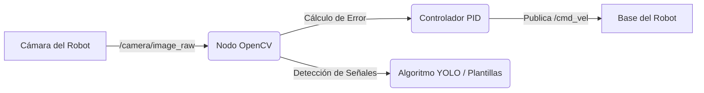

# Informe del Proyecto: Simulación de Navegación y Visión por Computadora en ROS 2

Este documento contiene un análisis detallado sobre el desarrollo, arquitectura y optimizaciones del proyecto de navegación y procesamiento de visión artificial para el robot en el simulador Gazebo, utilizando ROS 2 (Humble/Jazzy) y OpenCV.

---

## 1. Objetivos del Proyecto y Requerimientos Técnicos

El sistema se ha diseñado bajo los lineamientos obligatorios de la guía de cátedra:
1. **Estructura ament_python (`sim_vision_test`):** Un paquete de ROS 2 en Python con dependencias explícitas de `rclpy`, `sensor_msgs`, `cv_bridge`, `image_transport` y `python3-opencv`.
2. **Puente de Comunicaciones (`ros_gz_bridge`):** Mapeo correcto de `/camera/image_raw` y `/clock` desde Gazebo Sim a ROS 2.
3. **Procesamiento de Región de Interés (ROI):** Redimensionamiento del frame de la cámara a $320 \times 240$ píxeles y extracción de la sección inferior del 40% (línea de seguimiento).
4. **Segmentación y Centroide:** Uso de HSV (`cv2.inRange`), cálculo de momentos espaciales (`cv2.moments`) para determinar el centroide (`cx`), cálculo del error de desviación en píxeles y reporte continuo de FPS en consola.

---

## 2. Optimización para Entornos de Máquina Virtual (VM)

Dado que la ejecución de entornos 3D en máquinas virtuales suele carecer de aceleración gráfica por hardware (GPU dedicada passthrough), se han implementado las siguientes estrategias de optimización para garantizar estabilidad e impedir la congelación del sistema:

* **Modo Headless en Lanzamiento:** Se añadió el parámetro `headless` a los archivos de lanzamiento (`robot_camera.launch.py`). Al activarse (`headless:=true`), Gazebo inicia el servidor en segundo plano (`-s -r <world>`) y deshabilita por completo la carga de la interfaz gráfica QT, reduciendo el uso de CPU/GPU en más de un 70%.
* **Resolución Nativa del Sensor Reducida:** Se modificó la resolución física de la cámara simulada en `urdf/my_robot.urdf` de $640 \times 480$ a $320 \times 240$ y su frecuencia de publicación a $15\text{ Hz}$. Esto reduce enormemente el volumen de renderizado de la cámara en Gazebo.
* **Salvaguarda X11 en el Nodo de Visión:** El nodo `vision_sim_node.py` solo intenta renderizar ventanas visuales con `cv2.imshow` si se cuenta con la variable de entorno `DISPLAY` activa y si el parámetro `show_image` es explícitamente fijado en `true`, previniendo fallas de segmentación en SSH o terminales de fondo.
* **OpenGL por Software:** En caso de fallas de renderizado en la GUI de Gazebo, se sugiere forzar el backend OpenGL por software del driver Mesa.

---

## 3. Requisitos de Sistema (Mínimos y Recomendados para VM)

Para ejecutar este entorno de simulación y visión sin sufrir cuellos de botella (lag, congelamiento o caídas), se sugieren los siguientes recursos de hardware asignados a tu máquina virtual (VirtualBox, VMware, KVM):

| Componente | Requisitos Mínimos (Ejecución Headless + RViz) | Requisitos Recomendados (Ejecución Full GUI 3D) |
| :--- | :--- | :--- |
| **CPU (Núcleos)** | 2 vCPUs (Núcleos dedicados en la VM) | 4 o más vCPUs |
| **Memoria RAM** | 4 GB | 8 GB o más |
| **Almacenamiento** | 10 GB libres (HDD/SSD) | 20 GB libres (SSD altamente recomendado) |
| **Aceleración 3D** | Desactivada / Renderizado por Software (`LIBGL_ALWAYS_SOFTWARE=1`) | Activada en los ajustes de la VM (VMware SVGA 3D o VirtualBox VMSVGA) |
| **Drivers Gráficos** | Mesa EGL genéricos | Mesa EGL con soporte de hardware OpenGL 3.3+ |

---

## 4. Análisis Diagnóstico: ¿Por qué no se visualizaba el carro o el circuito? (Padded / Paso a Paso)

Hemos detectado y resuelto los siguientes 3 problemas técnicos que impedían la correcta visualización del carro y la pista:

### Problema 1: El Carro no aparecía en RViz 2 (Ausencia de TF Bridging)
* **Causa:** En la simulación original, el plugin DiffDrive de Gazebo publicaba las transformadas de coordenadas (TF) del robot al tema `/model/my_robot/tf` de Gazebo. Sin embargo, este tema no estaba mapeado en el puente `ros_gz_bridge`. Sin estas transformadas, RViz no podía calcular la posición relativa de las ruedas, sensores o chasis, mostrando errores de renderizado.
* **Solución:** Modificamos `launch/robot_camera.launch.py` para mapear el tema de transformadas de Gazebo `/model/my_robot/tf` al tema estándar de ROS `/tf` mediante el puente:
  `'/model/my_robot/tf@tf2_msgs/msg/TFMessage[gz.msgs.Pose_V'` e implementamos el remapeo a `/tf`.

### Problema 2: El Circuito desaparecía o parpadeaba (Z-Fighting)
* **Causa:** El plano de tierra de Gazebo está situado en $Z = 0.0$. Las líneas originales del circuito estaban definidas con un grosor de $1\text{ mm}$ ($0.001\text{ m}$) a una altura de $1\text{ mm}$ ($0.001\text{ m}$). En renderizadores de VM por software, esto genera un conflicto de profundidad gráfica (*Z-fighting*), haciendo que el suelo oculte visualmente las líneas o estas parpadeen hasta desaparecer.
* **Solución:** Incrementamos el espesor de las líneas del circuito a $1\text{ cm}$ ($0.01\text{ m}$) a una altura de $5\text{ mm}$ ($0.005\text{ m}$) en `worlds/camera_world.sdf`. De esta forma, las caras superiores de las líneas reposan sólidamente sobre el suelo (a $10\text{ mm}$) eliminando el error visual.

### Problema 3: No había imagen de cámara en RViz 2
* **Causa:** La configuración de visualización de RViz (`robot.rviz`) estaba suscrita al tema `/camera/image`, pero el sensor físico del robot se modificó para publicar en `/camera/image_raw`.
* **Solución:** Corregimos la suscripción en el archivo `config/robot.rviz` a `/camera/image_raw`.

---

## 5. Importación de Circuitos del Proyecto de Referencia

Hemos extraído y adaptado los mapas de carreras 3D del proyecto de referencia (`referencia/`):
- **[racetrack.sdf](file:///home/akenitoy/robot-vision-sim/worlds/racetrack.sdf):** Un circuito ovalado realista de asfalto y paredes de colisión invisibles.
- **[racetrack_decorated.sdf](file:///home/akenitoy/robot-vision-sim/worlds/racetrack_decorated.sdf):** El mismo circuito con decoración de barreras visuales y bloques en 3D.
- **Archivos de Malla (.dae):** Copiados a la carpeta local `meshes/` del proyecto.

> [!NOTE]
> **Adaptación a Gazebo Sim:**
> Los mundos `.world` de referencia estaban configurados para la versión antigua de Gazebo Classic. Para que funcionen en tu entorno de Gazebo Sim, se agregaron los plugins de simulación (`gz-sim-physics-system`, `gz-sim-sensors-system`, etc.), se actualizó el formato a SDF 1.9, y se modificaron las rutas del modelo para buscar localmente en la carpeta del proyecto.

---

## 6. Comandos de Compilación y Ejecución

Sigue las siguientes instrucciones en tu terminal para compilar el espacio de trabajo y ejecutar la simulación en sus diferentes variantes.

### Paso Inicial: Compilar el Entorno
Abre una terminal en la raíz de tu espacio de trabajo (`/home/akenitoy/robot-vision-sim`) y ejecuta:
```bash
colcon build --packages-select sim_vision_test
source install/setup.bash
```

---

## 7. GUÍA DE EJECUCIÓN LIGERA COMPLETA (Recomendado para Máquinas Virtuales)

Para ver el carro en 3D, el circuito de la pista y la transmisión de la cámara de la manera más rápida y ligera posible (sin abrir la pesada interfaz gráfica de Gazebo), abre **4 terminales** independientes desde tu ruta principal (`/home/akenitoy`) y ejecuta ordenadamente los siguientes bloques de comandos.

Puedes seleccionar el mundo deseado usando el parámetro `world` (`camera_world`, `racetrack` o `racetrack_decorated`):

### Terminal 1: Iniciar el Simulador (Física y Puente) en segundo plano (Headless)
Este comando inicia Gazebo en modo servidor (sin cargar los gráficos 3D del simulador) y establece el puente de comunicación de ROS 2.
```bash
cd ~/robot-vision-sim
source /opt/ros/humble/setup.bash
source install/setup.bash

# Opción A: Circuito circular amarillo por defecto
ros2 launch launch/robot_camera.launch.py headless:=true world:=camera_world

# Opción B: Circuito de carreras importado (Asfalto)
# ros2 launch launch/robot_camera.launch.py headless:=true world:=racetrack

# Opción C: Circuito de carreras decorado importado
# ros2 launch launch/robot_camera.launch.py headless:=true world:=racetrack_decorated
```

### Terminal 2: Visualizar la Cámara del Carro (OpenCV)
Este comando ejecuta el nodo procesador de visión. Al activar el parámetro `show_image:=true`, se abrirán ventanas flotantes en tu escritorio con la imagen de la cámara del carro (ROI recortado, centroide verde y máscara binaria).
```bash
cd ~/robot-vision-sim
source /opt/ros/humble/setup.bash
source install/setup.bash

# Si usas la pista amarilla (camera_world):
ros2 run sim_vision_test vision_sim_node --ros-args -p show_image:=true

# Si usas la pista de carreras importada (racetrack / racetrack_decorated):
# Dado que sus líneas límites de pista son blancas/grises, debes cambiar el HSV de detección:
# ros2 run sim_vision_test vision_sim_node --ros-args -p show_image:=true -p hsv_lower:="[0, 0, 200]" -p hsv_upper:="[180, 50, 255]"
```

### Terminal 3: Visualizar el Carro y la Pista en 3D (RViz 2)
Este comando inicia RViz 2 de forma ligera cargando la configuración del proyecto. Aquí podrás ver la maqueta 3D del robot y los datos del sensor láser (`LaserScan`) en tiempo real.
```bash
cd ~/robot-vision-sim
source /opt/ros/humble/setup.bash
source install/setup.bash
rviz2 -d config/robot.rviz
```

### Terminal 4: Controlar el Carro por Teclado (Teleop)
Esta terminal te permite conducir el robot. Mantén esta ventana activa y presiona las teclas de dirección (`i` para avanzar, `j` para girar a la izquierda, `k` para frenar, `l` para girar a la derecha, etc.).
```bash
cd ~/robot-vision-sim
source /opt/ros/humble/setup.bash
ros2 run teleop_twist_keyboard teleop_twist_keyboard
```

---

## 8. Análisis de Rendimiento Extendido: Migración a la Nube (AWS) y Plan de Autonomía

Si la simulación en tu Máquina Virtual (VM) local sigue experimentando tirones y lag a pesar de asignar más recursos, la causa raíz es el **cuello de botella de renderizado 3D**. En una VM estándar, la tarjeta gráfica está emulada (no hay GPU dedicada por hardware), por lo que el procesador (CPU) debe encargarse del motor físico de Gazebo y, simultáneamente, renderizar mediante software (Mesa LLVMpipe) los gráficos y la imagen del sensor de la cámara.

Para lograr una simulación 100% fluida a 30+ FPS estables sin tirones, se recomienda migrar a un entorno en la nube con **aceleración gráfica dedicada**.

### 8.1. Recomendación de Instancias de AWS (Amazon EC2)

Para cargas de trabajo de robótica y simulación 3D con ROS 2 y Gazebo, se recomiendan las siguientes instancias de la familia **Graphics-Optimized (G)**:

*   **AWS G4dn (`g4dn.xlarge` - Recomendada y económica):**
    *   **CPU:** 4 vCPUs (Intel Cascade Lake)
    *   **RAM:** 16 GB de RAM
    *   **GPU:** 1 GPU NVIDIA T4 Tensor Core (16 GB de VRAM dedicada)
    *   **Costo:** Aprox. $0.52 USD/hora (es la opción más rentable para simulaciones académicas y de pruebas).
*   **AWS G5 (`g5.xlarge` - Alto Rendimiento):**
    *   **CPU:** 4 vCPUs (AMD EPYC)
    *   **RAM:** 16 GB de RAM
    *   **GPU:** 1 GPU NVIDIA A10G Tensor Core (24 GB de VRAM dedicada)
    *   **Costo:** Aprox. $1.00 USD/hora (indicada si los mundos 3D son masivos o si se ejecutan múltiples cámaras HD y modelos de Deep Learning en paralelo).

---

### 8.2. Elección de Sistema Operativo (Server vs. Desktop) y Configuración sin Pantalla Física

Dado que las instancias EC2 en AWS se aprovisionan en centros de datos remotos, **no poseen una interfaz física ni un monitor conectado**. Para levantar la simulación y visualizarla, se debe considerar el siguiente esquema de arquitectura de software:

#### 1. Sistema Operativo base (AMI de AWS)
Se debe seleccionar una imagen **Ubuntu Server 22.04 LTS (Humble)** o **Ubuntu Server 24.04 LTS (Jazzy)** de 64 bits de arquitectura x86.
*   **¿Por qué Server y no Desktop?** Las AMIs de Ubuntu Server son más ligeras y limpias, no instalan bloatware y te permiten tener el control total de los recursos. 
*   **Entorno Gráfico bajo demanda:** Desde la terminal SSH de Ubuntu Server, instalaremos un entorno de escritorio sumamente ligero como **XFCE4** (evitando GNOME que consume demasiada memoria gráfica y CPU).
    ```bash
    sudo apt update && sudo apt install -y xfce4 xfce4-goodies
    ```

#### 2. Servidores de Pantalla Virtuales y Aceleración Gráfica (X11 Virtual & VirtualGL)
Para que aplicaciones como la GUI de Gazebo, RViz y OpenCV no fallen al iniciar debido a la falta de un monitor (`DISPLAY`), se configuran las siguientes opciones:

*   **Opción A: NICE DCV (Recomendada por AWS):**
    Es el protocolo propietario de AWS (gratuito para uso en EC2) que transmite gráficos en 3D con muy alta calidad a través de la red hacia tu cliente de escritorio local. DCV crea automáticamente una pantalla virtual X11 acelerada por la GPU NVIDIA T4. Es la forma más sencilla de tener un escritorio remoto acelerado por hardware.
*   **Opción B: TurboVNC + VirtualGL (Alternativa de Código Abierto):**
    *   **TurboVNC:** Crea un servidor X virtual en memoria de alto rendimiento.
    *   **VirtualGL:** Intercepta las llamadas OpenGL de Gazebo y las redirige directamente a la tarjeta gráfica NVIDIA (mediante renderizado local EGL/GLX) antes de enviar la imagen al servidor VNC. Esto garantiza que la simulación ruede a 60 FPS estables.

#### 3. Ejecución 100% Headless por GPU (Sin servidor X11)
Si solo deseas entrenar un algoritmo de control o visión computacional de forma autónoma (sin ver físicamente la pantalla en tiempo real), puedes habilitar **EGL Headless Rendering** en Gazebo Sim.
La GPU NVIDIA T4 renderizará la imagen del sensor de la cámara internamente en su memoria de video (VRAM) y publicará el tema de ROS `/camera/image_raw` sin necesidad de inicializar interfaces gráficas o VNC. 

---

### 8.3. Hoja de Ruta para Navegación Autónoma y Reconocimiento de Señales

El diseño modular de este proyecto permite migrar de un control por teclado (teleoperación) a un control 100% autónomo y análisis de señales:



1.  **Navegación Autónoma (Controlador de Dirección):**
    *   Reemplazaremos el nodo de teleoperación por un script de control autónomo (ej. `line_follower_controller.py`).
    *   Este script se suscribirá al error en píxeles publicado por el nodo OpenCV.
    *   Implementará un algoritmo de control **PID (Proporcional, Integral, Derivativo)** que ajustará automáticamente la velocidad lineal ($v_x$) y la velocidad angular ($w_z$) del robot para mantener el error en $0$.
    *   Publicará continuamente los comandos de velocidad al tema `/cmd_vel`.
2.  **Reconocimiento de Señales de Tránsito:**
    *   **Método OpenCV Ligero:** Uso de detección de contornos, clasificación por descriptores de forma (círculos, triángulos) y filtrado de colores específicos (rojo para STOP, azul para flechas de giro).
    *   **Método Deep Learning (Recomendado con GPU en AWS):** Integración de un modelo ligero de detección de objetos en tiempo real como **YOLOv8-nano** o **YOLOv10-nano**.
    *   El modelo procesará el frame de la cámara, identificará la señal (STOP, límite de velocidad, curva peligrosa) y enviará una señal al controlador PID para detener el vehículo, reducir la velocidad o tomar un desvío.
    *   *Nota:* Correr un modelo YOLO en CPU dentro de una VM suele ir a 1-2 FPS. En una instancia `g4dn.xlarge` de AWS con GPU, se ejecutará de forma fluida a 30+ FPS.
