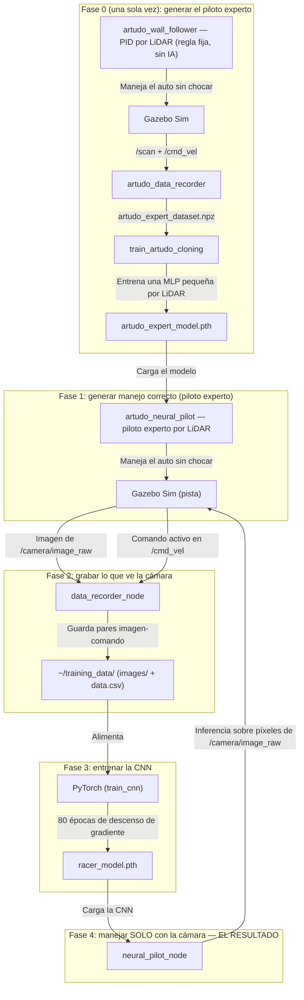

# 🏎️ Robot Vision Sim — Auto Autónomo por Visión de Cámara (CNN)

**Simulación en ROS 2 Humble + Gazebo Sim de un auto de carreras que maneja de forma 100% autónoma usando exclusivamente su cámara**, mediante una Red Neuronal Convolucional (CNN) entrenada por aprendizaje por imitación end-to-end (arquitectura estilo **PilotNet**, NVIDIA 2016).

> ✅ **Resultado logrado:** el piloto CNN (`neural_pilot_node`) completa el circuito sin colisionar, manejando en bucle cerrado a partir únicamente de los píxeles de `/camera/image_raw` — sin LiDAR y sin ninguna regla de color programada a mano. Este es el resultado central del proyecto y lo único que este README documenta en detalle.
>
> El repositorio también contiene dos líneas de trabajo **opcionales** (un piloto por Aprendizaje por Refuerzo con LiDAR, y un seguidor de línea clásico por OpenCV) que no forman parte del flujo principal — ver [Sección 11](#-extensiones-opcionales-no-forman-parte-del-flujo-principal).

---

## 📑 Índice

1. [Metodología y flujo completo](#-metodología-y-flujo-completo)
2. [Arquitectura de la red CNN](#-arquitectura-de-la-red-cnn-racercnn)
3. [Estructura de carpetas y archivos](#-estructura-de-carpetas-y-archivos)
4. [Cómo se relacionan y ejecutan los archivos](#-cómo-se-relacionan-y-ejecutan-los-archivos)
5. [Requisitos de sistema (optimizado para laptop)](#-requisitos-de-sistema-optimizado-para-laptop)
6. [Instalación](#-instalación)
7. [Guía de ejecución paso a paso](#-guía-de-ejecución-paso-a-paso)
8. [Pistas / mundos usados por el pipeline CNN](#-pistas--mundos-usados-por-el-pipeline-cnn)
9. [Problemas resueltos durante el desarrollo](#-problemas-resueltos-durante-el-desarrollo)
10. [Consejos de rendimiento para laptops modestas](#-consejos-de-rendimiento-para-laptops-modestas)
11. [Extensiones opcionales (no forman parte del flujo principal)](#-extensiones-opcionales-no-forman-parte-del-flujo-principal)
12. [Referencias](#-referencias)
13. [Informe técnico completo](#-informe-técnico-completo)

---

## 🧠 Metodología y flujo completo

La idea central: en vez de programar reglas ("girá cuando veas esto"), se le muestran a una red neuronal miles de ejemplos de (imagen de cámara → comando de manejo correcto), hasta que aprende sola a relacionar lo que ve con lo que tiene que hacer. Esto se llama **aprendizaje por imitación end-to-end**.

Para grabar esos ejemplos hace falta que **algo** maneje bien primero. Por eso el flujo completo tiene **4 pasos**, uno de bootstrap (Fase 0, se corre una sola vez) y tres del pipeline CNN propiamente dicho:



### Los 4 pasos explicados

* **Fase 0 — Bootstrap del piloto experto (una sola vez, LiDAR):** el "piloto experto" no viene de fábrica: primero un controlador PID clásico por LiDAR (`artudo_wall_follower`, sin IA, solo geometría) maneja el auto sin chocar mientras `artudo_data_recorder` graba sus lecturas de LiDAR + comandos. Con ese dataset, `train_artudo_cloning` entrena una red pequeña (MLP de 4 capas) que clona ese comportamiento y queda guardada en `~/dataset_artudo/artudo_expert_model.pth`. Una vez generado este archivo, la Fase 0 no hace falta repetirla.
* **Fase 1 — El piloto experto maneja (caja negra por LiDAR):** `artudo_neural_pilot` carga `artudo_expert_model.pth` y maneja el auto de forma autónoma **usando solo LiDAR**. Es el generador de "buen manejo" que necesita el paso siguiente — su funcionamiento interno no es relevante para el resultado final (que es 100% por cámara), se lo usa únicamente como fuente de datos.
* **Fase 2 — Grabar lo que ve la cámara:** mientras el piloto experto maneja, `data_recorder_node` guarda, varias veces por segundo, la imagen de la cámara junto con el comando de manejo (`linear.x`, `angular.z`) vigente en ese instante exacto.
* **Fase 3 — Entrenar la CNN:** `train_cnn` toma esas parejas (imagen, comando) y entrena la red `RacerCNN` para predecir el comando correcto a partir de la imagen.
* **Fase 4 — Manejar solo con la cámara (el resultado):** se apaga el piloto experto (LiDAR) y se enciende `neural_pilot_node`, que maneja el auto viendo **exclusivamente** la cámara.

📄 El desarrollo matemático completo (convolución, ReLU, backpropagation, Adam, balanceo de dataset), el flujo y código completo del piloto experto por LiDAR (Sección 4), y el código de cada nodo explicado línea por línea están en [`informeTecnicoCNN.md`](informeTecnicoCNN.md).

---

## 🏗️ Arquitectura de la red CNN (`RacerCNN`)

Imagen de entrada $120 \times 160 \times 3$ (RGB, normalizada a $[0,1]$) → 5 capas convolucionales → aplanado → 3 capas totalmente conectadas → 2 salidas (`linear_x`, `angular_z`):

| Capa | Tipo | Dimensión de salida |
|---|---|---|
| Entrada | Imagen normalizada | $3 \times 120 \times 160$ |
| Conv1 | `Conv2d(3,24,k=5,s=2)` + ReLU | $24 \times 58 \times 78$ |
| Conv2 | `Conv2d(24,36,k=5,s=2)` + ReLU | $36 \times 27 \times 37$ |
| Conv3 | `Conv2d(36,48,k=5,s=2)` + ReLU | $48 \times 12 \times 17$ |
| Conv4 | `Conv2d(48,64,k=3,s=1)` + ReLU | $64 \times 10 \times 15$ |
| Conv5 | `Conv2d(64,64,k=3,s=1)` + ReLU | $64 \times 8 \times 13$ |
| Flatten | Aplanado | $6656$ |
| FC1 → FC2 → FC3 | `Linear` 6656→100→50→2 | `[linear_x, angular_z]` |

Entrenamiento: `MSELoss`, optimizador `Adam` (`lr=0.0005`), lotes de 64, 80 épocas, con balanceo de dataset (se descarta parte de los tramos rectos para no sesgar el aprendizaje hacia "seguir siempre derecho"). Detalle matemático completo en [`informeTecnicoCNN.md`, Secciones 2 y 3](informeTecnicoCNN.md).

---

## 📂 Estructura de carpetas y archivos

```
robot-vision-sim/
├── src/sim_vision_test/                  # Paquete ROS 2 (ament_python) — TODO el código Python vive acá
│   ├── package.xml                       # Dependencias ROS del paquete (rclpy, cv_bridge, etc.)
│   ├── setup.py                          # Registra cada nodo como ejecutable de "ros2 run"
│   └── sim_vision_test/
│       ├── artudo_wall_follower_node.py  # Fase 0: PID por LiDAR (sin IA) — genera el dataset del piloto experto
│       ├── artudo_data_recorder_node.py  # Fase 0: graba LiDAR + comando -> artudo_expert_dataset.npz
│       ├── train_artudo_cloning.py       # Fase 0: entrena la MLP del piloto experto -> artudo_expert_model.pth
│       ├── artudo_neural_pilot_node.py   # Fase 1: piloto experto (carga artudo_expert_model.pth, maneja por LiDAR)
│       ├── data_recorder.py              # Fase 2: graba cámara + comando -> ~/training_data/
│       ├── train_cnn.py                  # Fase 3: entrena RacerCNN -> racer_model.pth
│       └── neural_pilot_node.py          # Fase 4: PILOTO FINAL (carga racer_model.pth, maneja por cámara)
├── launch/
│   └── robot_camera.launch.py            # Levanta Gazebo + spawnea el robot + arma el puente ROS<->Gazebo
├── urdf/
│   └── racer_robot.urdf                  # Descripción física del robot: chasis, ruedas, cámara y LiDAR simulados
├── worlds/                                # Pistas/circuitos en formato SDF (ver Sección 8)
├── meshes/                                # Modelos 3D (.dae) del auto y las pistas, referenciados por urdf/ y worlds/
├── config/
│   └── robot.rviz                        # Configuración de RViz2 (solo necesaria para depuración visual opcional)
├── scripts/                               # Instalación (ver Sección 6)
├── requirements.txt                       # Dependencias Python del pipeline CNN (torch, pandas, numpy)
├── requirements-optional.txt              # Dependencias solo para la línea opcional de RL (gymnasium, stable-baselines3)
├── informeTecnicoCNN.md                   # Informe técnico completo del pipeline CNN (este es el documento de referencia)
├── informeAprendizajeRefuerzo.md          # Informe de la línea opcional de RL/PPO
└── INFORME_VISION.md                      # Informe de la línea opcional de visión clásica + notas de infraestructura
```

> `urdf/my_robot.urdf` es una versión anterior sin uso actual — el launch file carga `racer_robot.urdf`. No hace falta tocarlo.

---

## 🔗 Cómo se relacionan y ejecutan los archivos

1. **`launch/robot_camera.launch.py`** es el punto de entrada de la simulación. Al correrlo:
   - Lee `urdf/racer_robot.urdf`, reemplaza las rutas `package://` por rutas absolutas a `meshes/`, y publica esa descripción en el tópico `/robot_description`.
   - Lee el archivo `worlds/<world>.sdf` elegido (parámetro `world:=`), parchea las rutas relativas de mallas a rutas absolutas de `meshes/`, y lanza **Gazebo Sim** con ese mundo (vía `ros_gz_sim`).
   - Lanza `robot_state_publisher` (publica las transformadas TF del robot) y `ros_gz_bridge` (traduce mensajes entre Gazebo y ROS 2: `/cmd_vel`, `/odom`, `/scan`, `/camera/image_raw`, `/camera/camera_info`, `/clock`, `/tf`).
   - Hace *spawn* del robot en la pista a partir de `/robot_description`.
2. Con la simulación arriba, **los nodos Python** (`src/sim_vision_test/sim_vision_test/*.py`) se conectan por tópicos ROS — cada uno se lanza en su propia terminal con `ros2 run sim_vision_test <ejecutable>` (el nombre del ejecutable está mapeado en `setup.py`):
   - `artudo_neural_pilot` **se suscribe** a `/scan` (LiDAR) y **publica** en `/cmd_vel` (Fase 1).
   - `data_recorder_node` **se suscribe** a `/camera/image_raw` y a `/cmd_vel` (sin publicar nada) y escribe archivos en `~/training_data/` (Fase 2).
   - `train_cnn` **no usa ROS**: es un script standalone que lee `~/training_data/data.csv` + `~/training_data/images/` del disco y escribe `~/training_data/racer_model.pth` (Fase 3).
   - `neural_pilot_node` **se suscribe** a `/camera/image_raw` y **publica** en `/cmd_vel`, cargando `~/training_data/racer_model.pth` al arrancar (Fase 4).
3. **Nunca correr dos nodos que publican en `/cmd_vel` al mismo tiempo** (por ejemplo `artudo_neural_pilot` junto con `neural_pilot_node`) — se pisan los comandos entre sí y el auto maneja de forma errática.
4. Los datos generados (`~/training_data/`, `~/dataset_artudo/`) viven en el **home del usuario**, no dentro del repositorio — así una sesión de grabación no se pierde ni se mezcla con el código fuente, y podés borrar/regenerar el dataset sin afectar git.

---

## 💻 Requisitos de sistema (optimizado para laptop)

Pensado para correr en una laptop modesta, **sin GPU dedicada** — el entrenamiento de la CNN es liviano (imágenes de 160×120, dataset chico) y corre bien en CPU:

| Componente | Mínimo (headless, sin GUI 3D) | Cómodo |
| :--- | :--- | :--- |
| **SO** | Ubuntu 22.04 LTS (x86_64) — nativo o WSL2 | Ubuntu 22.04 LTS |
| **CPU** | 2 núcleos | 4 núcleos |
| **RAM** | 4 GB | 8 GB |
| **Disco** | 6 GB libres | 10 GB libres |
| **GPU** | No requerida (PyTorch CPU, Gazebo con renderizado por software) | Opcional — acelera el entrenamiento, no es necesaria |

No hace falta GPU ni una instancia en la nube para correr el pipeline CNN completo. Ver [Sección 10](#-consejos-de-rendimiento-para-laptops-modestas) para exprimir aún más el rendimiento en equipos limitados.

---

## ⚙️ Instalación

Los scripts en [`scripts/`](scripts/) instalan **solo lo necesario para el pipeline CNN** (nada de RViz, teleclado ni dependencias de RL por defecto — eso queda aparte y es opcional, ver más abajo). Todos los comandos están completos con su ruta, para poder copiarlos y pegarlos tal cual en una terminal nueva.

> Requiere **Linux (Ubuntu 22.04)**, nativo o **WSL2** si desarrollás desde Windows — es el sistema operativo de ROS 2 Humble y Gazebo Sim.

### Opción A — Instalación en un solo paso (recomendada)

```bash
cd ~
git clone <url-de-tu-fork-o-repo> robot-vision-sim
cd ~/robot-vision-sim
chmod +x scripts/*.sh

# Instalación mínima: ROS 2 Humble (base) + Gazebo Sim + PyTorch CPU + build del workspace
./scripts/setup_all.sh
```

Si tenés GPU NVIDIA y querés acelerar el entrenamiento (**opcional**, no hace falta en una laptop sin GPU):
```bash
cd ~/robot-vision-sim
./scripts/setup_all.sh --cuda
```

### Opción B — Instalación paso a paso (mismo resultado, para entender/controlar cada etapa)

```bash
cd ~/robot-vision-sim

# 1) ROS 2 Humble (base, sin GUI) + Gazebo Sim (ros_gz) + cv_bridge + colcon
./scripts/install_ros2_gazebo.sh

# 2) PyTorch + pandas + numpy — CPU por defecto (laptop sin GPU)
./scripts/install_python_deps.sh
# ...o con GPU NVIDIA (opcional):
# ./scripts/install_python_deps.sh --cuda

# 3) Compilar el paquete ROS 2 sim_vision_test
./scripts/build_workspace.sh
```

Verificar que la instalación quedó lista:
```bash
source /opt/ros/humble/setup.bash
source ~/robot-vision-sim/install/setup.bash
ros2 pkg list | grep sim_vision_test
```
Si el comando anterior imprime `sim_vision_test`, la instalación fue exitosa.

### Herramientas opcionales (NO hacen falta para el pipeline CNN)

Solo si vas a depurar visualmente (RViz2, visor de cámara, teleclado) o vas a explorar la línea opcional de RL/PPO (Gymnasium + Stable-Baselines3):
```bash
cd ~/robot-vision-sim
./scripts/install_optional_tools.sh
```

| Script | Qué instala | ¿Cuándo correrlo? |
|---|---|---|
| [`scripts/install_ros2_gazebo.sh`](scripts/install_ros2_gazebo.sh) | ROS 2 Humble **base** (sin GUI de escritorio), Gazebo Sim (`ros_gz`), `cv_bridge`, `colcon` | Siempre (paso 1) |
| [`scripts/install_python_deps.sh`](scripts/install_python_deps.sh) | PyTorch (CPU por defecto, `--cuda` opcional), pandas, numpy | Siempre (paso 2) |
| [`scripts/build_workspace.sh`](scripts/build_workspace.sh) | Compila el paquete `sim_vision_test` con `colcon build` | Siempre (paso 3), y de nuevo cada vez que se modifique el código |
| [`scripts/setup_all.sh`](scripts/setup_all.sh) | Corre los 3 anteriores en orden | Alternativa a hacerlo paso a paso (Opción A) |
| [`scripts/install_optional_tools.sh`](scripts/install_optional_tools.sh) | RViz2, `rqt_image_view`, teleclado, Gymnasium/Stable-Baselines3 | **Opcional** — no hace falta para el pipeline CNN |

---

## ▶️ Guía de ejecución paso a paso

Cada bloque de comandos está completo (ruta + `source` + comando) para poder tipearlo o pegarlo tal cual en una terminal nueva, sin pasos implícitos. Reemplazá `~/robot-vision-sim` por la ruta real si clonaste el repo en otro lugar.

### Fase 0 — Generar el piloto experto por LiDAR (una sola vez)

Bootstrap explicado con código completo en [`informeTecnicoCNN.md`, Sección 4](informeTecnicoCNN.md). Si todavía **no** existe `~/dataset_artudo/artudo_expert_model.pth`, generalo así (si ya existe, saltar directo a la Fase 1):

**Terminal 1 — Simulación (headless recomendado en laptop):**
```bash
cd ~/robot-vision-sim
source /opt/ros/humble/setup.bash
source install/setup.bash
ros2 launch launch/robot_camera.launch.py world:=racetrack headless:=true
```

**Terminal 2 — Controlador PID por LiDAR (sin IA), maneja el auto:**
```bash
cd ~/robot-vision-sim
source /opt/ros/humble/setup.bash
source install/setup.bash
ros2 run sim_vision_test artudo_wall_follower
```

**Terminal 3 — Graba LiDAR + comandos mientras el PID maneja:**
```bash
cd ~/robot-vision-sim
source /opt/ros/humble/setup.bash
source install/setup.bash
ros2 run sim_vision_test artudo_data_recorder
```
Dejalo grabar varias vueltas y después `Ctrl+C` **en la Terminal 3** (el dataset se guarda recién al cerrar el nodo). Cerrá también las Terminales 1 y 2.

**Terminal 4 — Entrenar la red del piloto experto:**
```bash
cd ~/robot-vision-sim
source /opt/ros/humble/setup.bash
source install/setup.bash
ros2 run sim_vision_test train_artudo_cloning
```
Esto genera `~/dataset_artudo/artudo_expert_model.pth`, usado por `artudo_neural_pilot` en la Fase 1. No hace falta repetir esta fase salvo que quieras cambiar el comportamiento base del piloto experto.

### Fase 1 + 2 — Grabar datos de entrenamiento de la CNN (piloto experto maneja + se graba la cámara)

**Terminal 1 — Simulación:**
```bash
cd ~/robot-vision-sim
source /opt/ros/humble/setup.bash
source install/setup.bash
ros2 launch launch/robot_camera.launch.py world:=racetrack headless:=true
```

**Terminal 2 — Piloto experto por LiDAR (genera el manejo correcto):**
```bash
cd ~/robot-vision-sim
source /opt/ros/humble/setup.bash
source install/setup.bash
ros2 run sim_vision_test artudo_neural_pilot
```

**Terminal 3 — Grabador de imagen + comando (cámara):**
```bash
cd ~/robot-vision-sim
source /opt/ros/humble/setup.bash
source install/setup.bash
ros2 run sim_vision_test data_recorder_node
```
⚠️ **No manejar manualmente durante esta fase** — `data_recorder_node` graba cualquier cosa que llegue a `/cmd_vel`, y una intervención humana contamina el dataset (ver [Sección 9](#-problemas-resueltos-durante-el-desarrollo)). Dejalo grabar varias vueltas; cuantas más, mejor generaliza la CNN. `Ctrl+C` en la Terminal 3 para terminar. Los datos quedan en `~/training_data/images/` y `~/training_data/data.csv`, acumulándose entre sesiones.

### Fase 3 — Entrenar la CNN

```bash
cd ~/robot-vision-sim
source /opt/ros/humble/setup.bash
source install/setup.bash
ros2 run sim_vision_test train_cnn
```
Muestra el progreso por época y guarda el modelo en `~/training_data/racer_model.pth`. En CPU, con el dataset típico de este proyecto, tarda del orden de minutos (no horas) — no hace falta GPU. Podés cerrar las terminales de la Fase 1 antes de entrenar.

### Fase 4 — Manejar solo con la cámara (el resultado)

**Terminal 1 — Simulación:**
```bash
cd ~/robot-vision-sim
source /opt/ros/humble/setup.bash
source install/setup.bash
ros2 launch launch/robot_camera.launch.py world:=racetrack_decorated headless:=false
```

**Terminal 2 — Piloto CNN por cámara:**
```bash
cd ~/robot-vision-sim
source /opt/ros/humble/setup.bash
source install/setup.bash
ros2 run sim_vision_test neural_pilot_node
```
Esta terminal maneja el auto solo, publicando en `/cmd_vel` en base a lo que la CNN predice mirando `/camera/image_raw`.

**Terminal 3 (opcional) — Ver lo que la CNN está mirando:**
```bash
cd ~/robot-vision-sim
source /opt/ros/humble/setup.bash
ros2 run rqt_image_view rqt_image_view
```
Requiere `scripts/install_optional_tools.sh`. Seleccionar el tópico `/camera/image_raw` en la ventana.

⚠️ **Nunca correr dos pilotos que publiquen en `/cmd_vel` al mismo tiempo** — ni `artudo_wall_follower` junto con `artudo_neural_pilot` (Fase 0), ni `artudo_neural_pilot` (Fase 1+2) junto con `neural_pilot_node` (Fase 4). Se pisan las órdenes entre sí.

---

## 🗺️ Pistas / mundos usados por el pipeline CNN

Seleccionables con el argumento `world:=` del launch file (archivos en [`worlds/`](worlds/)):

| Archivo | Uso recomendado |
|---|---|
| `racetrack.sdf` | Recomendado para **grabar datos y entrenar** en equipos modestos — geometría simple, sin decoración extra, menor costo de renderizado |
| `racetrack_decorated.sdf` | Circuito con barreras y bloques 3D decorativos — más pesado de renderizar, útil para ver el resultado final con mejor ambientación |
| `camera_world.sdf` | Circuito circular simple, liviano, alternativa válida para cualquier fase |

> `oval_track.sdf` y `circuito_ovalo.sdf` no son usados por el pipeline CNN — pertenecen a la línea opcional de Aprendizaje por Refuerzo.

---

## 🛠️ Problemas resueltos durante el desarrollo

1. **Errata de escala:** una versión anterior desnormalizaba la salida de la red multiplicando por los límites físicos del auto (`0.50`/`0.70`) en vez del inverso exacto de la normalización de entrenamiento (`2.0`/`3.0`), reduciendo el giro real enviado al auto a ~23% de lo predicho.
2. **Suavizado de dirección mal calibrado:** un suavizado exponencial alto (`0.6`) introducía demasiado retraso frente a curvas cerradas, causando más choques. Quedó desactivado (`0.0`) por defecto, ajustable vía `--ros-args -p steer_smoothing:=X`.
3. **Contaminación del dataset (causa raíz real):** intervenciones manuales del operador durante la grabación (Fase 2) quedaban registradas como si fueran ejemplos correctos, y la CNN las imitaba fielmente. La solución fue descartar ese dataset y regrabar dejando manejar exclusivamente al piloto experto, sin intervención manual.

Detalle completo, con notas de depuración textuales, en [`informeTecnicoCNN.md`, Sección 7](informeTecnicoCNN.md).

---

## ⚡ Consejos de rendimiento para laptops modestas

- Usá siempre `headless:=true` mientras grabás datos o entrenás — no necesitás ver la ventana 3D de Gazebo para esas fases, y ahorra la mayor parte del uso de CPU/GPU.
- Preferí `world:=racetrack` (o `camera_world`) sobre `racetrack_decorated` durante grabación/entrenamiento — la decoración 3D extra solo suma costo de renderizado sin aportar a los datos.
- Instalá con `./scripts/setup_all.sh` (PyTorch CPU) salvo que tengas GPU NVIDIA — evita descargar ~2 GB extra de librerías CUDA que no vas a usar.
- No instales `scripts/install_optional_tools.sh` si no vas a usar RViz2, teleclado o RL — son paquetes que no aporta nada al pipeline CNN y consumen espacio/RAM.
- Cerrá las terminales de Fase 0/1/2 antes de entrenar (Fase 3) — `train_cnn` no necesita la simulación corriendo y libera CPU/RAM para el entrenamiento.

---

## 🧪 Extensiones opcionales (no forman parte del flujo principal)

El repositorio incluye dos líneas de trabajo adicionales, documentadas en sus propios informes, que **no son necesarias** para reproducir el resultado del piloto CNN y no están cubiertas en detalle acá:

- **Piloto por Aprendizaje por Refuerzo (PPO, LiDAR):** `train_sb3` / `sb3_pilot`, sobre el entorno `racetrack_env.py`. Requiere `requirements-optional.txt` (Gymnasium + Stable-Baselines3). Ver [`informeAprendizajeRefuerzo.md`](informeAprendizajeRefuerzo.md).
- **Seguidor de línea clásico (OpenCV, sin Deep Learning):** `vision_sim_node`, detección por color HSV + centroide. Ver [`INFORME_VISION.md`](INFORME_VISION.md).

---

## 📚 Referencias

- Bojarski, M. et al. (2016) — *"End to End Learning for Self-Driving Cars"* (**PilotNet**, NVIDIA) — arquitectura de referencia para `RacerCNN`: convoluciones + capas totalmente conectadas entrenadas end-to-end por aprendizaje por imitación.
- [ROS 2 Humble](https://docs.ros.org/en/humble/) — middleware robótico usado para la comunicación entre nodos.
- [Gazebo Sim](https://gazebosim.org/) (`ros_gz`) — simulador 3D y puente ROS↔Gazebo.
- [PyTorch](https://pytorch.org/) — entrenamiento e inferencia de la CNN.
- [OpenCV](https://opencv.org/) / [`cv_bridge`](https://github.com/ros-perception/vision_opencv) — conversión y preprocesamiento de imágenes.

---

## 📄 Informe técnico completo

Este README es una guía práctica rápida. El desarrollo matemático completo, el flujo y código completo del piloto experto por LiDAR (bootstrap: PID → grabador → clonación → piloto experto), el código de los nodos del pipeline CNN explicado línea por línea, la guía extendida de ejecución (con comandos completos y rutas para cada fase) y las preguntas frecuentes de exposición académica están en:

**[`informeTecnicoCNN.md`](informeTecnicoCNN.md)**
