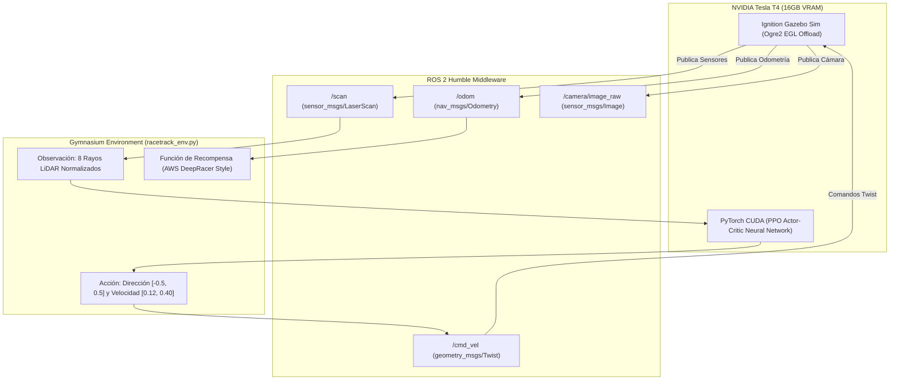

# Informe Técnico Completo: Navegación Autónoma con Aprendizaje por Refuerzo (Deep RL) en ROS 2 + Gazebo Sim (AWS EC2 GPU T4)

---

## 📄 Resumen Ejecutivo

Este documento constituye el informe técnico de arquitectura, lógica de control, aceleración por hardware y sugerencias de optimización para el sistema de conducción autónoma en simulación 3D. El proyecto integra **ROS 2 Humble**, **Ignition Gazebo (Fortress)**, **Gymnasium** y **Stable-Baselines3 (PPO)** ejecutados en una instancia **AWS EC2 con aceleración por GPU NVIDIA Tesla T4 (16GB VRAM)**.

---

## 1. Arquitectura General e Infraestructura de Hardware

El pipeline completo se ejecuta de forma desacoplada y paralela aprovechando la aceleración por GPU en dos frentes independientes:



### Detalle de Infraestructura:
1. **GPU (NVIDIA Tesla T4):**
   * **Aceleración Gráfica 3D (EGL):** Mediante `libEGL_nvidia.so.0` y las variables de entorno `__NV_PRIME_RENDER_OFFLOAD=1` y `__GLX_VENDOR_LIBRARY_NAME=nvidia`, el motor gráfico Ogre2 de Gazebo renderiza sensores sin requerir un servidor X11.
   * **Aceleración de Cómputo PyTorch (CUDA):** El modelo PPO procesa los gradientes de la Red Neuronal mediante Tensor Cores en VRAM (dispositivo `cuda:0`).
2. **Sistema Robótico (ROS 2 Humble):**
   * `ros_gz_bridge` actúa como puente bi-direccional de mensajes de alta velocidad entre la física del simulador y los nodos de control en ROS 2.

---

## 2. Definición del Entorno Gymnasium (`RacetrackEnv`)

El entorno [racetrack_env.py](file:///home/akenitoy/robot-vision-sim/src/sim_vision_test/sim_vision_test/racetrack_env.py) implementa la interfaz estándar de Gymnasium (`gym.Env`).

### A. Espacio de Observaciones (State Space)
El vector de observación consiste en **8 valores continuos normalizados en el rango $[0.0, 1.0]$**:

$$\mathbf{S}_t = \left[ r_0, r_1, r_2, r_3, r_4, r_5, r_6, r_7 \right] \quad \text{donde } r_i = \frac{\min(\text{rayo}_i, 10.0)}{10.0}$$

* Los 8 rayos están distribuidos equitativamente en un abanico frontal/lateral del LiDAR de 360° para detectar bordes y curvas de la pista.

### B. Espacio de Acciones (Action Space)
El espacio de acción es continuo de 2 dimensiones ($a_t \in \mathbb{R}^2$):

1. **Dirección ($\text{steer}$):** Angulo angular en radianes $[\mathbf{-0.50}, \mathbf{+0.50}]$ rad ($\approx \pm 28.6^\circ$).
2. **Velocidad ($\text{speed}$):** Velocidad lineal en m/s $[\mathbf{0.12}, \mathbf{0.40}]$ m/s.

### C. Función de Recompensa (AWS DeepRacer Style)
La función de recompensa premia el avance rápido sobre el eje central del carril y castiga desviaciones o choques:

$$R_t = \underbrace{v_t \cdot \cos(\theta_{\text{diff}})}_{\text{Avance Alineado}} - \underbrace{0.5 \cdot |d_{\text{centro}}|}_{\text{Penalización de Desviación}} - \underbrace{\text{Castigo}_{\text{choque}}}_{\text{Si } |d_{\text{centro}}| > 0.85\text{m}}$$

Donde:
* $v_t$: Velocidad lineal actual.
* $\theta_{\text{diff}}$: Ángulo entre la orientación del vehículo y el vector tangente del segmento de pista.
* $d_{\text{centro}}$: Distancia perpendicular en metros desde el vehículo al centro del carril.
* $\text{Castigo}_{\text{choque}} = -10.0$ si el vehículo cruza la pared del carril ($|d_{\text{centro}}| > 0.85$ m).

---

## 3. Algoritmo PPO (Proximal Policy Optimization)

Usamos **PPO de Stable-Baselines3**, el algoritmo estándar en robótica autónoma por su estabilidad y convergencia suave.

### ¿Por qué PPO sobre otros algoritmos?
1. **Actor-Critic (Dos Redes Neuronaes):**
   * **Actor:** Decide la mejor acción $(\text{steer}, \text{speed})$ según los 8 rayos del LiDAR.
   * **Critic:** Evalúa qué tan buena fue esa decisión (predice el valor esperado de la recompensa futura $V(s)$).
2. **Clipped Surrogate Objective:** Evita cambios drásticos en la política entre iteraciones, garantizando que el auto no "olvide" cómo conducir tras una actualización mala.

### Hiperparámetros Optimizados para Tesla T4:
* **`policy`**: `"MlpPolicy"` (Red Multicapa 2x64 neuronas).
* **`device`**: `"cuda"` (Ejecución directa en GPU).
* **`n_steps`**: `2048` (Recolecta 2,048 pasos de experiencia por iteración).
* **`batch_size`**: `256` (Minibatch grande para aprovechar los Tensor Cores de la T4).
* **`n_epochs`**: `10` (Épocas de optimización SGD por batch).
* **`learning_rate`**: `3e-4` (Tasa de aprendizaje del optimizador Adam).
* **`gamma`**: `0.99` (Factor de descuento de recompensas futuras).

---

## 4. Guía de Mejoras y Optimizaciones Futuras

Si deseas llevar el rendimiento de la IA al siguiente nivel, aquí están las mejoras recomendadas clasificadas por impacto:

### 1️⃣ Incorporar la Velocidad Actual en el Vector de Estado (Impacto: ALTO)
* **Situación:** Actualmente la IA solo ve 8 distancias de LiDAR ($8$ variables). No sabe a qué velocidad se está desplazando.
* **Mejora:** Ampliar el espacio de observaciones a **10 variables**:
  $$\mathbf{S}_t = \left[ r_0, \dots, r_7, \frac{v_{\text{actual}}}{0.40}, \frac{\text{steer}_{\text{anterior}}}{0.50} \right]$$
* **Beneficio:** Permitirá a la IA aprender a frenar antes de ingresar a una curva cerrada.

### 2️⃣ Recompensa con Anticipación (Lookahead Distance)
* **Situación:** La recompensa actual evalúa la alineación con el segmento presente.
* **Mejora:** Calcular la alineación con el waypoint situado **1.5 metros adelante**.
* **Beneficio:** El carro aprenderá a trazar curvas suaves anticipadas (aprovechando el vértice interno de las curvas).

### 3️⃣ Integrar la Cámara ZED (CNNPolicy - Conducción Pura por Visión)
* **Situación:** Actualmente el carro conduce por LiDAR.
* **Mejora:** Cambiar la política en `train_sb3.py` a `"CnnPolicy"` y alimentar las imágenes redimensionadas ($84 \times 84$ píxeles en escala de grises) de la cámara `/camera/image_raw`.
* **Beneficio:** Permite conducción visual autónoma como los autos de tamaño real.

---

## 5. Resumen de Comandos de Operación

### Lanzamiento Completo en AWS:

```bash
# 1. Actualizar y Compilar
cd /home/ubuntu/robot-vision-sim
git pull origin main
source /opt/ros/humble/setup.bash
colcon build --packages-select sim_vision_test
source install/setup.bash

# 2. Terminal 1: Simulación Gazebo en GPU T4
ros2 launch launch/robot_camera.launch.py world:=racetrack headless:=true

# 3. Terminal 2: Cámara en Vivo
ros2 run rqt_image_view rqt_image_view

# 4. Terminal 3: Entrenamiento PPO en GPU T4
ros2 run sim_vision_test train_sb3

# 5. Terminal 4: Monitoreo de Hardware
nvidia-smi
```

---

*Informe generado para el proyecto Robot Vision Sim — ROS 2 Humble & Deep RL.*
