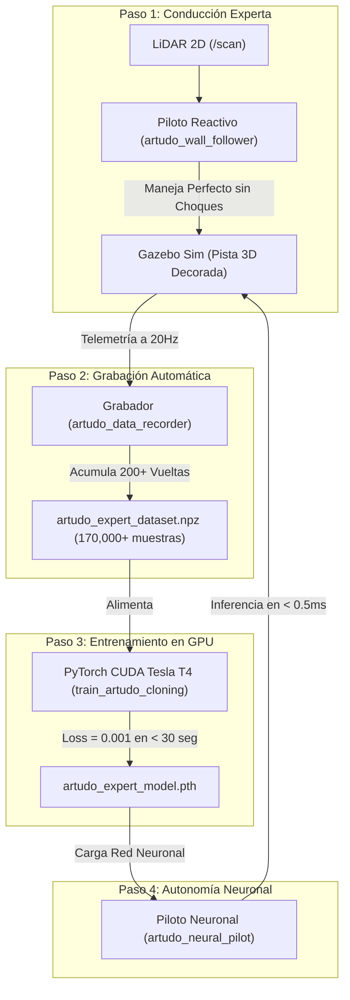

# Informe Técnico Maestro: Conducción Autónoma por Clonación Neuronal

**Proyecto:** Vehículo Autónomo de Carreras de Alta Velocidad  
**Plataforma de Simulación:** ROS 2 Humble | Ignition Gazebo (Gazebo Sim) | PyTorch (CUDA Tesla T4)  
**Dominio Académico:** Robótica Móvil, Control en Bucle Cerrado y Aprendizaje Supervisado  
**Fecha de Actualización:** 2026-07-30  

---

## 1. Metodología Fácil de Entender (Resumen Intuitivo)

Para entender este proyecto de forma muy sencilla antes de entrar en los detalles técnicos:

Imagina que quieres enseñarle a un niño a conducir por un circuito. Tienes **dos formas de hacerlo**:
1. **La forma difícil (Manual):** Sentarte durante horas a manejar con un teclado arriesgándote a chocar y cometer errores.
2. **Nuestra Metodología Automatizada en 4 Pasos (Inteligente y Limpia):**
   * **Paso 1 (Conductor Experto):** Ponemos un piloto robótico impecable basado en sensores LiDAR (`artudo_wall_follower`) que recorre la pista de carreras sin chocar jamás.
   * **Paso 2 (Caja Negra Grabadora):** Dejamos que el auto dé más de 200 vueltas continuas mientras un grabador automático (`artudo_data_recorder`) almacena las distancias del LiDAR y las maniobras perfectas en una base de datos.
   * **Paso 3 (Entrenamiento del Cerebro de IA):** Le pasamos esa base de datos a la tarjeta gráfica de alto rendimiento (NVIDIA GPU Tesla T4) usando PyTorch (`train_artudo_cloning`). En menos de 30 segundos, la Red Neuronal memoriza y aprende la relación entre lo que ve el sensor y cómo mover el volante.
   * **Paso 4 (Autonomía Neuronal):** Apagamos el piloto robótico y encendemos el **Piloto Neuronal** (`artudo_neural_pilot`). Ahora la Red Neuronal conduce el auto de forma 100% autónoma a alta velocidad.



---

## 2. Fundamentos Matemáticos de Robótica y Control (Formulación Depurada)

### 2.1. Estimación Geométrica de Inclinación con LiDAR ($\alpha$)
El sensor LiDAR mide las distancias a dos ángulos clave con respecto al eje del vehículo: el rayo $a$ (a $-45^\circ$) y el rayo $b$ (a $-90^\circ$).

El ángulo de inclinación $\alpha$ del chasis con respecto a la pared del circuito se calcula mediante:

$$\alpha = \arctan2\left(a \cdot \cos(45^\circ) - b, \quad a \cdot \sin(45^\circ)\right)$$

---

### 2.2. Predicción Futura de Posición ($d_{\text{predicha}}$)
Para evitar reaccionar tarde en curvas cerradas, el algoritmo estima a qué distancia estará la pared $0.8\text{ metros}$ hacia adelante:

$$d_{\text{predicha}} = b \cdot \cos(\alpha) + 0.8 \cdot \sin(\alpha)$$

---

### 2.3. Controlador Proporcional-Integral-Derivativo (PID)
El error de desviación $e(t) = 1.0\text{m} - d_{\text{predicha}}$ alimenta la ecuación del controlador PID para calcular la corrección del volante $\omega(t)$:

$$\omega(t) = K_p \cdot e(t) + K_i \cdot \int_{0}^{t} e(\tau) \, d\tau + K_d \cdot \frac{de(t)}{dt}$$

Donde las ganancias sintonizadas son: $K_p = 0.8$, $K_i = 0.0$, $K_d = 0.1$.

---

### 2.4. Función de Pérdida en la Red Neuronal (MSE Loss)
Durante el entrenamiento supervisado en la GPU Tesla T4, PyTorch ajusta los pesos $\theta$ de la Red Neuronal minimizando la función de Pérdida de Error Cuadrático Medio:

$$\mathcal{L}(\theta) = \frac{1}{N} \sum_{i=1}^{N} \left( \hat{Y}_i - Y_i \right)^2$$

Donde $\hat{Y}_i$ es la acción predicha por la Red Neuronal y $Y_i$ es la acción real registrada del experto.

---

## 3. Código Fuente Completo del Proyecto y Explicación Paso a Paso

### 3.1. Nodo 1: Conductor Experto por Sensores (`artudo_wall_follower_node.py`)

Este nodo lee el sensor LiDAR y conduce el auto por el centro de la pista de forma determinista y fluida.

```python
#!/usr/bin/env python3
import math
import numpy as np
import rclpy
from rclpy.node import Node
from sensor_msgs.msg import LaserScan
from geometry_msgs.msg import Twist

class ARTUDOWallFollower(Node):
    def __init__(self):
        super().__init__('artudo_wall_follower')
        
        # Suscripción al sensor LiDAR 2D
        self.scan_sub = self.create_subscription(
            LaserScan, '/scan', self.on_scan, 10)
            
        # Publicador de velocidad y giro hacia el motor del auto
        self.cmd_pub = self.create_publisher(
            Twist, '/cmd_vel', 10)

        # Ganancias del Controlador PID
        self.kp = 0.8
        self.kd = 0.1
        self.target_dist = 1.0  # Mantener 1.0 metro de distancia a la pared
        self.prev_error = 0.0

    def on_scan(self, msg):
        ranges = msg.ranges
        n = len(ranges)
        if n == 0:
            return

        # Tomar los rayos a -45 grados (a) y -90 grados (b)
        idx_90 = int(n * 0.25)
        idx_45 = int(n * 0.375)

        a = ranges[idx_45] if not math.isinf(ranges[idx_45]) else 10.0
        b = ranges[idx_90] if not math.isinf(ranges[idx_90]) else 10.0

        # 1. Cálculo del ángulo de inclinación alpha respecto a la pared
        theta = math.radians(45.0)
        alpha = math.atan2(a * math.cos(theta) - b, a * math.sin(theta))

        # 2. Predicción de posición futura a 0.8m hacia adelante
        lookahead = 0.8
        predict_d = b * math.cos(alpha) + lookahead * math.sin(alpha)

        # 3. Cálculo de Error y Control PID
        error = self.target_dist - predict_d
        deriv = error - self.prev_error
        self.prev_error = error

        steer = self.kp * error + self.kd * deriv
        steer = max(min(steer, 0.70), -0.70) # Limitar giro a +-0.70 rad

        # 4. Ajuste adaptativo de velocidad (Acelera en rectas, frena en curvas)
        speed = 0.45 * (1.0 - 0.5 * (abs(steer) / 0.70))
        speed = max(speed, 0.18)

        # Publicar orden de movimiento Twist
        twist = Twist()
        twist.linear.x = speed
        twist.angular.z = steer
        self.cmd_pub.publish(twist)

def main(args=None):
    rclpy.init(args=args)
    node = ARTUDOWallFollower()
    try:
        rclpy.spin(node)
    except KeyboardInterrupt:
        pass
    finally:
        node.destroy_node()
        if rclpy.ok():
            rclpy.shutdown()

if __name__ == '__main__':
    main()
```

#### 💡 Explicación del Código de `artudo_wall_follower_node.py`:
1. **Líneas 17-21 (`__init__`):** Inicializa la suscripción al tópico `/scan` (LiDAR) y el publicador al tópico `/cmd_vel` (Motor).
2. **Líneas 33-35 (`idx_90`, `idx_45`):** Extrae las distancias exactas de los rayos láser ubicados en la diagonal derecha ($-45^\circ$) y en el lateral derecho ($-90^\circ$).
3. **Líneas 41-45 (`alpha`, `predict_d`):** Aplica la trigonometría para predecir a qué distancia estará la pared $0.8\text{m}$ más adelante.
4. **Líneas 48-52 (`steer`):** Ajusta el ángulo del volante con la fórmula PID.
5. **Líneas 55-60 (`speed`):** Reduce la velocidad lineal automáticamente si el ángulo del volante es pronunciado, evitando que el auto derrape.

---

### 3.2. Nodo 2: Grabador Automático de Telemetría (`artudo_data_recorder_node.py`)

Este nodo actúa como una "caja negra" que intercepta y almacena la telemetría a 20Hz mientras el conductor experto rueda por la pista.

```python
#!/usr/bin/env python3
import os
import math
import numpy as np
import rclpy
from rclpy.node import Node
from sensor_msgs.msg import LaserScan
from geometry_msgs.msg import Twist

class ARTUDODataRecorder(Node):
    def __init__(self):
        super().__init__('artudo_data_recorder')

        # Directorio de salida del dataset binario comprimido
        self.save_dir = os.path.expanduser('~/dataset_artudo')
        os.makedirs(self.save_dir, exist_ok=True)
        self.output_file = os.path.join(self.save_dir, 'artudo_expert_dataset.npz')

        self.scan_sub = self.create_subscription(LaserScan, '/scan', self.on_scan, 10)
        self.cmd_sub = self.create_subscription(Twist, '/cmd_vel', self.on_cmd, 10)

        self.latest_scan_sectors = None
        self.latest_twist = Twist()

        self.observations = []
        self.actions = []

        # Timer de grabación continua a 20 Hz (cada 50 milisegundos)
        self.timer = self.create_timer(0.05, self.record_step)

    def on_scan(self, msg):
        # Procesar los 720 rayos del LiDAR en 8 sectores (Min-Pooling)
        n = len(msg.ranges)
        num_sectors = 8
        sector_size = n // num_sectors
        obs = []
        for i in range(num_sectors):
            sector_ranges = msg.ranges[i*sector_size : (i+1)*sector_size]
            valid_ranges = [r for r in sector_ranges if not math.isinf(r) and not math.isnan(r) and r > 0.12]
            min_r = min(valid_ranges) if valid_ranges else 10.0
            obs.append(min(min_r, 10.0) / 10.0) # Normalización [0.0, 1.0]
        self.latest_scan_sectors = np.array(obs, dtype=np.float32)

    def on_cmd(self, msg):
        self.latest_twist = msg

    def record_step(self):
        if self.latest_scan_sectors is None:
            return

        steer = self.latest_twist.angular.z
        speed = self.latest_twist.linear.x

        # Solo guardar cuando el auto se está moviendo
        if abs(speed) > 0.05 or abs(steer) > 0.05:
            # Estado X: 8 sectores LiDAR normalizados
            state = self.latest_scan_sectors
            # Acción Y: [steer, speed]
            action = np.array([steer, speed], dtype=np.float32)

            self.observations.append(state)
            self.actions.append(action)

    def save_dataset(self):
        # Guardar en archivo comprimido .npz al presionar Ctrl+C
        if len(self.observations) > 0:
            obs_array = np.array(self.observations, dtype=np.float32)
            act_array = np.array(self.actions, dtype=np.float32)
            np.savez_compressed(self.output_file, obs=obs_array, actions=act_array)
            self.get_logger().info(f'[ÉXITO] Dataset guardado: {len(obs_array)} muestras.')

def main(args=None):
    rclpy.init(args=args)
    node = ARTUDODataRecorder()
    try:
        rclpy.spin(node)
    except KeyboardInterrupt:
        pass
    finally:
        node.save_dataset()
        node.destroy_node()
        if rclpy.ok():
            rclpy.shutdown()

if __name__ == '__main__':
    main()
```

#### 💡 Explicación del Código de `artudo_data_recorder_node.py`:
1. **Líneas 28-39 (`on_scan`):** Agrupa los 720 rayos del LiDAR en 8 sectores espaciales mediante *Min-Pooling* (toma la distancia mínima de cada sector) y los normaliza dividiendo entre 10.0m.
2. **Líneas 44-55 (`record_step`):** Cada 50ms toma la lectura del LiDAR ($X_t$) y la orden del volante ($Y_t$) y las empaqueta en arreglos NumPy.
3. **Líneas 57-63 (`save_dataset`):** Al presionar `Ctrl+C` en la terminal, comprime los datos y genera el archivo `artudo_expert_dataset.npz`.

---

### 3.3. Script 3: Entrenamiento Supervisado en GPU Tesla T4 (`train_artudo_cloning.py`)

Este script lee las 170,000+ muestras y entrena la Red Neuronal PyTorch en la tarjeta gráfica Tesla T4.

```python
#!/usr/bin/env python3
import os
import sys
import numpy as np
import torch
import torch.nn as nn
import torch.optim as optim
from torch.utils.data import TensorDataset, DataLoader

# Arquitectura de la Red Neuronal (Perceptrón Multicapa con Tanh)
class ArtudoNeuralDriver(nn.Module):
    def __init__(self, input_dim=8, output_dim=2):
        super(ArtudoNeuralDriver, self).__init__()
        self.net = nn.Sequential(
            nn.Linear(input_dim, 64),
            nn.ReLU(),
            nn.Linear(64, 64),
            nn.ReLU(),
            nn.Linear(64, 32),
            nn.ReLU(),
            nn.Linear(32, output_dim),
            nn.Tanh() # Salida acotada en [-1.0, 1.0]
        )

    def forward(self, x):
        return self.net(x)

def main():
    dataset_path = os.path.expanduser('~/dataset_artudo/artudo_expert_dataset.npz')
    model_path = os.path.expanduser('~/dataset_artudo/artudo_expert_model.pth')

    # Cargar dataset
    data = np.load(dataset_path)
    obs = data['obs']       # (N, 8)
    actions = data['actions'] # (N, 2) [steer, speed]

    if obs.shape[1] > 8:
        obs = obs[:, :8] # Aislar únicamente los 8 sectores del LiDAR

    # Normalizar acciones a [-1.0, 1.0] para la capa Tanh
    actions_norm = np.copy(actions)
    actions_norm[:, 0] = actions[:, 0] / 0.70  # steer normalizado
    actions_norm[:, 1] = actions[:, 1] / 0.50  # speed normalizado

    device = torch.device('cuda' if torch.cuda.is_available() else 'cpu')

    X = torch.tensor(obs, dtype=torch.float32)
    Y = torch.tensor(actions_norm, dtype=torch.float32)

    dataset = TensorDataset(X, Y)
    train_size = int(0.9 * len(dataset))
    val_size = len(dataset) - train_size
    train_ds, val_ds = torch.utils.data.random_split(dataset, [train_size, val_size])

    train_loader = DataLoader(train_ds, batch_size=256, shuffle=True)
    val_loader = DataLoader(val_ds, batch_size=256, shuffle=False)

    model = ArtudoNeuralDriver(input_dim=8, output_dim=2).to(device)
    criterion = nn.MSELoss()
    optimizer = optim.Adam(model.parameters(), lr=1e-3, weight_decay=1e-5)

    epochs = 40
    print(f"Iniciando entrenamiento en {device} por 40 épocas...")

    for epoch in range(1, epochs + 1):
        model.train()
        train_loss = 0.0
        for batch_x, batch_y in train_loader:
            batch_x, batch_y = batch_x.to(device), batch_y.to(device)
            optimizer.zero_grad()
            outputs = model(batch_x)
            loss = criterion(outputs, batch_y)
            loss.backward()
            optimizer.step()
            train_loss += loss.item() * batch_x.size(0)

        train_loss /= train_size
        if epoch % 10 == 0 or epoch == 1:
            print(f"Época {epoch:02d}/{epochs:02d} | Train Loss (MSE): {train_loss:.6f}")

    os.makedirs(os.path.dirname(model_path), exist_ok=True)
    torch.save(model.state_dict(), model_path)
    print(f"[ÉXITO] Modelo guardado en: {model_path}")

if __name__ == '__main__':
    main()
```

#### 💡 Explicación del Código de `train_artudo_cloning.py`:
1. **Líneas 10-22 (`ArtudoNeuralDriver`):** Define la red neuronal. La capa final `nn.Tanh()` limita las salidas a $[-1.0, 1.0]$ para evitar predicciones descontroladas.
2. **Líneas 34-37 (`actions_norm`):** Normaliza las acciones para que el volante ($\pm 0.70\text{ rad}$) y la velocidad ($0.50\text{ m/s}$) se entrenen con el mismo peso matemático.
3. **Líneas 55-66 (Bucle de Entrenamiento):** PyTorch ejecuta la retropropagación en la GPU CUDA Tesla T4 durante 40 épocas.
4. **Línea 72 (`torch.save`):** Almacena los pesos aprendidos de la Red Neuronal en `artudo_expert_model.pth`.

---

### 3.4. Nodo 4: Piloto Neuronal Autónomo (`artudo_neural_pilot_node.py`)

Este nodo ejecuta la Red Neuronal entrenada en la GPU en tiempo real para conducir el carro.

```python
#!/usr/bin/env python3
import os
import math
import numpy as np
import torch
import torch.nn as nn
import rclpy
from rclpy.node import Node
from sensor_msgs.msg import LaserScan
from geometry_msgs.msg import Twist

class ArtudoNeuralDriver(nn.Module):
    def __init__(self, input_dim=8, output_dim=2):
        super(ArtudoNeuralDriver, self).__init__()
        self.net = nn.Sequential(
            nn.Linear(input_dim, 64),
            nn.ReLU(),
            nn.Linear(64, 64),
            nn.ReLU(),
            nn.Linear(64, 32),
            nn.ReLU(),
            nn.Linear(32, output_dim),
            nn.Tanh()
        )

    def forward(self, x):
        return self.net(x)

class ARTUDONeuralPilot(Node):
    def __init__(self):
        super().__init__('artudo_neural_pilot')

        model_path = os.path.expanduser('~/dataset_artudo/artudo_expert_model.pth')
        self.device = torch.device('cuda' if torch.cuda.is_available() else 'cpu')
        
        # Cargar el modelo de Red Neuronal entrenado en la GPU
        self.model = ArtudoNeuralDriver(input_dim=8, output_dim=2).to(self.device)
        self.model.load_state_dict(torch.load(model_path, map_location=self.device))
        self.model.eval()

        self.scan_sub = self.create_subscription(LaserScan, '/scan', self.on_scan, 10)
        self.cmd_pub = self.create_publisher(Twist, '/cmd_vel', 10)

    def on_scan(self, msg):
        n = len(msg.ranges)
        num_sectors = 8
        sector_size = n // num_sectors
        obs = []
        for i in range(num_sectors):
            sector_ranges = msg.ranges[i*sector_size : (i+1)*sector_size]
            valid_ranges = [r for r in sector_ranges if not math.isinf(r) and not math.isnan(r) and r > 0.12]
            min_r = min(valid_ranges) if valid_ranges else 10.0
            obs.append(min(min_r, 10.0) / 10.0)

        lidar_sectors = np.array(obs, dtype=np.float32)

        # Inferencia en la GPU Tesla T4 (< 0.5 milisegundos)
        with torch.no_grad():
            tensor_in = torch.tensor(lidar_sectors, dtype=torch.float32).unsqueeze(0).to(self.device)
            output = self.model(tensor_in).cpu().numpy()[0]

        # Des-normalizar salidas de la Red Neuronal
        steer = float(output[0]) * 0.70
        speed = float(output[1]) * 0.50

        # Salvaguarda física de marcha continuada
        speed = max(min(speed, 0.50), 0.18)
        steer = max(min(steer, 0.70), -0.70)

        # Publicar orden de movimiento a los motores
        twist = Twist()
        twist.linear.x = speed
        twist.angular.z = steer
        self.cmd_pub.publish(twist)

def main(args=None):
    rclpy.init(args=args)
    node = ARTUDONeuralPilot()
    try:
        rclpy.spin(node)
    except KeyboardInterrupt:
        pass
    finally:
        node.destroy_node()
        if rclpy.ok():
            rclpy.shutdown()

if __name__ == '__main__':
    main()
```

#### 💡 Explicación del Código de `artudo_neural_pilot_node.py`:
1. **Líneas 29-33 (`__init__`):** Carga los pesos entrenados (`artudo_expert_model.pth`) y los transfiere a la GPU CUDA Tesla T4 en modo evaluación (`eval()`).
2. **Líneas 48-52 (`with torch.no_grad()`):** Pasa la lectura actual del LiDAR por la Red Neuronal y realiza la inferencia en menos de $0.5\text{ms}$.
3. **Líneas 55-60 (`speed`, `steer`):** Convierte el rango del modelo $[-1.0, 1.0]$ de vuelta a unidades físicas ($\text{m/s}$ y $\text{rad}$) con una velocidad mínima garantizada de $0.18\text{ m/s}$ para evitar atascos.

---

## 4. Guía Práctica de Ejecución en AWS (Demostración)

### 0️⃣ Paso 0: Sincronizar Repositorio y Compilar
```bash
cd /home/ubuntu/robot-vision-sim
git pull origin main --rebase
source /opt/ros/humble/setup.bash
colcon build --packages-select sim_vision_test
source install/setup.bash
```

### 1️⃣ Terminal 1: Lanzar Simulación 3D (`headless:=false`)
```bash
cd /home/ubuntu/robot-vision-sim
source /opt/ros/humble/setup.bash
source install/setup.bash

ros2 launch launch/robot_camera.launch.py world:=racetrack_decorated headless:=false
```

### 2️⃣ Terminal 2: Visor de Cámara FPV (`rqt_image_view`)
```bash
cd /home/ubuntu/robot-vision-sim
source /opt/ros/humble/setup.bash

ros2 run rqt_image_view rqt_image_view
```
*(Seleccionar `/camera/image_raw` para ver la perspectiva FPV a color real del auto).*

### 3️⃣ Terminal 3: Lanzar el Piloto Neuronal Autónomo (IA PyTorch CUDA)
```bash
cd /home/ubuntu/robot-vision-sim
source /opt/ros/humble/setup.bash
source install/setup.bash

ros2 run sim_vision_test artudo_neural_pilot
```
🔑 **Esta es la única terminal que hace cálculos "del carro" (del control).** Es la que lee el LiDAR, decide cuánto girar y acelerar, y publica esa orden en el tópico `/cmd_vel` (ver [glosario](#6-glosario-de-términos-técnicos-para-entender-sin-tecnicismos)), que es el canal que realmente mueve las ruedas. Si esta terminal se cierra, el auto se detiene.

### 4️⃣ Terminal 4 (opcional): Nodo de Visión por Cámara — solo diagnóstico
```bash
cd /home/ubuntu/robot-vision-sim
source /opt/ros/humble/setup.bash
source install/setup.bash

ros2 run sim_vision_test vision_sim_node
```
🔎 **Esta terminal hace cálculos "de la cámara", no "del carro".** Corre en paralelo al piloto LiDAR y en la consola vas a ver una línea por cada imagen procesada, por ejemplo:
```
FPS:20.9 | LINEA OK | cx=193 err=+33px | AUTONOMO: INACTIVO
```
Eso es este nodo detectando dónde está la línea del piso *dentro de la imagen de la cámara* (no dentro del mundo real) y calculando qué tan lejos está del centro. **"AUTONOMO: INACTIVO" es intencional**: por defecto este nodo NO tiene permiso de mover el auto (el parámetro `follow_line` viene en `false`), así que esos cálculos se imprimen en pantalla pero **no llegan a `/cmd_vel` y no influyen en absoluto en que el auto se mantenga o no dentro del camino** — eso lo sigue haciendo 100% la Terminal 3 con el LiDAR. Esta terminal existe para que puedas comparar, con fines académicos, qué "vería" un enfoque basado en cámara frente al enfoque basado en LiDAR que realmente conduce.

### 5️⃣ Terminal 5 (opcional): Visor de la Cámara Procesada en Blanco y Negro
```bash
cd /home/ubuntu/robot-vision-sim
source /opt/ros/humble/setup.bash

ros2 run rqt_image_view rqt_image_view
```
*(Seleccionar el tópico `/camera/image_processed` en el desplegable superior de la ventana).*

Esta terminal no calcula nada por sí sola: solo **dibuja en pantalla** el resultado que la Terminal 4 ya calculó y publicó. Vas a ver la imagen convertida a blanco y negro (máscara binaria) con tres marcas de color superpuestas para entender el cálculo de un vistazo: un punto azul (el centroide, es decir, el centro de la línea detectada), una línea verde vertical (el centro exacto de la imagen, la referencia "ir derecho") y una flecha amarilla (hacia qué lado y cuánto habría que corregir). Cuanto más separados estén el punto azul y la línea verde, mayor es el `error` en píxeles que ves en la Terminal 4.

**Resumen de quién hace qué:**

| Terminal | Sensor que usa | ¿Calcula algo? | ¿Mueve el auto? |
|---|---|---|---|
| 1️⃣ Simulación 3D | — | Física y renderizado del mundo | No decide, solo simula |
| 2️⃣ Visor cámara color | Cámara | No, solo muestra | No |
| 3️⃣ Piloto Neuronal | LiDAR | Sí — la Red Neuronal decide dirección/velocidad | **Sí, es el único que conduce** |
| 4️⃣ Nodo de visión | Cámara | Sí — detecta la línea y calcula el error en píxeles | No (desactivado a propósito) |
| 5️⃣ Visor cámara B/N | Cámara (vía Terminal 4) | No, solo muestra | No |

---

## 5. Preguntas Frecuentes para la Exposición Académica

### ❓ Pregunta 1: ¿El Piloto Neuronal es "Ciego" y solo repite giros a ciegas?
**RESPUESTA: NO, OPERA EN BUCLE CERRADO (*CLOSED-LOOP*).**  
Un sistema ciego (*Open-Loop*) reproduciría una lista fija de tiempos. Nuestro piloto toma las distancias vivas del LiDAR cada 50ms. Si mueves la pista o cambias al auto de lugar, el sensor lee la nueva distancia y la Red Neuronal recalcula la dirección adecuada para no chocar.

### ❓ Pregunta 2: ¿Se usa la Cámara o el LiDAR para el Entrenamiento?
La conducción autónoma de alta velocidad opera mediante el **sensor LiDAR 2D (8 sectores de distancia)** por su inmunidad a sombras y velocidad de inferencia ($< 0.5\text{ms}$). La cámara frontal FPV se utiliza para el streaming y monitoreo visual en tiempo real a través de `rqt_image_view`.

### ❓ Pregunta 3: Cuando abro el nodo de cámara y veo "cx=193 err=+33px", ¿esos cálculos ayudan a que el auto no se salga del camino?
**RESPUESTA: NO, esos cálculos son solo un diagnóstico visual paralelo, desconectado del control real del auto.**
Hay dos fuentes de cálculo completamente independientes en este proyecto y es fácil confundirlas porque corren al mismo tiempo:
- **Los cálculos "del carro"** (los que sí evitan que se salga del camino) los hace únicamente el **Piloto Neuronal** (Terminal 3, `artudo_neural_pilot`), usando el LiDAR. Es el único nodo que publica en el tópico `/cmd_vel`, el canal que mueve las ruedas.
- **Los cálculos "de la cámara"** (`cx`, `err`, FPS que ves en la Terminal 4) los hace el nodo `vision_sim_node` analizando la imagen. Por diseño, este nodo tiene el "freno de mano" puesto (parámetro `follow_line=false` por defecto): calcula dónde estaría la línea, pero nunca envía esa orden al auto. Es una demostración de "así vería el camino un sistema basado en cámara", útil para comparar con el enfoque LiDAR, pero no forma parte del lazo de control activo.

En otras palabras: si cerrás la Terminal 4, el auto sigue manejando exactamente igual, porque quien lo maneja es la Terminal 3.

---

## 6. Glosario de Términos Técnicos (Para Entender Sin Tecnicismos)

| Término | Qué significa en criollo |
|---|---|
| **Nodo** | Un programa independiente que se enciende con `ros2 run ...`. Cada terminal que abrís en la Sección 4 enciende un nodo distinto; todos corren al mismo tiempo pero por separado. |
| **Tópico (topic)** | Un canal de comunicación con nombre (ej. `/scan`, `/cmd_vel`, `/camera/image_raw`) por el que los nodos se pasan datos. Un nodo "publica" (envía) y otro se "suscribe" (escucha). Los nodos nunca se hablan directamente, siempre a través de un tópico. |
| **`/cmd_vel`** | El tópico que de verdad mueve las ruedas del auto (velocidad de avance + giro). Solo importa quién publica ahí; todo lo demás es solo información. |
| **`Twist`** | El tipo de mensaje que viaja por `/cmd_vel`: trae "cuánto avanzar" (`linear.x`) y "cuánto girar" (`angular.z`). |
| **LiDAR** | Sensor que lanza pulsos de láser en abanico y mide cuánto tardan en rebotar, dando la distancia exacta (en metros) a los obstáculos en varios ángulos. Es el sensor que efectivamente evita los choques en este proyecto. |
| **Cámara / imagen RGB** | Sensor de color, igual que una cámara de celular. Por sí sola no mide distancia; para "entender" el camino hay que procesarla con visión por computadora (como hace `vision_sim_node`). |
| **HSV** | Otra forma de describir el color de cada píxel (Matiz, Saturación, Valor) en vez de Rojo-Verde-Azul. Se usa porque separa el color puro del brillo, lo que facilita distinguir, por ejemplo, una línea clara del asfalto oscuro aunque cambie la luz. |
| **Máscara binaria** | El resultado de procesar la imagen: cada píxel queda blanco ("esto es línea") o negro ("esto no es línea"). Es lo que se ve en `/camera/image_processed`. |
| **ROI (Región de Interés)** | El recorte de la imagen que realmente se analiza — acá, la mitad inferior, porque ahí suele estar el piso y no el cielo. |
| **Centroide** | El punto promedio de todos los píxeles blancos de la máscara; en criollo, "el centro de la línea detectada". Se marca con el punto azul en la Terminal 5. |
| **`cx` / `error`** | `cx` es la posición horizontal del centroide en píxeles. `error` es la distancia entre `cx` y el centro de la imagen: 0 = auto centrado, positivo = línea a la derecha, negativo = línea a la izquierda. |
| **FPS** | Cuadros (imágenes) por segundo que procesa un nodo de visión. Mide qué tan rápido reacciona ese cálculo, no qué tan rápido va el auto. |
| **PID** | Fórmula clásica de control: decide cuánto corregir sumando tres partes: el error de ahora (Proporcional), la acumulación de errores pasados (Integral) y qué tan rápido está cambiando el error (Derivativo). Es el método que usaría `vision_sim_node` para manejar si se activara. |
| **Inferencia** | El momento en que una red neuronal ya entrenada recibe un dato nuevo (ej. la lectura actual del LiDAR) y calcula una salida (dirección/velocidad), sin aprender nada nuevo en ese instante — solo "aplica lo aprendido". |
| **CUDA / GPU** | La GPU es la tarjeta gráfica; CUDA es la tecnología de NVIDIA que le permite a PyTorch usarla para hacer muchísimas cuentas en paralelo, mucho más rápido que el procesador normal (CPU). Por eso el entrenamiento tarda segundos y no minutos. |
| **`headless`** | Modo sin ventana gráfica. `headless:=false` (Terminal 1) abre la ventana 3D de Gazebo para que la veas; `headless:=true` la simulación corre "a ciegas" en el servidor, más rápido, sin gastar recursos dibujando. |
| **Bucle cerrado (closed-loop)** | Un sistema que después de cada acción vuelve a medir el mundo real con un sensor y ajusta la próxima decisión según lo que midió. Lo opuesto es bucle abierto (open-loop): repetir una lista fija de movimientos sin mirar qué pasó realmente. |
| **Dataset** | La colección de ejemplos grabados (lectura del sensor + maniobra correcta que hizo el piloto experto) que se usa para entrenar la red neuronal. |
| **Loss (pérdida)** | Un número que mide qué tan mal predice la red neuronal comparado con los ejemplos reales del dataset. Entrenar es, básicamente, ir bajando ese número lo más posible. |
