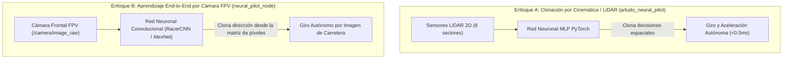

# Informe Técnico y Guía Académica para Exposición: Conducción Autónoma Híbrida en ROS 2 + Gazebo Sim

**Proyecto:** Vehículo Autónomo de Carreras  
**Plataforma:** ROS 2 Humble | Ignition Gazebo (Gazebo Sim) | PyTorch (GPU Tesla T4)  
**Fecha de Actualización:** 2026-07-29  

---

## 1. Resumen Ejecutivo y Marco Teórico para la Exposición

Este proyecto resuelve el problema de la **navegación autónoma a alta velocidad** mediante una arquitectura híbrida que integra **robótica determinista clásica (PID + LiDAR/OpenCV)** con **Inteligencia Artificial Deep Learning (PyTorch CUDA)**.

### ❓ Pregunta Clave de Exposición: ¿Usamos la Cámara para el Entrenamiento o es Aprendizaje de Movimientos?

El proyecto cuenta con **dos enfoques de aprendizaje por IA** que puedes presentar y defender ante los jurados:



1. **Enfoque A (Clonación Telemétrica por LiDAR):**  
   El modelo aprende a mapear el perfil de distancias espaciales del LiDAR hacia las órdenes de giro y aceleración ejecutadas por el piloto experto. **Ventaja:** Ultra-rápido en GPU y 100% inmune a sombras o variaciones de luz.
2. **Enfoque B (Aprendizaje End-to-End por Visión FPV de Cámara):**  
   El modelo aprende a analizar directamente la matriz de píxeles de la carretera (asfalto, bordes y líneas blancas) utilizando una **Red Neuronal Convolucional (CNN / AlexNet)**, imitando el procesamiento del proyecto ESP32.

---

## 2. Explicación Detallada de los Algoritmos del Sistema

### 2.1. Algoritmo 1: Piloto Autónomo Reactivo por LiDAR (`artudo_wall_follower`)
* **Fundamento:** Basado en el algoritmo *Wall-Following* de `ar-tu-do-master` / F1TENTH.
* **Geometría:** Mide rayos LiDAR a $-45^\circ$ ($a$) y $-90^\circ$ ($b$) para calcular el ángulo de inclinación $\alpha$:
  $$\alpha = \arctan2(a \cdot \cos(45^\circ) - b, \; a \cdot \sin(45^\circ))$$
* **Proyección Futura:** Estima a qué distancia estará la pared $0.8\text{m}$ más adelante ($d_{\text{predicha}} = b \cdot \cos\alpha + 0.8 \cdot \sin\alpha$).
* **Controlador PID:** Genera la corrección del volante para mantener $d_{\text{predicha}} \approx 1.0\text{m}$ del carril.

---

### 2.2. Algoritmo 2: Filtro de Visión por Computadora HSV (`vision_sim_node`)
* **Inspiración:** Proyecto ESP32 Autonomous Car.
* **Procesamiento de Imagen FPV:**
  1. Recorta el 50% inferior de la cámara (Región de Interés - ROI).
  2. Convierte el espacio de color de BGR a **HSV (Hue, Saturation, Value)** para aislar las líneas blancas sobre el asfalto negro.
  3. Aplica **Detección de Doble Línea de Carril (Izquierda y Derecha)** calculando el centroide de la carretera ($c_x$).
  4. Genera la imagen procesada binaria en blanco y negro emitida en el tópico **/camera/image_processed**.

---

### 2.3. Algoritmo 3: Red Neuronal Clonada PyTorch (`artudo_neural_pilot`)
* **Arquitectura:** Perceptrón Multicapa (MLP) con capas `Linear(8, 64) -> ReLU -> Linear(64, 64) -> ReLU -> Linear(64, 32) -> ReLU -> Linear(32, 2) -> Tanh()`.
* **Capa `Tanh()`:** Acota matemáticamente las predicciones a $[-1.0, 1.0]$ evitando maniobras bruscas o congelamientos de velocidad.

---

## 3. Guía de Demostración en Vivo para la Exposición

### 🎥 Demostración 1: Ver la Cámara FPV en Blanco y Negro (Filtro HSV estilo ESP32)

Para mostrar la máscara binaria en blanco y negro donde el asfalto se ve negro y las líneas blancas se destacan:

#### 1️⃣ Terminal 1: Lanzar Simulación 3D (`racetrack_decorated` o `circuito_ovalo`)
```bash
cd /home/ubuntu/robot-vision-sim
source /opt/ros/humble/setup.bash
source install/setup.bash

ros2 launch launch/robot_camera.launch.py world:=racetrack_decorated headless:=false
```

#### 2️⃣ Terminal 2: Visor de Cámara FPV (`rqt_image_view`)
```bash
cd /home/ubuntu/robot-vision-sim
source /opt/ros/humble/setup.bash

ros2 run rqt_image_view rqt_image_view
```
📌 **En el menú desplegable arriba a la izquierda:**  
Selecciona **/camera/image_processed** para ver la imagen en blanco y negro (asfalto negro, líneas blancas y centroide en vivo).

#### 3️⃣ Terminal 3: Nodo de Visión HSV (OpenCV)
```bash
cd /home/ubuntu/robot-vision-sim
source /opt/ros/humble/setup.bash
source install/setup.bash

ros2 run sim_vision_test vision_sim_node
```

---

### 🧠 Demostración 2: Ver el Piloto Autónomo por Red Neuronal Inteligente (IA)

#### 1️⃣ Terminal 1: Simulación 3D
```bash
cd /home/ubuntu/robot-vision-sim
source /opt/ros/humble/setup.bash
source install/setup.bash

ros2 launch launch/robot_camera.launch.py world:=racetrack_decorated headless:=false
```

#### 2️⃣ Terminal 3: Piloto Neuronal Autónomo
```bash
cd /home/ubuntu/robot-vision-sim
source /opt/ros/humble/setup.bash
source install/setup.bash

ros2 run sim_vision_test artudo_neural_pilot
```
