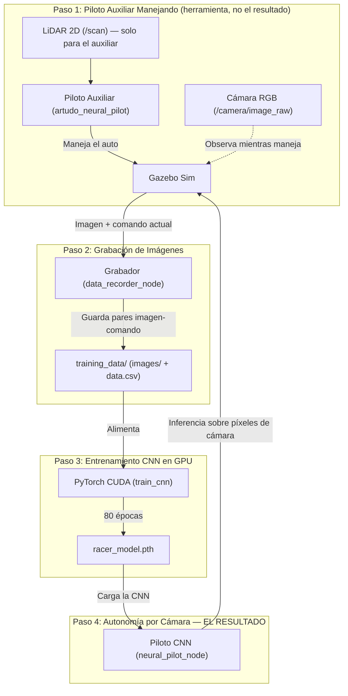
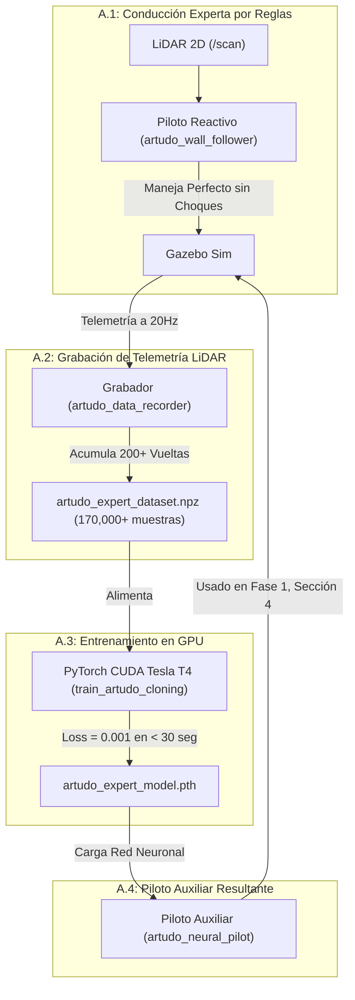

# Informe Técnico Maestro: Piloto Autónomo por Cámara (Visión + Deep Learning)

**Proyecto:** Vehículo Autónomo de Carreras — Conducción Autónoma por Cámara mediante Red Neuronal Convolucional (CNN)  
**Plataforma de Simulación:** ROS 2 Humble | Ignition Gazebo (Gazebo Sim) | PyTorch (CUDA Tesla T4)  
**Dominio Académico:** Visión por Computadora, Deep Learning End-to-End y Control en Bucle Cerrado  
**Fecha de Actualización:** 2026-07-30

---

## 1. Metodología Fácil de Entender (Resumen Intuitivo)

Para entender este proyecto de forma muy sencilla antes de entrar en los detalles técnicos:

Imagina que quieres enseñarle a un niño a conducir por un circuito mirando solo por el parabrisas, sin explicarle reglas — simplemente mostrándole muchos ejemplos de un buen conductor manejando, hasta que el niño aprende a imitarlo con la vista. Eso es exactamente lo que hace este proyecto: una **Red Neuronal Convolucional (CNN)** aprende a manejar el auto mirando **únicamente la cámara**, sin ningún sensor de distancia y sin ninguna regla de color programada a mano.

**Los 4 pasos de la metodología:**

* **Paso 1 (Piloto Experto Auxiliar):** Para generar los ejemplos de "buen manejo" que la CNN necesita para aprender, usamos un piloto robótico que ya maneja perfecto (`artudo_neural_pilot`, basado en sensores LiDAR). ⚠️ **Este piloto no es el resultado del proyecto** — es solo una herramienta auxiliar que conduce mientras la cámara graba lo que ve. Ver la Nota 1.1 abajo.
* **Paso 2 (Grabadora de Imágenes):** Mientras el piloto auxiliar maneja, un grabador (`data_recorder_node`) guarda cada imagen de la cámara junto con el comando de manejo que se estaba usando en ese instante.
* **Paso 3 (Entrenamiento de la CNN):** Un script (`train_cnn`) entrena la Red Neuronal Convolucional en la GPU para que, a partir de la imagen cruda de la cámara, prediga la velocidad y el giro correctos (80 épocas).
* **Paso 4 (Autonomía por Visión — el resultado del proyecto):** Se apaga el piloto auxiliar y se enciende el **Piloto CNN** (`neural_pilot_node`), que maneja el auto viendo exclusivamente la cámara, sin LiDAR.



### 1.1. Nota Importante: ¿Por Qué Aparece un Piloto LiDAR en el Paso 1?

Es la pregunta más común al leer este informe, así que se aclara de entrada: **el LiDAR no es el foco de este proyecto.** Entrenar una CNN por imitación requiere ejemplos de manejo correcto — alguien (o algo) tiene que manejar bien primero para que la cámara "vea" cómo se hace. En vez de manejar manualmente con teclado durante horas, se reutiliza un piloto que ya existía y ya maneja perfecto, basado en LiDAR, únicamente como **generador automático de ejemplos**.

Ese piloto auxiliar es, en sí mismo, el resultado de otro proceso de entrenamiento previo (LiDAR → Red Neuronal simple), documentado en el **Apéndice A** de este informe. Se incluye ahí solo por completitud académica y trazabilidad — **el entregable real de este proyecto es el Piloto CNN por Cámara del Paso 4**, que es el que efectivamente se evalúa, se explica en detalle en la Sección 3, y se ejecuta en la Sección 4.

---

## 2. Fundamentos Matemáticos

Las Secciones 2.1 a 2.4 corresponden al control clásico que usa el **piloto auxiliar** (Apéndice A) para generar los datos de entrenamiento. La Sección 2.5 corresponde a la **CNN**, que es el foco central del proyecto.

### 2.1. Estimación Geométrica de Inclinación con LiDAR ($\alpha$)
El sensor LiDAR del piloto auxiliar mide las distancias a dos ángulos clave con respecto al eje del vehículo: el rayo $a$ (a $-45^\circ$) y el rayo $b$ (a $-90^\circ$).

El ángulo de inclinación $\alpha$ del chasis con respecto a la pared del circuito se calcula mediante:

$$\alpha = \arctan2\left(a \cdot \cos(45^\circ) - b, \quad a \cdot \sin(45^\circ)\right)$$

---

### 2.2. Predicción Futura de Posición ($d_{\text{predicha}}$)
Para evitar reaccionar tarde en curvas cerradas, el algoritmo estima a qué distancia estará la pared $0.8\text{ metros}$ hacia adelante:

$$d_{\text{predicha}} = b \cdot \cos(\alpha) + 0.8 \cdot \sin(\alpha)$$

---

### 2.3. Controlador Proporcional-Integral-Derivativo (PID)
El error de desviación $e(t) = 1.0\text{m} - d_{\text{predicha}}$ alimenta la ecuación del controlador PID para calcular la corrección del volante $\omega(t)$:

$$\omega(t) = K_p \cdot e(t) + K_i \cdot \int_{0}^{t} e(\tau) \, d\tau + K_d \cdot \frac{de(t)}{dt}$$

Donde las ganancias sintonizadas son: $K_p = 0.8$, $K_i = 0.0$, $K_d = 0.1$.

---

### 2.4. Función de Pérdida en la Red Neuronal (MSE Loss)
Durante el entrenamiento supervisado en la GPU Tesla T4, PyTorch ajusta los pesos $\theta$ de la Red Neuronal minimizando la función de Pérdida de Error Cuadrático Medio. Esta fórmula aplica tanto al piloto auxiliar (Apéndice A) como a la CNN (Sección 3):

$$\mathcal{L}(\theta) = \frac{1}{N} \sum_{i=1}^{N} \left( \hat{Y}_i - Y_i \right)^2$$

Donde $\hat{Y}_i$ es la acción predicha por la Red Neuronal y $Y_i$ es la acción real registrada del experto.

---

### 2.5. Operación de Convolución (Extracción de Características Visuales) — Núcleo Matemático de la CNN

A diferencia de una red que recibe pocos números (como el piloto auxiliar), la CNN recibe una imagen completa. Cada capa convolucional desliza un filtro (kernel) $K$ de tamaño $k \times k$ sobre la imagen de entrada $I$, calculando en cada posición $(x,y)$ una suma ponderada:

$$F(x,y) = \sum_{i=0}^{k-1}\sum_{j=0}^{k-1} I(x+i,\, y+j) \cdot K(i,j)$$

El resultado $F$ es un "mapa de características": una nueva imagen más pequeña donde los valores altos marcan dónde el filtro encontró el patrón que aprendió a detectar (ej. un borde, un cambio de color). Apilando varias capas convolucionales (ver arquitectura `RacerCNN`, Sección 3.2), la red pasa de detectar bordes simples en las primeras capas a detectar patrones compuestos (como la curvatura del borde de la pista) en las capas finales — sin que ningún humano programe esa regla a mano, se ajusta sola durante el entrenamiento minimizando la misma función de pérdida MSE de la Sección 2.4.

---

## 3. Código Fuente del Piloto CNN por Cámara (Foco Principal del Proyecto)

### 3.1. Nodo 1: Grabador de Imágenes para la CNN (`data_recorder.py`)

Este nodo graba la imagen de la cámara junto con el comando de manejo vigente en ese instante (emitido por el piloto auxiliar del Apéndice A), para construir el dataset que luego entrena la CNN.

```python
import rclpy
from rclpy.node import Node
from sensor_msgs.msg import Image
from geometry_msgs.msg import Twist
from cv_bridge import CvBridge
import cv2
import csv
import os
import time

class DataRecorderNode(Node):
    def __init__(self):
        super().__init__('data_recorder_node')

        # Directorio de guardado de datos
        self.data_dir = os.path.expanduser('~/training_data')
        self.images_dir = os.path.join(self.data_dir, 'images')
        os.makedirs(self.images_dir, exist_ok=True)

        self.csv_path = os.path.join(self.data_dir, 'data.csv')
        self.csv_fileExists = os.path.exists(self.csv_path)

        # Crear archivo CSV e incluir cabecera si es nuevo
        self.csv_file = open(self.csv_path, 'a', newline='')
        self.csv_writer = csv.writer(self.csv_file)
        if not self.csv_fileExists:
            self.csv_writer.writerow(['image_path', 'linear_x', 'angular_z'])
            self.csv_file.flush()

        self.bridge = CvBridge()
        self.latest_twist = Twist()

        # Suscripción a la cámara
        self.image_sub = self.create_subscription(
            Image, '/camera/image_raw', self.image_callback, 10)

        # Suscripción a cmd_vel (comandos del piloto activo)
        self.cmd_sub = self.create_subscription(
            Twist, '/cmd_vel', self.cmd_callback, 10)

        self.frame_count = 0

    def cmd_callback(self, msg):
        self.latest_twist = msg

    def image_callback(self, msg):
        # Solo grabamos datos si el carro se esta moviendo (conduccion activa)
        linear = self.latest_twist.linear.x
        angular = self.latest_twist.angular.z

        if abs(linear) > 0.01 or abs(angular) > 0.01:
            try:
                frame = self.bridge.imgmsg_to_cv2(msg, 'bgr8')
                frame_resized = cv2.resize(frame, (160, 120))

                timestamp = int(time.time() * 1000)
                img_filename = f"frame_{timestamp}_{self.frame_count:05d}.png"
                img_path = os.path.join(self.images_dir, img_filename)

                cv2.imwrite(img_path, frame_resized)

                rel_img_path = os.path.join('images', img_filename)
                self.csv_writer.writerow([rel_img_path, linear, angular])
                self.csv_file.flush()

                self.frame_count += 1

            except Exception as e:
                self.get_logger().error(f"Error al grabar frame: {e}")

    def destroy_node(self):
        self.csv_file.close()
        super().destroy_node()

def main(args=None):
    rclpy.init(args=args)
    node = DataRecorderNode()
    try:
        rclpy.spin(node)
    except KeyboardInterrupt:
        pass
    finally:
        node.destroy_node()
        if rclpy.ok():
            rclpy.shutdown()

if __name__ == '__main__':
    main()
```

#### 💡 Explicación del Código de `data_recorder.py`:
1. **Líneas 16-28 (`__init__`):** Crea `~/training_data/images/` y abre `data.csv` en modo `'a'` (append/agregar) — si ya existía de una grabación anterior, sigue sumando filas nuevas sin borrar nada.
2. **Líneas 34-39 (suscripciones):** Escucha simultáneamente `/camera/image_raw` (la imagen) y `/cmd_vel` (el comando que esté manejando el auto en ese momento — en la Fase 1 de la Sección 4, ese comando lo emite el piloto auxiliar del Apéndice A).
3. **Líneas 48-53 (`image_callback`):** Solo guarda un frame si el auto se está moviendo de verdad (evita llenar el dataset de fotos del auto parado sin hacer nada).
4. **Líneas 61-70:** Cada imagen se reduce a 160×120 píxeles (igual tamaño que espera la CNN) y se guarda en disco; la fila correspondiente en el CSV queda `(ruta_imagen, velocidad_lineal, velocidad_angular)`.

---

### 3.2. Script 2: Entrenamiento de la Red Convolucional (`train_cnn.py`)

Este script lee el dataset de imágenes grabado en la Sección 3.1 y entrena una CNN de extremo a extremo (*end-to-end*): recibe píxeles crudos, produce comandos de manejo.

```python
import torch
import torch.nn as nn
import torch.optim as optim
from torch.utils.data import Dataset, DataLoader
import pandas as pd
import numpy as np
import cv2
import os
import sys

# Modelo CNN multivariable
class RacerCNN(nn.Module):
    def __init__(self):
        super(RacerCNN, self).__init__()
        self.conv = nn.Sequential(
            nn.Conv2d(3, 24, kernel_size=5, stride=2),
            nn.ReLU(),
            nn.Conv2d(24, 36, kernel_size=5, stride=2),
            nn.ReLU(),
            nn.Conv2d(36, 48, kernel_size=5, stride=2),
            nn.ReLU(),
            nn.Conv2d(48, 64, kernel_size=3),
            nn.ReLU(),
            nn.Conv2d(64, 64, kernel_size=3),
            nn.ReLU(),
        )
        self.fc = nn.Sequential(
            nn.Flatten(),
            nn.Linear(64 * 8 * 13, 100),
            nn.ReLU(),
            nn.Linear(100, 50),
            nn.ReLU(),
            nn.Linear(50, 2) # [linear_x, angular_z]
        )

    def forward(self, x):
        x = self.conv(x)
        x = self.fc(x)
        return x

class RacerDataset(Dataset):
    def __init__(self, dataframe, root_dir):
        self.data_df = dataframe
        self.root_dir = root_dir

    def __len__(self):
        return len(self.data_df)

    def __getitem__(self, idx):
        img_name = os.path.join(self.root_dir, self.data_df.iloc[idx, 0])
        image = cv2.imread(img_name)
        image = image.astype(np.float32) / 255.0
        image = np.transpose(image, (2, 0, 1))

        linear_x = float(self.data_df.iloc[idx, 1])
        angular_z = float(self.data_df.iloc[idx, 2])

        linear_x_norm = linear_x / 2.0
        angular_z_norm = angular_z / 3.0
        targets = np.array([linear_x_norm, angular_z_norm], dtype=np.float32)

        return torch.tensor(image), torch.tensor(targets, dtype=torch.float32)

def train():
    data_dir = os.path.expanduser('~/training_data')
    csv_path = os.path.join(data_dir, 'data.csv')

    if not os.path.exists(csv_path):
        print(f"ERROR: No se encontro el archivo de datos {csv_path}")
        sys.exit(1)

    df = pd.read_csv(csv_path)

    # --- BALANCEO DE DATOS ---
    rectas = df[(df['angular_z'].abs() < 0.05) & (df['linear_x'] > 0.0)]
    curvas = df[df['angular_z'].abs() >= 0.05]
    reversa = df[df['linear_x'] < -0.01]
    detenido = df[(df['linear_x'].abs() < 0.01) & (df['angular_z'].abs() < 0.01)]

    rectas_filtradas = rectas.sample(frac=0.15, random_state=42) if len(rectas) > 0 else rectas
    detenidos_filtrados = detenido.sample(frac=0.10, random_state=42) if len(detenido) > 0 else detenido

    df_balanceado = pd.concat([rectas_filtradas, detenidos_filtrados, curvas, reversa]).sample(frac=1.0, random_state=42).reset_index(drop=True)

    dataset = RacerDataset(dataframe=df_balanceado, root_dir=data_dir)

    train_size = int(0.8 * len(dataset))
    val_size = len(dataset) - train_size
    train_dataset, val_dataset = torch.utils.data.random_split(dataset, [train_size, val_size])

    train_loader = DataLoader(train_dataset, batch_size=64, shuffle=True, num_workers=2)
    val_loader = DataLoader(val_dataset, batch_size=64, shuffle=False, num_workers=2)

    device = torch.device('cuda' if torch.cuda.is_available() else 'cpu')

    model = RacerCNN().to(device)
    criterion = nn.MSELoss()
    optimizer = optim.Adam(model.parameters(), lr=0.0005)

    epochs = 80
    for epoch in range(epochs):
        model.train()
        train_loss = 0.0
        for images, targets in train_loader:
            images, targets = images.to(device), targets.to(device)
            optimizer.zero_grad()
            outputs = model(images)
            loss = criterion(outputs, targets)
            loss.backward()
            optimizer.step()
            train_loss += loss.item() * images.size(0)

        model.eval()
        val_loss = 0.0
        with torch.no_grad():
            for images, targets in val_loader:
                images, targets = images.to(device), targets.to(device)
                outputs = model(images)
                loss = criterion(outputs, targets)
                val_loss += loss.item() * images.size(0)

        train_loss /= len(train_dataset)
        val_loss /= len(val_dataset)

        if (epoch+1) % 5 == 0 or epoch == 0:
            print(f"Epoch {epoch+1:02d}/{epochs:02d} | Train Loss: {train_loss:.5f} | Val Loss: {val_loss:.5f}")

    model_path = os.path.join(data_dir, 'racer_model.pth')
    torch.save(model.state_dict(), model_path)
    print(f"Entrenamiento completado. Modelo guardado en {model_path}")
```

#### 💡 Explicación del Código de `train_cnn.py`:
1. **Líneas 13-26 (`RacerCNN.conv`):** 5 capas convolucionales apiladas (arquitectura tipo *PilotNet* de NVIDIA) que reducen la imagen de 160×120 a un mapa de características compacto, aplicando la operación de la Sección 2.5 repetidamente.
2. **Líneas 41-53 (`RacerDataset`):** Carga cada imagen desde disco, la normaliza a rango $[0,1]$ y reordena los canales de color al formato que espera PyTorch (canal, alto, ancho).
3. **Líneas 76-85 (Balanceo de datos):** Si no se corrige, el dataset queda dominado por tramos rectos (el auto pasa la mayoría del tiempo en línea recta). Este bloque descarta aleatoriamente el 85% de los frames "recta" y el 90% de los frames "detenido", para que la red le preste tanta atención a las curvas (que son más raras pero más importantes) como a las rectas.
4. **Líneas 105-137 (Bucle de entrenamiento):** 80 épocas, calculando la pérdida MSE (Sección 2.4) tanto en el set de entrenamiento como en un set de validación separado (20% de los datos) que la red nunca usa para ajustar pesos, solo para medir si está generalizando bien.
5. **Línea 140:** Guarda el modelo final en `~/training_data/racer_model.pth`, que es exactamente el archivo que carga `neural_pilot_node.py` (Sección 3.3) para manejar.

---

### 3.3. Nodo 3: Piloto CNN Autónomo por Cámara (`neural_pilot_node.py`) — EL ENTREGABLE FINAL

Este es el nodo que efectivamente conduce el auto usando **solo** la imagen de la cámara, sin LiDAR y sin reglas de color manuales. Es el resultado central del proyecto.

```python
import rclpy
from rclpy.node import Node
from sensor_msgs.msg import Image
from geometry_msgs.msg import Twist
from cv_bridge import CvBridge
import cv2
import numpy as np
import os
import torch
import torch.nn as nn

# Modelo CNN con 2 salidas normalizadas
class RacerCNN(nn.Module):
    def __init__(self):
        super(RacerCNN, self).__init__()
        self.conv = nn.Sequential(
            nn.Conv2d(3, 24, kernel_size=5, stride=2),
            nn.ReLU(),
            nn.Conv2d(24, 36, kernel_size=5, stride=2),
            nn.ReLU(),
            nn.Conv2d(36, 48, kernel_size=5, stride=2),
            nn.ReLU(),
            nn.Conv2d(48, 64, kernel_size=3),
            nn.ReLU(),
            nn.Conv2d(64, 64, kernel_size=3),
            nn.ReLU(),
        )
        self.fc = nn.Sequential(
            nn.Flatten(),
            nn.Linear(64 * 8 * 13, 100),
            nn.ReLU(),
            nn.Linear(100, 50),
            nn.ReLU(),
            nn.Linear(50, 2)
        )

    def forward(self, x):
        x = self.conv(x)
        x = self.fc(x)
        return x

class NeuralPilotNode(Node):
    def __init__(self):
        super().__init__('neural_pilot_node')

        self.cmd_pub = self.create_publisher(Twist, '/cmd_vel', 10)
        self.bridge = CvBridge()

        self.declare_parameter('base_speed', 0.50)
        self.declare_parameter('max_angular_speed', 0.70)
        self.declare_parameter('reverse_threshold', -0.15)

        model_path = os.path.expanduser('~/training_data/racer_model.pth')
        self.device = torch.device('cuda' if torch.cuda.is_available() else 'cpu')

        if not os.path.exists(model_path):
            self.get_logger().error(f"ERROR: No se encontro el modelo en {model_path}")
            raise FileNotFoundError("Modelo racer_model.pth no encontrado.")

        self.model = RacerCNN()
        self.model.load_state_dict(torch.load(model_path, map_location=self.device))
        self.model.to(self.device)
        self.model.eval()

        self.sub = self.create_subscription(
            Image, '/camera/image_raw', self.image_callback, 10)

    def image_callback(self, msg):
        try:
            frame = self.bridge.imgmsg_to_cv2(msg, 'bgr8')
            frame_resized = cv2.resize(frame, (160, 120))

            # Transformar imagen para PyTorch
            img_tensor = frame_resized.astype(np.float32) / 255.0
            img_tensor = np.transpose(img_tensor, (2, 0, 1))
            img_tensor = torch.tensor(img_tensor).unsqueeze(0).to(self.device)

            # Inferencia en la GPU
            with torch.no_grad():
                prediction = self.model(img_tensor)
                outputs = prediction.cpu().numpy()[0]

            raw_linear = float(outputs[0]) * 0.50
            raw_angular = float(outputs[1]) * 0.70

            base_speed = self.get_parameter('base_speed').value
            max_ang = self.get_parameter('max_angular_speed').value
            rev_thr = self.get_parameter('reverse_threshold').value

            # --- SISTEMA HIBRIDO: IA DIRIGE, REGLA CONTROLA VELOCIDAD ---
            angular_z = float(np.clip(raw_angular, -max_ang, max_ang))

            if raw_linear < rev_thr:
                linear_x = float(np.clip(raw_linear, -0.4, -0.1))
                mode = "REVERSA"
            else:
                turn_ratio = abs(angular_z) / max_ang
                linear_x = base_speed * max(0.25, 1.0 - 0.7 * turn_ratio)
                mode = "AVANCE"

            twist = Twist()
            twist.linear.x = linear_x
            twist.angular.z = angular_z
            self.cmd_pub.publish(twist)

        except Exception as e:
            self.get_logger().error(f"Error en piloto de IA: {e}")

def main(args=None):
    rclpy.init(args=args)
    try:
        node = NeuralPilotNode()
        rclpy.spin(node)
    except KeyboardInterrupt:
        pass
    except FileNotFoundError:
        pass
    finally:
        if rclpy.ok():
            rclpy.shutdown()

if __name__ == '__main__':
    main()
```

#### 💡 Explicación del Código de `neural_pilot_node.py`:
1. **Líneas 69-70 (suscripción):** Se suscribe únicamente a `/camera/image_raw` — no toca `/scan` (LiDAR) en ningún momento, esta es la confirmación de que el manejo es 100% por cámara.
2. **Líneas 76-82 (preprocesamiento):** Redimensiona la imagen a 160×120 (el tamaño con el que se entrenó) y la normaliza a rango $[0,1]$, exactamente igual que hace `RacerDataset` en el entrenamiento (Sección 3.2) — la imagen de entrada tiene que procesarse igual en entrenamiento e inferencia o la red predice mal.
3. **Líneas 85-87 (inferencia):** Un solo *forward pass* de la CNN entrenada produce directamente `[velocidad, giro]`.
4. **Líneas 98-111 ("Sistema Híbrido"):** La dirección (`angular_z`) sale tal cual de la red. La velocidad, en cambio, combina la predicción de la IA con una regla simple: si la red predice reversa, se acota a un rango seguro de reversa; si no, se frena proporcionalmente en curvas cerradas — esto evita que errores de la red en la componente de velocidad hagan que el auto acelere de forma imprudente.

---

## 4. Guía Práctica de Ejecución en AWS: Piloto CNN por Cámara

Este piloto **no viene entrenado de fábrica**: hay que grabar datos y entrenar la CNN antes de poder usarlo para manejar. Se hace en 3 fases, una sola vez (el modelo entrenado después se reutiliza siempre).

### 0️⃣ Paso 0: Sincronizar Repositorio y Compilar
```bash
cd /home/ubuntu/robot-vision-sim
git pull origin main --rebase
source /opt/ros/humble/setup.bash
colcon build --packages-select sim_vision_test
source install/setup.bash
```

### 📼 Fase 1: Grabar Datos de Entrenamiento (usando el Piloto Auxiliar + la Grabadora)

**Terminal 1 — Simulación 3D:**
```bash
cd /home/ubuntu/robot-vision-sim
source /opt/ros/humble/setup.bash
source install/setup.bash
ros2 launch launch/robot_camera.launch.py world:=racetrack_decorated headless:=false
```

**Terminal 2 — Piloto Auxiliar manejando (el "piloto robot que conduce perfecto", Apéndice A.4 — genera el movimiento a grabar):**
```bash
cd /home/ubuntu/robot-vision-sim
source /opt/ros/humble/setup.bash
source install/setup.bash
ros2 run sim_vision_test artudo_neural_pilot
```

**Terminal 3 — Grabador de imágenes + comandos (Sección 3.1):**
```bash
cd /home/ubuntu/robot-vision-sim
source /opt/ros/humble/setup.bash
source install/setup.bash
ros2 run sim_vision_test data_recorder_node
```
🔑 **Esta es la combinación clave para generar el dataset:** el piloto auxiliar (Terminal 2) maneja perfecto usando LiDAR, y el grabador (Terminal 3) captura la cámara + esos mismos comandos. La CNN nunca ve el LiDAR — solo hereda, a través de las imágenes grabadas, el buen manejo que el piloto auxiliar ya sabía hacer.

Dejalo grabando varios minutos (varias vueltas — cuantas más, mejor generaliza la CNN). Al terminar, `Ctrl+C` en esta terminal. Los datos quedan en `~/training_data/images/` y `~/training_data/data.csv`, y se **acumulan** entre sesiones (no se borran si volvés a grabar otro día).

### 🧠 Fase 2: Entrenar la CNN (Sección 3.2)

**Terminal 4 — Entrenamiento (podés cerrar las Terminales 1-3 primero):**
```bash
cd /home/ubuntu/robot-vision-sim
source /opt/ros/humble/setup.bash
source install/setup.bash
ros2 run sim_vision_test train_cnn
```
Muestra el progreso por época (`Epoch 05/80 | Train Loss... | Val Loss...`) y guarda el modelo final en `~/training_data/racer_model.pth`.

### 🚗 Fase 3: Manejar Solo con la Cámara (Sección 3.3 — el resultado final)

**Terminal 1 — Simulación 3D (reabrir):**
```bash
cd /home/ubuntu/robot-vision-sim
source /opt/ros/humble/setup.bash
source install/setup.bash
ros2 launch launch/robot_camera.launch.py world:=racetrack_decorated headless:=false
```

**Terminal 2 — Piloto CNN por cámara:**
```bash
cd /home/ubuntu/robot-vision-sim
source /opt/ros/humble/setup.bash
source install/setup.bash
ros2 run sim_vision_test neural_pilot_node
```
Esta terminal es la que "maneja por cámara" de verdad: publica en `/cmd_vel` con base en lo que predice la CNN sobre la imagen — el auto se mueve solo, mirando únicamente `/camera/image_raw`.

**Terminal 3 (opcional) — Ver lo que la CNN está mirando:**
```bash
cd /home/ubuntu/robot-vision-sim
source /opt/ros/humble/setup.bash
ros2 run rqt_image_view rqt_image_view
```
*(Seleccionar `/camera/image_raw`).*

⚠️ **Nunca correr `artudo_neural_pilot` (piloto auxiliar LiDAR) al mismo tiempo que `neural_pilot_node` (CNN)** — ambos publican en `/cmd_vel` y se pisan las órdenes entre sí. Uno u otro, no los dos juntos.

---

## 5. Preguntas Frecuentes para la Exposición Académica

### ❓ Pregunta 1: ¿La cámara realmente se usa con Inteligencia Artificial, o solo para mirar?
**RESPUESTA: SÍ, la cámara es el único sensor que usa el piloto final, con Deep Learning real.**
El piloto `neural_pilot_node` (Sección 3.3) usa una **Red Neuronal Convolucional (CNN)** que recibe la imagen cruda de la cámara, sin ningún umbral de color programado a mano, y aprende sola —entrenando con ejemplos— qué mirar en la imagen para decidir el manejo. Esta es la arquitectura reconocida académicamente como *"end-to-end learning"* (aprendizaje de extremo a extremo): píxeles entran, comando de manejo sale, sin pasos intermedios diseñados por un humano.

### ❓ Pregunta 2: ¿El dataset de 170,000 muestras del LiDAR sirve para entrenar la CNN de cámara?
**RESPUESTA: NO, son datasets estructuralmente distintos y viven en carpetas distintas.**
El dataset del LiDAR (`~/dataset_artudo/artudo_expert_dataset.npz`, generado por `artudo_data_recorder`, Apéndice A.2) contiene únicamente pares de *(8 distancias numéricas, comando)* — no tiene ninguna imagen adentro. El dataset de la CNN (`~/training_data/data.csv` + `~/training_data/images/`, generado por `data_recorder_node`, Sección 3.1) contiene pares de *(imagen, comando)*. Una red que espera una imagen de 160×120×3 píxeles no puede recibir 8 números en su lugar, así que no hay manera de reconvertir uno en el otro.

### ❓ Pregunta 3: ¿Para qué se usa entonces el LiDAR, si el foco del proyecto es la cámara?
**RESPUESTA: Únicamente como atajo para generar datos de entrenamiento de buena calidad, sin manejar a mano con teclado.**
El LiDAR nunca participa del piloto final (Sección 3.3). Su única función es alimentar al piloto auxiliar (Apéndice A) que maneja perfecto y sirve de "maestro" durante la Fase 1 de la Sección 4. Es infraestructura de generación de datos, no parte del producto final.

### ❓ Pregunta 4: Cuando corro el nodo de visión clásica (`vision_sim_node`) y veo "cx=193 err=+33px", ¿eso es lo que maneja el auto por cámara?
**RESPUESTA: NO — ese es un enfoque de visión clásica distinto (HSV + PID), separado de la CNN, y no es el piloto de este informe.**
`vision_sim_node` es un nodo de comparación académica: detecta una línea con reglas de color fijas (sin aprendizaje) y calcula un error en píxeles, pero por defecto no maneja el auto (parámetro `follow_line=false`). El piloto real por cámara de este proyecto es la CNN (`neural_pilot_node`, Sección 3.3), que no usa reglas de color en absoluto — aprende directamente de ejemplos. Si te interesa igual cómo funciona el enfoque clásico, está documentado en el Apéndice C.

### ❓ Pregunta 5: ¿El Piloto Auxiliar (o la CNN) son "ciegos" y solo repiten giros a ciegas?
**RESPUESTA: NO, ambos operan en bucle cerrado (*closed-loop*).**
Un sistema ciego (*open-loop*) reproduciría una lista fija de tiempos sin mirar nada. El piloto auxiliar lee el LiDAR cada 50ms y recalcula; la CNN lee la cámara en cada frame y recalcula. Si movés la pista o cambiás al auto de lugar, ambos reaccionan a la nueva situación real, no a un guion pregrabado.

---

## Apéndice A: Código del Piloto Experto Auxiliar (Generador de Datos de Entrenamiento)

⚠️ **Este apéndice no es el resultado del proyecto.** Se incluye por completitud académica y trazabilidad: acá se documenta cómo se construyó el piloto auxiliar basado en LiDAR que se usa en la Fase 1 de la Sección 4 únicamente para generar, manejando perfecto, los datos con los que se entrena la CNN (el entregable real, Sección 3). Sigue el mismo patrón de 4 pasos que la Sección 1, pero aplicado al sensor LiDAR en vez de a la cámara.



### A.1. Conductor Experto por Reglas (`artudo_wall_follower_node.py`)

Este nodo lee el sensor LiDAR y conduce el auto por el centro de la pista de forma determinista y fluida, aplicando las fórmulas de las Secciones 2.1-2.3.

```python
#!/usr/bin/env python3
import math
import numpy as np
import rclpy
from rclpy.node import Node
from sensor_msgs.msg import LaserScan
from geometry_msgs.msg import Twist

class ARTUDOWallFollower(Node):
    def __init__(self):
        super().__init__('artudo_wall_follower')
        
        # Suscripción al sensor LiDAR 2D
        self.scan_sub = self.create_subscription(
            LaserScan, '/scan', self.on_scan, 10)
            
        # Publicador de velocidad y giro hacia el motor del auto
        self.cmd_pub = self.create_publisher(
            Twist, '/cmd_vel', 10)

        # Ganancias del Controlador PID
        self.kp = 0.8
        self.kd = 0.1
        self.target_dist = 1.0  # Mantener 1.0 metro de distancia a la pared
        self.prev_error = 0.0

    def on_scan(self, msg):
        ranges = msg.ranges
        n = len(ranges)
        if n == 0:
            return

        # Tomar los rayos a -45 grados (a) y -90 grados (b)
        idx_90 = int(n * 0.25)
        idx_45 = int(n * 0.375)

        a = ranges[idx_45] if not math.isinf(ranges[idx_45]) else 10.0
        b = ranges[idx_90] if not math.isinf(ranges[idx_90]) else 10.0

        # 1. Cálculo del ángulo de inclinación alpha respecto a la pared
        theta = math.radians(45.0)
        alpha = math.atan2(a * math.cos(theta) - b, a * math.sin(theta))

        # 2. Predicción de posición futura a 0.8m hacia adelante
        lookahead = 0.8
        predict_d = b * math.cos(alpha) + lookahead * math.sin(alpha)

        # 3. Cálculo de Error y Control PID
        error = self.target_dist - predict_d
        deriv = error - self.prev_error
        self.prev_error = error

        steer = self.kp * error + self.kd * deriv
        steer = max(min(steer, 0.70), -0.70) # Limitar giro a +-0.70 rad

        # 4. Ajuste adaptativo de velocidad (Acelera en rectas, frena en curvas)
        speed = 0.45 * (1.0 - 0.5 * (abs(steer) / 0.70))
        speed = max(speed, 0.18)

        # Publicar orden de movimiento Twist
        twist = Twist()
        twist.linear.x = speed
        twist.angular.z = steer
        self.cmd_pub.publish(twist)

def main(args=None):
    rclpy.init(args=args)
    node = ARTUDOWallFollower()
    try:
        rclpy.spin(node)
    except KeyboardInterrupt:
        pass
    finally:
        node.destroy_node()
        if rclpy.ok():
            rclpy.shutdown()

if __name__ == '__main__':
    main()
```

#### 💡 Explicación:
1. **`__init__`:** Inicializa la suscripción al tópico `/scan` (LiDAR) y el publicador al tópico `/cmd_vel` (Motor).
2. **`idx_90`, `idx_45`:** Extrae las distancias exactas de los rayos láser ubicados en la diagonal derecha ($-45^\circ$) y en el lateral derecho ($-90^\circ$).
3. **`alpha`, `predict_d`:** Aplica la trigonometría de las Secciones 2.1-2.2 para predecir a qué distancia estará la pared $0.8\text{m}$ más adelante.
4. **`steer`:** Ajusta el ángulo del volante con la fórmula PID de la Sección 2.3.
5. **`speed`:** Reduce la velocidad lineal automáticamente si el ángulo del volante es pronunciado, evitando que el auto derrape.

---

### A.2. Grabador de Telemetría LiDAR (`artudo_data_recorder_node.py`)

Este nodo actúa como una "caja negra" que intercepta y almacena la telemetría a 20Hz mientras el conductor experto de A.1 rueda por la pista. **No graba imágenes** — solo distancias del LiDAR.

```python
#!/usr/bin/env python3
import os
import math
import numpy as np
import rclpy
from rclpy.node import Node
from sensor_msgs.msg import LaserScan
from geometry_msgs.msg import Twist

class ARTUDODataRecorder(Node):
    def __init__(self):
        super().__init__('artudo_data_recorder')

        # Directorio de salida del dataset binario comprimido
        self.save_dir = os.path.expanduser('~/dataset_artudo')
        os.makedirs(self.save_dir, exist_ok=True)
        self.output_file = os.path.join(self.save_dir, 'artudo_expert_dataset.npz')

        self.scan_sub = self.create_subscription(LaserScan, '/scan', self.on_scan, 10)
        self.cmd_sub = self.create_subscription(Twist, '/cmd_vel', self.on_cmd, 10)

        self.latest_scan_sectors = None
        self.latest_twist = Twist()

        self.observations = []
        self.actions = []

        # Timer de grabación continua a 20 Hz (cada 50 milisegundos)
        self.timer = self.create_timer(0.05, self.record_step)

    def on_scan(self, msg):
        # Procesar los 720 rayos del LiDAR en 8 sectores (Min-Pooling)
        n = len(msg.ranges)
        num_sectors = 8
        sector_size = n // num_sectors
        obs = []
        for i in range(num_sectors):
            sector_ranges = msg.ranges[i*sector_size : (i+1)*sector_size]
            valid_ranges = [r for r in sector_ranges if not math.isinf(r) and not math.isnan(r) and r > 0.12]
            min_r = min(valid_ranges) if valid_ranges else 10.0
            obs.append(min(min_r, 10.0) / 10.0) # Normalización [0.0, 1.0]
        self.latest_scan_sectors = np.array(obs, dtype=np.float32)

    def on_cmd(self, msg):
        self.latest_twist = msg

    def record_step(self):
        if self.latest_scan_sectors is None:
            return

        steer = self.latest_twist.angular.z
        speed = self.latest_twist.linear.x

        # Solo guardar cuando el auto se está moviendo
        if abs(speed) > 0.05 or abs(steer) > 0.05:
            # Estado X: 8 sectores LiDAR normalizados
            state = self.latest_scan_sectors
            # Acción Y: [steer, speed]
            action = np.array([steer, speed], dtype=np.float32)

            self.observations.append(state)
            self.actions.append(action)

    def save_dataset(self):
        # Guardar en archivo comprimido .npz al presionar Ctrl+C
        if len(self.observations) > 0:
            obs_array = np.array(self.observations, dtype=np.float32)
            act_array = np.array(self.actions, dtype=np.float32)
            np.savez_compressed(self.output_file, obs=obs_array, actions=act_array)
            self.get_logger().info(f'[ÉXITO] Dataset guardado: {len(obs_array)} muestras.')

def main(args=None):
    rclpy.init(args=args)
    node = ARTUDODataRecorder()
    try:
        rclpy.spin(node)
    except KeyboardInterrupt:
        pass
    finally:
        node.save_dataset()
        node.destroy_node()
        if rclpy.ok():
            rclpy.shutdown()

if __name__ == '__main__':
    main()
```

#### 💡 Explicación:
1. **`on_scan`:** Agrupa los 720 rayos del LiDAR en 8 sectores espaciales mediante *Min-Pooling* (toma la distancia mínima de cada sector) y los normaliza dividiendo entre 10.0m.
2. **`record_step`:** Cada 50ms toma la lectura del LiDAR ($X_t$) y la orden del volante ($Y_t$) y las empaqueta en arreglos NumPy.
3. **`save_dataset`:** Al presionar `Ctrl+C` en la terminal, comprime los datos y genera el archivo `artudo_expert_dataset.npz` (170,000+ muestras tras 200+ vueltas).

---

### A.3. Entrenamiento del Piloto Auxiliar en GPU (`train_artudo_cloning.py`)

Este script lee las 170,000+ muestras de A.2 y entrena la Red Neuronal PyTorch (perceptrón simple, no convolucional) en la tarjeta gráfica Tesla T4.

```python
#!/usr/bin/env python3
import os
import sys
import numpy as np
import torch
import torch.nn as nn
import torch.optim as optim
from torch.utils.data import TensorDataset, DataLoader

# Arquitectura de la Red Neuronal (Perceptrón Multicapa con Tanh)
class ArtudoNeuralDriver(nn.Module):
    def __init__(self, input_dim=8, output_dim=2):
        super(ArtudoNeuralDriver, self).__init__()
        self.net = nn.Sequential(
            nn.Linear(input_dim, 64),
            nn.ReLU(),
            nn.Linear(64, 64),
            nn.ReLU(),
            nn.Linear(64, 32),
            nn.ReLU(),
            nn.Linear(32, output_dim),
            nn.Tanh() # Salida acotada en [-1.0, 1.0]
        )

    def forward(self, x):
        return self.net(x)

def main():
    dataset_path = os.path.expanduser('~/dataset_artudo/artudo_expert_dataset.npz')
    model_path = os.path.expanduser('~/dataset_artudo/artudo_expert_model.pth')

    # Cargar dataset
    data = np.load(dataset_path)
    obs = data['obs']       # (N, 8)
    actions = data['actions'] # (N, 2) [steer, speed]

    if obs.shape[1] > 8:
        obs = obs[:, :8] # Aislar únicamente los 8 sectores del LiDAR

    # Normalizar acciones a [-1.0, 1.0] para la capa Tanh
    actions_norm = np.copy(actions)
    actions_norm[:, 0] = actions[:, 0] / 0.70  # steer normalizado
    actions_norm[:, 1] = actions[:, 1] / 0.50  # speed normalizado

    device = torch.device('cuda' if torch.cuda.is_available() else 'cpu')

    X = torch.tensor(obs, dtype=torch.float32)
    Y = torch.tensor(actions_norm, dtype=torch.float32)

    dataset = TensorDataset(X, Y)
    train_size = int(0.9 * len(dataset))
    val_size = len(dataset) - train_size
    train_ds, val_ds = torch.utils.data.random_split(dataset, [train_size, val_size])

    train_loader = DataLoader(train_ds, batch_size=256, shuffle=True)
    val_loader = DataLoader(val_ds, batch_size=256, shuffle=False)

    model = ArtudoNeuralDriver(input_dim=8, output_dim=2).to(device)
    criterion = nn.MSELoss()
    optimizer = optim.Adam(model.parameters(), lr=1e-3, weight_decay=1e-5)

    epochs = 40
    print(f"Iniciando entrenamiento en {device} por 40 épocas...")

    for epoch in range(1, epochs + 1):
        model.train()
        train_loss = 0.0
        for batch_x, batch_y in train_loader:
            batch_x, batch_y = batch_x.to(device), batch_y.to(device)
            optimizer.zero_grad()
            outputs = model(batch_x)
            loss = criterion(outputs, batch_y)
            loss.backward()
            optimizer.step()
            train_loss += loss.item() * batch_x.size(0)

        train_loss /= train_size
        if epoch % 10 == 0 or epoch == 1:
            print(f"Época {epoch:02d}/{epochs:02d} | Train Loss (MSE): {train_loss:.6f}")

    os.makedirs(os.path.dirname(model_path), exist_ok=True)
    torch.save(model.state_dict(), model_path)
    print(f"[ÉXITO] Modelo guardado en: {model_path}")

if __name__ == '__main__':
    main()
```

#### 💡 Explicación:
1. **`ArtudoNeuralDriver`:** Define la red neuronal. La capa final `nn.Tanh()` limita las salidas a $[-1.0, 1.0]$ para evitar predicciones descontroladas.
2. **`actions_norm`:** Normaliza las acciones para que el volante ($\pm 0.70\text{ rad}$) y la velocidad ($0.50\text{ m/s}$) se entrenen con el mismo peso matemático.
3. **Bucle de Entrenamiento:** PyTorch ejecuta la retropropagación en la GPU CUDA Tesla T4 durante 40 épocas.
4. **`torch.save`:** Almacena los pesos aprendidos en `artudo_expert_model.pth` — el archivo que carga A.4 para convertirse en el piloto auxiliar usado en la Fase 1 de la Sección 4.

---

### A.4. Piloto Auxiliar Resultante (`artudo_neural_pilot_node.py`)

Este es "el piloto robot que conduce perfecto" que se usa en la Fase 1 de la Sección 4 para generar los datos de la CNN. Ejecuta la Red Neuronal de A.3 entrenada en la GPU, en tiempo real, usando LiDAR.

```python
#!/usr/bin/env python3
import os
import math
import numpy as np
import torch
import torch.nn as nn
import rclpy
from rclpy.node import Node
from sensor_msgs.msg import LaserScan
from geometry_msgs.msg import Twist

class ArtudoNeuralDriver(nn.Module):
    def __init__(self, input_dim=8, output_dim=2):
        super(ArtudoNeuralDriver, self).__init__()
        self.net = nn.Sequential(
            nn.Linear(input_dim, 64),
            nn.ReLU(),
            nn.Linear(64, 64),
            nn.ReLU(),
            nn.Linear(64, 32),
            nn.ReLU(),
            nn.Linear(32, output_dim),
            nn.Tanh()
        )

    def forward(self, x):
        return self.net(x)

class ARTUDONeuralPilot(Node):
    def __init__(self):
        super().__init__('artudo_neural_pilot')

        model_path = os.path.expanduser('~/dataset_artudo/artudo_expert_model.pth')
        self.device = torch.device('cuda' if torch.cuda.is_available() else 'cpu')
        
        # Cargar el modelo de Red Neuronal entrenado en la GPU
        self.model = ArtudoNeuralDriver(input_dim=8, output_dim=2).to(self.device)
        self.model.load_state_dict(torch.load(model_path, map_location=self.device))
        self.model.eval()

        self.scan_sub = self.create_subscription(LaserScan, '/scan', self.on_scan, 10)
        self.cmd_pub = self.create_publisher(Twist, '/cmd_vel', 10)

    def on_scan(self, msg):
        n = len(msg.ranges)
        num_sectors = 8
        sector_size = n // num_sectors
        obs = []
        for i in range(num_sectors):
            sector_ranges = msg.ranges[i*sector_size : (i+1)*sector_size]
            valid_ranges = [r for r in sector_ranges if not math.isinf(r) and not math.isnan(r) and r > 0.12]
            min_r = min(valid_ranges) if valid_ranges else 10.0
            obs.append(min(min_r, 10.0) / 10.0)

        lidar_sectors = np.array(obs, dtype=np.float32)

        # Inferencia en la GPU Tesla T4 (< 0.5 milisegundos)
        with torch.no_grad():
            tensor_in = torch.tensor(lidar_sectors, dtype=torch.float32).unsqueeze(0).to(self.device)
            output = self.model(tensor_in).cpu().numpy()[0]

        # Des-normalizar salidas de la Red Neuronal
        steer = float(output[0]) * 0.70
        speed = float(output[1]) * 0.50

        # Salvaguarda física de marcha continuada
        speed = max(min(speed, 0.50), 0.18)
        steer = max(min(steer, 0.70), -0.70)

        # Publicar orden de movimiento a los motores
        twist = Twist()
        twist.linear.x = speed
        twist.angular.z = steer
        self.cmd_pub.publish(twist)

def main(args=None):
    rclpy.init(args=args)
    node = ARTUDONeuralPilot()
    try:
        rclpy.spin(node)
    except KeyboardInterrupt:
        pass
    finally:
        node.destroy_node()
        if rclpy.ok():
            rclpy.shutdown()

if __name__ == '__main__':
    main()
```

#### 💡 Explicación:
1. **`__init__`:** Carga los pesos entrenados en A.3 (`artudo_expert_model.pth`) y los transfiere a la GPU CUDA Tesla T4 en modo evaluación (`eval()`).
2. **`with torch.no_grad()`:** Pasa la lectura actual del LiDAR por la Red Neuronal y realiza la inferencia en menos de $0.5\text{ms}$.
3. **`speed`, `steer`:** Convierte el rango del modelo $[-1.0, 1.0]$ de vuelta a unidades físicas ($\text{m/s}$ y $\text{rad}$) con una velocidad mínima garantizada de $0.18\text{ m/s}$ para evitar atascos. Este es el nodo que se ejecuta en la Terminal 2 de la Fase 1 (Sección 4).

---

## Apéndice B: Ejecutar el Piloto Auxiliar de Forma Independiente (Sin Grabar Datos)

Estas terminales **no son necesarias para usar el Piloto CNN** (Sección 4) — sirven solo si querés correr el piloto auxiliar LiDAR por separado, por ejemplo para verificar que sigue manejando bien antes de usarlo como maestro en la Fase 1.

**Terminal 1 — Simulación 3D:**
```bash
cd /home/ubuntu/robot-vision-sim
source /opt/ros/humble/setup.bash
source install/setup.bash

ros2 launch launch/robot_camera.launch.py world:=racetrack_decorated headless:=false
```

**Terminal 2 — Visor de Cámara FPV (`rqt_image_view`):**
```bash
cd /home/ubuntu/robot-vision-sim
source /opt/ros/humble/setup.bash

ros2 run rqt_image_view rqt_image_view
```
*(Seleccionar `/camera/image_raw` para ver la perspectiva FPV a color real del auto).*

**Terminal 3 — Piloto Auxiliar (Apéndice A.4):**
```bash
cd /home/ubuntu/robot-vision-sim
source /opt/ros/humble/setup.bash
source install/setup.bash

ros2 run sim_vision_test artudo_neural_pilot
```

---

## Apéndice C: Diagnóstico de Visión Clásica (HSV + PID) — No es el Piloto CNN

Este nodo es un enfoque de visión por computadora **clásico** (sin aprendizaje), útil solo como punto de comparación académica frente a la CNN. Por defecto no maneja el auto.

**Terminal — Nodo de visión clásica:**
```bash
cd /home/ubuntu/robot-vision-sim
source /opt/ros/humble/setup.bash
source install/setup.bash

ros2 run sim_vision_test vision_sim_node
```
En consola vas a ver algo como:
```
FPS:20.9 | LINEA OK | cx=193 err=+33px | AUTONOMO: INACTIVO
```
Ese cálculo (`cx`, `err`) es la detección de una línea por color (HSV) — no involucra ninguna red neuronal, y por defecto no llega a `/cmd_vel` (parámetro `follow_line=false`), así que no mueve el auto.

**Terminal — Visor de la máscara en blanco y negro:**
```bash
cd /home/ubuntu/robot-vision-sim
source /opt/ros/humble/setup.bash

ros2 run rqt_image_view rqt_image_view
```
*(Seleccionar el tópico `/camera/image_processed`).* Vas a ver la imagen convertida a blanco y negro con un punto azul (centroide detectado), una línea verde (centro de la imagen) y una flecha amarilla (corrección sugerida).

---

## 6. Glosario de Términos Técnicos (Para Entender Sin Tecnicismos)

| Término | Qué significa en criollo |
|---|---|
| **Nodo** | Un programa independiente que se enciende con `ros2 run ...`. Cada terminal que abrís enciende un nodo distinto; todos corren al mismo tiempo pero por separado. |
| **Tópico (topic)** | Un canal de comunicación con nombre (ej. `/scan`, `/cmd_vel`, `/camera/image_raw`) por el que los nodos se pasan datos. Un nodo "publica" (envía) y otro se "suscribe" (escucha). Los nodos nunca se hablan directamente, siempre a través de un tópico. |
| **`/cmd_vel`** | El tópico que de verdad mueve las ruedas del auto (velocidad de avance + giro). Solo importa quién publica ahí; todo lo demás es solo información. |
| **`Twist`** | El tipo de mensaje que viaja por `/cmd_vel`: trae "cuánto avanzar" (`linear.x`) y "cuánto girar" (`angular.z`). |
| **LiDAR** | Sensor que lanza pulsos de láser en abanico y mide cuánto tardan en rebotar, dando la distancia exacta (en metros) a los obstáculos en varios ángulos. En este proyecto se usa solo en el Apéndice A, para el piloto auxiliar generador de datos. |
| **Cámara / imagen RGB** | Sensor de color, igual que una cámara de celular. Es el único sensor que usa el piloto final (CNN, Sección 3.3). |
| **HSV** | Otra forma de describir el color de cada píxel (Matiz, Saturación, Valor) en vez de Rojo-Verde-Azul. La usa el enfoque clásico del Apéndice C, no la CNN. |
| **Máscara binaria** | El resultado de procesar la imagen con reglas de color: cada píxel queda blanco ("esto es línea") o negro ("esto no es línea"). Es lo que se ve en `/camera/image_processed` (Apéndice C). |
| **ROI (Región de Interés)** | El recorte de la imagen que realmente se analiza en el enfoque clásico — la mitad inferior, porque ahí suele estar el piso y no el cielo. |
| **Centroide** | El punto promedio de todos los píxeles blancos de la máscara del enfoque clásico; en criollo, "el centro de la línea detectada". |
| **`cx` / `error`** | `cx` es la posición horizontal del centroide en píxeles (enfoque clásico). `error` es la distancia entre `cx` y el centro de la imagen. |
| **FPS** | Cuadros (imágenes) por segundo que procesa un nodo de visión. Mide qué tan rápido reacciona ese cálculo, no qué tan rápido va el auto. |
| **PID** | Fórmula clásica de control: decide cuánto corregir sumando tres partes: el error de ahora (Proporcional), la acumulación de errores pasados (Integral) y qué tan rápido está cambiando el error (Derivativo). La usa el piloto auxiliar del Apéndice A. |
| **Inferencia** | El momento en que una red neuronal ya entrenada recibe un dato nuevo (ej. una imagen de cámara) y calcula una salida (dirección/velocidad), sin aprender nada nuevo en ese instante — solo "aplica lo aprendido". |
| **CUDA / GPU** | La GPU es la tarjeta gráfica; CUDA es la tecnología de NVIDIA que le permite a PyTorch usarla para hacer muchísimas cuentas en paralelo, mucho más rápido que el procesador normal (CPU). Por eso el entrenamiento tarda segundos y no minutos. |
| **`headless`** | Modo sin ventana gráfica. `headless:=false` abre la ventana 3D de Gazebo para que la veas; `headless:=true` la simulación corre "a ciegas" en el servidor, más rápido, sin gastar recursos dibujando. |
| **Bucle cerrado (closed-loop)** | Un sistema que después de cada acción vuelve a medir el mundo real con un sensor y ajusta la próxima decisión según lo que midió. Lo opuesto es bucle abierto (open-loop): repetir una lista fija de movimientos sin mirar qué pasó realmente. |
| **Dataset** | La colección de ejemplos grabados (sensor + maniobra correcta) que se usa para entrenar una red neuronal. |
| **Loss (pérdida)** | Un número que mide qué tan mal predice la red neuronal comparado con los ejemplos reales del dataset. Entrenar es, básicamente, ir bajando ese número lo más posible. |
| **Época (epoch)** | Una pasada completa por todo el dataset de entrenamiento. Entrenar "80 épocas" significa que la red revisó los mismos ejemplos 80 veces seguidas, ajustando un poquito los pesos en cada pasada. |
| **CNN (Red Neuronal Convolucional)** | Un tipo de red neuronal diseñada para procesar imágenes completas (no solo números sueltos). Aplica filtros que se deslizan sobre la imagen para detectar patrones visuales (bordes, curvas) de forma automática, sin reglas de color programadas a mano. Es el piloto final de este proyecto (Sección 3.3). |
| **Convolución / Kernel / Filtro** | La operación básica de una CNN: una pequeña ventana (kernel) que recorre toda la imagen calculando una suma ponderada en cada posición (fórmula en Sección 2.5), produciendo un "mapa" de dónde aparece cierto patrón. |
| **End-to-end (extremo a extremo)** | Un diseño donde la entrada cruda (píxeles de la cámara) se conecta directamente a la salida final (comando de manejo) mediante una sola red, sin pasos intermedios diseñados por un humano (como sí tiene el enfoque clásico del Apéndice C). |
| **Balanceo de datos** | Técnica para evitar que el dataset esté dominado por el caso más común (ej. manejar en línea recta) a costa de los casos raros pero importantes (ej. curvas). Se logra descartando aleatoriamente una parte de los ejemplos más repetidos antes de entrenar. |
| **Piloto Auxiliar / Piloto Experto** | En este informe, el nombre que se le da al piloto basado en LiDAR (`artudo_neural_pilot`, Apéndice A.4) cuando se usa exclusivamente para generar datos de entrenamiento para la CNN — no es un piloto final, es una herramienta. |
