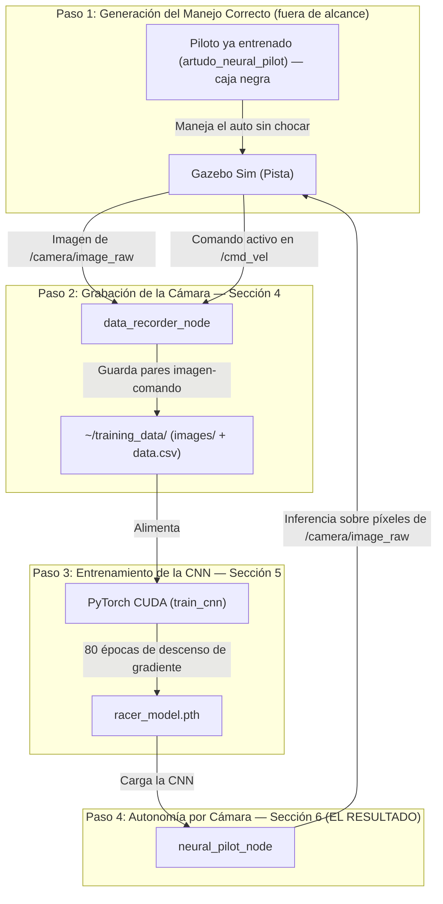

# Informe Técnico: Piloto Autónomo por Cámara mediante Red Neuronal Convolucional (CNN)

**Proyecto:** Vehículo Autónomo de Carreras — Conducción 100% por Visión de Cámara  
**Plataforma de Simulación:** ROS 2 Humble | Ignition Gazebo (Gazebo Sim) | PyTorch (CUDA Tesla T4)  
**Dominio Académico:** Visión por Computadora, Deep Learning End-to-End (Aprendizaje por Imitación), Control en Bucle Cerrado  
**Alcance de este informe:** Este documento cubre **exclusivamente** el pipeline de cámara: grabación de imágenes, arquitectura y entrenamiento de la Red Neuronal Convolucional (CNN), y el piloto autónomo resultante. No se desarrollan aquí otros algoritmos del proyecto (control por LiDAR, visión clásica por color); se los menciona únicamente cuando son estrictamente necesarios como fuente de datos de entrenamiento.  
**Fecha de Actualización:** 2026-07-30

---

## 1. Metodología Fácil de Entender (Resumen Intuitivo)

Imaginá que querés enseñarle a alguien a manejar mostrándole exclusivamente lo que se ve por el parabrisas — sin decirle ninguna regla ("girá cuando veas esto", "frená cuando veas aquello"). Simplemente le mostrás miles de fotos de un buen conductor manejando, cada una con la acción correcta que tomó en ese instante, hasta que la persona aprende, por pura repetición y ejemplo, a relacionar lo que ve con lo que tiene que hacer. Eso es exactamente lo que hace este proyecto: una **Red Neuronal Convolucional (CNN)** aprende a manejar mirando **únicamente los píxeles de la cámara**, sin ningún sensor de distancia y sin ninguna regla de color programada a mano. A esta técnica se la llama **aprendizaje por imitación end-to-end** (extremo a extremo): la entrada cruda (la imagen) se conecta directamente, mediante una sola red, a la salida final (el comando de manejo).

### 1.1. Los 4 Pasos de la Metodología

* **Paso 1 — Generar el manejo correcto:** Para poder grabar "ejemplos de buen manejo", primero algo tiene que manejar bien. Se usa un piloto automático ya construido y ya entrenado (`artudo_neural_pilot`) que conduce el auto sin chocar. Este piloto usa internamente un sensor LiDAR — su funcionamiento interno **no es objeto de este informe** (es un sistema externo y anterior a este trabajo); acá se lo trata como una "caja negra" que simplemente sabe manejar bien y con la que se cuenta ya lista para usar.
* **Paso 2 — Grabar lo que ve la cámara:** Mientras ese piloto maneja, un nodo grabador (`data_recorder_node`) guarda, muchas veces por segundo, la imagen que la cámara está viendo en ese instante junto con el comando de manejo (velocidad y giro) que se estaba usando en ese mismo instante. Esto sí es parte central de este informe (Sección 4).
* **Paso 3 — Entrenar la CNN:** Un script (`train_cnn`) toma todas esas parejas (imagen, comando) y entrena una Red Neuronal Convolucional en la GPU para que aprenda a predecir el comando correcto a partir de la imagen (Sección 5).
* **Paso 4 — Manejar solo con la cámara (el resultado del proyecto):** Se apaga el piloto del Paso 1 y se enciende el **Piloto CNN** (`neural_pilot_node`), que maneja el auto viendo exclusivamente la cámara — sin LiDAR, sin reglas de color (Sección 6).



### 1.2. ¿Por Qué la Cámara y No Otro Sensor?

La cámara es el único sensor que se usa para el piloto final porque el objetivo académico de este trabajo es demostrar visión por computadora con Deep Learning: la capacidad de una red neuronal de extraer, por sí sola y sin reglas manuales, la información necesaria para conducir a partir de una imagen de color. Ningún otro sensor (LiDAR, ultrasonido, etc.) participa del piloto final — el `/scan` de LiDAR ni siquiera está entre las suscripciones del nodo que maneja al final (se verifica en la Sección 6.1).

---

## 2. Fundamentos Matemáticos de la Red Neuronal Convolucional (CNN)

Esta sección explica, paso a paso y sin saltos, toda la matemática que hace posible que una imagen se convierta en un comando de manejo.

### 2.1. La Imagen como Tensor de Entrada

Una imagen de cámara se representa numéricamente como un **tensor** (un arreglo multidimensional de números) de dimensiones $Alto \times Ancho \times Canales$. En este proyecto, cada imagen capturada se redimensiona a $120 \times 160$ píxeles con 3 canales de color (Rojo, Verde, Azul), y cada valor de píxel (originalmente un entero de 0 a 255) se normaliza al rango $[0,1]$:

$$I_{norm}(x,y,c) = \frac{I(x,y,c)}{255}$$

Normalizar es importante porque las redes neuronales entrenan mejor y más rápido cuando sus entradas están en rangos numéricos pequeños y centrados, en vez de rangos grandes como $[0,255]$.

---

### 2.2. Operación de Convolución (Extracción de Patrones Visuales)

El corazón de una CNN es la capa convolucional. Un filtro (también llamado *kernel*) $K$, de tamaño $k \times k$, se desliza sobre la imagen de entrada $I$, y en cada posición $(x,y)$ calcula una suma ponderada entre los valores de la imagen bajo el filtro y los propios valores del filtro:

$$F(x,y) = \sum_{i=0}^{k-1}\sum_{j=0}^{k-1} I(x+i,\, y+j) \cdot K(i,j)$$

El resultado $F$ es un **mapa de características**: una nueva imagen (más pequeña) donde los valores altos indican dónde la imagen original contenía el patrón visual que ese filtro particular "sabe" reconocer (un borde, un cambio brusco de color, una textura). A diferencia de la visión clásica (donde un humano define a mano qué buscar, por ejemplo un rango de color), **en una CNN los valores del filtro $K$ se aprenden solos durante el entrenamiento** — nadie los programa, se ajustan automáticamente para minimizar el error de predicción (Sección 2.5).

El parámetro *stride* (usado en este proyecto con valor 2 en las primeras capas) controla cada cuántos píxeles se mueve el filtro: un stride de 2 reduce el tamaño del mapa de características a la mitad en cada dimensión, lo que además de ahorrar cómputo obliga a la red a resumir información de una zona más amplia por cada valor de salida.

Apilando varias capas convolucionales una tras otra (la arquitectura de este proyecto usa 5, ver Sección 4.2), las primeras capas aprenden a detectar patrones simples (bordes, líneas, cambios de color) y las capas siguientes combinan esos patrones simples en patrones cada vez más complejos y específicos de la tarea (por ejemplo, la curvatura del borde de la pista) — sin que ningún humano diseñe esa jerarquía a mano.

---

### 2.3. Función de Activación ReLU

Después de cada convolución (y de cada capa totalmente conectada), se aplica una función de activación no lineal. Este proyecto usa **ReLU** (*Rectified Linear Unit*), la más común en visión por computadora:

$$\text{ReLU}(x) = \max(0, x)$$

Es decir: los valores negativos se convierten en 0, los positivos quedan igual. Sin esta no linealidad, apilar muchas capas sería matemáticamente equivalente a tener una sola capa (una cadena de operaciones puramente lineales sigue siendo lineal) — ReLU es lo que le permite a la red aprender relaciones complejas y no solo una simple combinación proporcional de píxeles.

---

### 2.4. Aplanado (Flatten) y Capas Totalmente Conectadas

Después de las 5 capas convolucionales, el mapa de características resultante (un tensor 3D de $64 \times 8 \times 13$, es decir, 64 canales de $8\times13$ píxeles cada uno) se **aplana** (*flatten*) a un solo vector de $64 \times 8 \times 13 = 6656$ números. Ese vector pasa por capas "totalmente conectadas" (*fully connected* / `nn.Linear`), donde cada neurona de salida es una combinación lineal de **todas** las entradas más un sesgo (*bias*):

$$z_j = \sum_{i} w_{ji} \cdot x_i + b_j$$

Donde $w_{ji}$ son los pesos aprendidos y $b_j$ el sesgo de la neurona $j$. Este proyecto reduce progresivamente ese vector de 6656 → 100 → 50 → 2 números, donde los **2 números finales son la salida real de la red**: velocidad lineal y velocidad angular.

---

### 2.5. Función de Pérdida (MSE Loss)

Para que la red aprenda, necesita una forma de medir qué tan mal está prediciendo. Se usa el **Error Cuadrático Medio** (*Mean Squared Error*):

$$\mathcal{L}(\theta) = \frac{1}{N} \sum_{i=1}^{N} \left( \hat{Y}_i - Y_i \right)^2$$

Donde $\hat{Y}_i$ es la acción (velocidad, giro) que predice la red para el ejemplo $i$, $Y_i$ es la acción real que hizo el piloto experto en ese mismo ejemplo (el dato grabado), y $\theta$ representa todos los pesos de la red (los filtros convolucionales y las capas totalmente conectadas juntos). Cuanto más se parezca la predicción al dato real, más chico es $\mathcal{L}$.

---

### 2.6. Optimización por Descenso de Gradiente (Backpropagation + Adam)

Entrenar consiste en ajustar los pesos $\theta$ para que $\mathcal{L}(\theta)$ sea lo más chico posible. Esto se hace con **descenso de gradiente**: se calcula la derivada parcial de la pérdida respecto a cada peso (esto es lo que hace *backpropagation*, propagando el error desde la salida hacia atrás por toda la red) y se actualiza cada peso moviéndolo en la dirección que más reduce el error:

$$\theta \leftarrow \theta - \eta \cdot \nabla_\theta \mathcal{L}(\theta)$$

Donde $\eta$ (*learning rate*, tasa de aprendizaje) controla el tamaño del paso — en este proyecto $\eta = 0.0005$. En vez del descenso de gradiente más simple, se usa el optimizador **Adam** (`torch.optim.Adam`), que adapta automáticamente la magnitud del ajuste para cada peso individualmente en función de su historial reciente de gradientes, lo que en la práctica converge más rápido y de forma más estable que un descenso de gradiente de tasa fija.

Este proceso se repite en **lotes** (*batches* de 64 ejemplos a la vez, en vez de uno por uno, por eficiencia computacional en la GPU) durante **80 épocas** (80 pasadas completas por todo el dataset).

---

### 2.7. Normalización de las Salidas (Targets)

Así como la imagen de entrada se normaliza (Sección 2.1), los comandos de manejo grabados (velocidad lineal en $\text{m/s}$, velocidad angular en $\text{rad/s}$) también se normalizan antes de entrenar, dividiéndolos por una constante de escala:

$$\text{lin}_{norm} = \frac{\text{lin}_x}{2.0} \qquad \text{ang}_{norm} = \frac{\text{ang}_z}{3.0}$$

Esto pone ambas salidas en rangos numéricos comparables, evitando que la red le dé más importancia (por tener valores más grandes en magnitud) a una salida sobre la otra durante el entrenamiento. Al usar la red ya entrenada (Sección 6), este proceso se revierte multiplicando por las mismas constantes ($\times 0.50$ y $\times 0.70$ respectivamente en el código final, ajustadas a los límites físicos reales del auto).

---

## 3. Arquitectura Completa de la Red `RacerCNN`

Antes del código de cada nodo, esta tabla resume la arquitectura completa de la red, capa por capa, con las dimensiones exactas del tensor en cada etapa (partiendo de una imagen de entrada de $120 \times 160 \times 3$):

| Capa | Tipo | Parámetros | Dimensión de salida |
|---|---|---|---|
| Entrada | Imagen normalizada | — | $3 \times 120 \times 160$ |
| Conv1 | `Conv2d(3, 24, kernel=5, stride=2)` + ReLU | 24 filtros de $5\times5$ | $24 \times 58 \times 78$ |
| Conv2 | `Conv2d(24, 36, kernel=5, stride=2)` + ReLU | 36 filtros de $5\times5$ | $36 \times 27 \times 37$ |
| Conv3 | `Conv2d(36, 48, kernel=5, stride=2)` + ReLU | 48 filtros de $5\times5$ | $48 \times 12 \times 17$ |
| Conv4 | `Conv2d(48, 64, kernel=3, stride=1)` + ReLU | 64 filtros de $3\times3$ | $64 \times 10 \times 15$ |
| Conv5 | `Conv2d(64, 64, kernel=3, stride=1)` + ReLU | 64 filtros de $3\times3$ | $64 \times 8 \times 13$ |
| Flatten | Aplanado | — | $6656$ |
| FC1 | `Linear(6656, 100)` + ReLU | — | $100$ |
| FC2 | `Linear(100, 50)` + ReLU | — | $50$ |
| FC3 (salida) | `Linear(50, 2)` | — | $2$ → `[linear_x, angular_z]` |

Esta arquitectura (5 convoluciones + 3 capas totalmente conectadas, achicando progresivamente el número de neuronas hasta llegar a las 2 salidas finales) sigue el mismo patrón de diseño que **PilotNet**, la arquitectura publicada por NVIDIA en 2016 para conducción autónoma end-to-end por cámara — es una de las arquitecturas de referencia más citadas académicamente para este tipo de tarea.

---

## 4. Nodo 1: Grabador de Datos de Entrenamiento (`data_recorder.py`)

Este nodo es el puente entre el Paso 1 (piloto que maneja bien) y el Paso 3 (entrenamiento): captura, sincronizadas en el tiempo, la imagen de la cámara y el comando de manejo vigente en ese instante.

```python
import rclpy
from rclpy.node import Node
from sensor_msgs.msg import Image
from geometry_msgs.msg import Twist
from cv_bridge import CvBridge
import cv2
import csv
import os
import time

class DataRecorderNode(Node):
    def __init__(self):
        super().__init__('data_recorder_node')

        # Directorio de guardado de datos
        self.data_dir = os.path.expanduser('~/training_data')
        self.images_dir = os.path.join(self.data_dir, 'images')
        os.makedirs(self.images_dir, exist_ok=True)

        self.csv_path = os.path.join(self.data_dir, 'data.csv')
        self.csv_fileExists = os.path.exists(self.csv_path)

        # Crear archivo CSV e incluir cabecera si es nuevo
        self.csv_file = open(self.csv_path, 'a', newline='')
        self.csv_writer = csv.writer(self.csv_file)
        if not self.csv_fileExists:
            self.csv_writer.writerow(['image_path', 'linear_x', 'angular_z'])
            self.csv_file.flush()

        self.bridge = CvBridge()
        self.latest_twist = Twist()

        # Suscripción a la cámara
        self.image_sub = self.create_subscription(
            Image, '/camera/image_raw', self.image_callback, 10)

        # Suscripción a cmd_vel (comandos del piloto activo)
        self.cmd_sub = self.create_subscription(
            Twist, '/cmd_vel', self.cmd_callback, 10)

        self.frame_count = 0

    def cmd_callback(self, msg):
        self.latest_twist = msg

    def image_callback(self, msg):
        # Solo grabamos datos si el carro se esta moviendo (conduccion activa)
        linear = self.latest_twist.linear.x
        angular = self.latest_twist.angular.z

        if abs(linear) > 0.01 or abs(angular) > 0.01:
            try:
                frame = self.bridge.imgmsg_to_cv2(msg, 'bgr8')
                frame_resized = cv2.resize(frame, (160, 120))

                timestamp = int(time.time() * 1000)
                img_filename = f"frame_{timestamp}_{self.frame_count:05d}.png"
                img_path = os.path.join(self.images_dir, img_filename)

                cv2.imwrite(img_path, frame_resized)

                rel_img_path = os.path.join('images', img_filename)
                self.csv_writer.writerow([rel_img_path, linear, angular])
                self.csv_file.flush()

                self.frame_count += 1

            except Exception as e:
                self.get_logger().error(f"Error al grabar frame: {e}")

    def destroy_node(self):
        self.csv_file.close()
        super().destroy_node()

def main(args=None):
    rclpy.init(args=args)
    node = DataRecorderNode()
    try:
        rclpy.spin(node)
    except KeyboardInterrupt:
        pass
    finally:
        node.destroy_node()
        if rclpy.ok():
            rclpy.shutdown()

if __name__ == '__main__':
    main()
```

### 💡 Explicación Línea por Línea de `data_recorder.py`:

1. **Importaciones (líneas 1-9):** `Image` y `Twist` son los tipos de mensaje de ROS 2 para imágenes de cámara y comandos de velocidad respectivamente. `CvBridge` es la librería que convierte entre el formato de mensaje de imagen de ROS y el formato `numpy`/OpenCV que se puede procesar y guardar como archivo `.png`.
2. **`self.data_dir` / `self.images_dir` (líneas 16-18):** Define `~/training_data/` como carpeta raíz y `~/training_data/images/` para las imágenes. `os.makedirs(..., exist_ok=True)` crea la carpeta si no existe, y si ya existe **no la borra ni la toca** — esto es lo que permite que grabaciones de sesiones distintas se acumulen en el mismo lugar.
3. **`self.csv_path` / apertura del archivo (líneas 20-24):** El archivo `data.csv` se abre en modo `'a'` (*append*, agregar), no en modo `'w'` (que sobrescribiría). `self.csv_fileExists` se chequea antes de abrir, para saber si hace falta escribir la fila de encabezado (`image_path, linear_x, angular_z`) o si ya está.
4. **`self.bridge` y `self.latest_twist` (líneas 30-31):** `latest_twist` es una variable de estado que siempre guarda el último comando de manejo recibido — es la memoria que le permite al nodo saber "qué estaba haciendo el auto" en el momento exacto en que llega cada imagen nueva.
5. **Las dos suscripciones (líneas 34-39):** Una escucha `/camera/image_raw` (dispara `image_callback` cada vez que llega un frame nuevo de cámara) y otra escucha `/cmd_vel` (dispara `cmd_callback` cada vez que el piloto activo publica un comando). Son asíncronas entre sí — por eso se necesita la variable `self.latest_twist` como puente entre ambas.
6. **`cmd_callback` (líneas 44-45):** Extremadamente simple a propósito: solo actualiza la variable de memoria. No hace ningún procesamiento pesado en este callback para no introducir demoras.
7. **`image_callback`, condición de movimiento (líneas 48-53):** Antes de guardar nada, chequea que `linear` o `angular` superen un umbral mínimo (0.01). Esto descarta automáticamente los frames en los que el auto está detenido, evitando que el dataset final quede lleno de miles de ejemplos redundantes de "auto parado, comando cero" que no le enseñarían nada útil a la red.
8. **Conversión y redimensionado (líneas 55-59):** `imgmsg_to_cv2(msg, 'bgr8')` convierte el mensaje ROS a una matriz `numpy` en formato de color BGR (el que usa OpenCV por convención). `cv2.resize(frame, (160, 120))` la reduce al tamaño exacto que espera la red (Sección 3) — reducir el tamaño de la imagen disminuye drásticamente el costo computacional del entrenamiento sin perder la información relevante para la tarea de manejo.
9. **Nombre de archivo único (líneas 61-63):** `timestamp = int(time.time() * 1000)` da el tiempo actual en milisegundos, combinado con `self.frame_count` (un contador que empieza en 0 cada vez que se ejecuta el nodo). Esta combinación garantiza que dos ejecuciones distintas del grabador, en momentos distintos, nunca generen el mismo nombre de archivo — es lo que hace seguro acumular datos de múltiples sesiones sin colisiones.
10. **Guardado en disco y en CSV (líneas 65-71):** `cv2.imwrite` escribe el `.png` físicamente en `images/`. La fila que se agrega al CSV usa una ruta **relativa** (`images/frame_...png`, no la ruta absoluta completa) — esto hace que el dataset sea portable: si se mueve la carpeta `~/training_data/` a otra máquina, las rutas del CSV siguen siendo válidas.
11. **`self.csv_file.flush()` (línea 71):** Fuerza que la fila se escriba físicamente en disco de inmediato, en vez de quedar en un buffer de memoria — así, si el proceso se interrumpe abruptamente (por ejemplo, se corta la sesión SSH), no se pierden los datos ya grabados hasta ese punto.
12. **`destroy_node` (líneas 80-82):** Sobrescribe el método estándar de ROS 2 para asegurarse de cerrar (`close()`) el archivo CSV correctamente al apagar el nodo, evitando corrupción del archivo.

---

## 5. Script 2: Entrenamiento de la Red Convolucional (`train_cnn.py`)

Este script implementa exactamente la arquitectura y la matemática descritas en las Secciones 2 y 3: lee el dataset grabado por `data_recorder.py` (Sección 4) y produce el modelo entrenado.

```python
import torch
import torch.nn as nn
import torch.optim as optim
from torch.utils.data import Dataset, DataLoader
import pandas as pd
import numpy as np
import cv2
import os
import sys

# Modelo CNN multivariable
class RacerCNN(nn.Module):
    def __init__(self):
        super(RacerCNN, self).__init__()
        self.conv = nn.Sequential(
            nn.Conv2d(3, 24, kernel_size=5, stride=2),
            nn.ReLU(),
            nn.Conv2d(24, 36, kernel_size=5, stride=2),
            nn.ReLU(),
            nn.Conv2d(36, 48, kernel_size=5, stride=2),
            nn.ReLU(),
            nn.Conv2d(48, 64, kernel_size=3),
            nn.ReLU(),
            nn.Conv2d(64, 64, kernel_size=3),
            nn.ReLU(),
        )
        self.fc = nn.Sequential(
            nn.Flatten(),
            nn.Linear(64 * 8 * 13, 100),
            nn.ReLU(),
            nn.Linear(100, 50),
            nn.ReLU(),
            nn.Linear(50, 2) # [linear_x, angular_z]
        )

    def forward(self, x):
        x = self.conv(x)
        x = self.fc(x)
        return x

class RacerDataset(Dataset):
    def __init__(self, dataframe, root_dir):
        self.data_df = dataframe
        self.root_dir = root_dir

    def __len__(self):
        return len(self.data_df)

    def __getitem__(self, idx):
        img_name = os.path.join(self.root_dir, self.data_df.iloc[idx, 0])
        image = cv2.imread(img_name)
        image = image.astype(np.float32) / 255.0
        image = np.transpose(image, (2, 0, 1))

        linear_x = float(self.data_df.iloc[idx, 1])
        angular_z = float(self.data_df.iloc[idx, 2])

        linear_x_norm = linear_x / 2.0
        angular_z_norm = angular_z / 3.0
        targets = np.array([linear_x_norm, angular_z_norm], dtype=np.float32)

        return torch.tensor(image), torch.tensor(targets, dtype=torch.float32)

def train():
    data_dir = os.path.expanduser('~/training_data')
    csv_path = os.path.join(data_dir, 'data.csv')

    if not os.path.exists(csv_path):
        print(f"ERROR: No se encontro el archivo de datos {csv_path}")
        sys.exit(1)

    df = pd.read_csv(csv_path)

    # --- BALANCEO DE DATOS ---
    rectas = df[(df['angular_z'].abs() < 0.05) & (df['linear_x'] > 0.0)]
    curvas = df[df['angular_z'].abs() >= 0.05]
    reversa = df[df['linear_x'] < -0.01]
    detenido = df[(df['linear_x'].abs() < 0.01) & (df['angular_z'].abs() < 0.01)]

    rectas_filtradas = rectas.sample(frac=0.15, random_state=42) if len(rectas) > 0 else rectas
    detenidos_filtrados = detenido.sample(frac=0.10, random_state=42) if len(detenido) > 0 else detenido

    df_balanceado = pd.concat([rectas_filtradas, detenidos_filtrados, curvas, reversa]).sample(frac=1.0, random_state=42).reset_index(drop=True)

    dataset = RacerDataset(dataframe=df_balanceado, root_dir=data_dir)

    train_size = int(0.8 * len(dataset))
    val_size = len(dataset) - train_size
    train_dataset, val_dataset = torch.utils.data.random_split(dataset, [train_size, val_size])

    train_loader = DataLoader(train_dataset, batch_size=64, shuffle=True, num_workers=2)
    val_loader = DataLoader(val_dataset, batch_size=64, shuffle=False, num_workers=2)

    device = torch.device('cuda' if torch.cuda.is_available() else 'cpu')

    model = RacerCNN().to(device)
    criterion = nn.MSELoss()
    optimizer = optim.Adam(model.parameters(), lr=0.0005)

    epochs = 80
    for epoch in range(epochs):
        model.train()
        train_loss = 0.0
        for images, targets in train_loader:
            images, targets = images.to(device), targets.to(device)
            optimizer.zero_grad()
            outputs = model(images)
            loss = criterion(outputs, targets)
            loss.backward()
            optimizer.step()
            train_loss += loss.item() * images.size(0)

        model.eval()
        val_loss = 0.0
        with torch.no_grad():
            for images, targets in val_loader:
                images, targets = images.to(device), targets.to(device)
                outputs = model(images)
                loss = criterion(outputs, targets)
                val_loss += loss.item() * images.size(0)

        train_loss /= len(train_dataset)
        val_loss /= len(val_dataset)

        if (epoch+1) % 5 == 0 or epoch == 0:
            print(f"Epoch {epoch+1:02d}/{epochs:02d} | Train Loss: {train_loss:.5f} | Val Loss: {val_loss:.5f}")

    model_path = os.path.join(data_dir, 'racer_model.pth')
    torch.save(model.state_dict(), model_path)
    print(f"Entrenamiento completado. Modelo guardado en {model_path}")
```

### 💡 Explicación Línea por Línea de `train_cnn.py`:

1. **`class RacerCNN` (líneas 12-39):** Implementación exacta en PyTorch de la arquitectura de la Sección 3. `self.conv` es la secuencia de las 5 capas convolucionales + ReLU (Secciones 2.2-2.3); `self.fc` es el aplanado + las 3 capas totalmente conectadas (Sección 2.4). El método `forward` define el orden en que los datos atraviesan la red: primero todas las convoluciones, después el bloque totalmente conectado.
2. **`class RacerDataset` (líneas 41-59):** Implementa la interfaz `Dataset` de PyTorch, que permite que `DataLoader` (más abajo) recorra el dataset en lotes de forma eficiente. `__len__` le dice a PyTorch cuántos ejemplos hay en total; `__getitem__` define cómo se construye **un** ejemplo individual dado su índice.
3. **Carga y normalización de imagen (líneas 51-53):** `cv2.imread` lee el `.png` del disco. `.astype(np.float32) / 255.0` aplica exactamente la normalización de la Sección 2.1. `np.transpose(image, (2, 0, 1))` reordena los ejes de (Alto, Ancho, Canal) — el formato en que OpenCV guarda imágenes — a (Canal, Alto, Ancho), que es el formato que PyTorch espera para sus capas convolucionales.
4. **Normalización de targets (líneas 58-60):** Aplica exactamente las constantes de escala de la Sección 2.7 ($/2.0$ y $/3.0$) a los comandos reales grabados, antes de dárselos a la red como "respuesta correcta" durante el entrenamiento.
5. **Carga del CSV y validación (líneas 68-73):** Si `~/training_data/data.csv` no existe (es decir, si nunca se corrió el grabador de la Sección 4), el script termina con un mensaje de error claro en vez de fallar de forma confusa más adelante.
6. **Balanceo de datos (líneas 78-88):** Este es uno de los bloques más importantes técnicamente. Sin corregirlo, un dataset grabado en una pista real queda dominado por los tramos rectos (el auto pasa la mayor parte del tiempo manejando derecho). Si se entrenara así sin más, la red aprendería a minimizar el error promedio simplemente prediciendo "seguir derecho" casi siempre, porque estadísticamente eso ya minimiza gran parte de la pérdida — y fallaría justo en las curvas, que es donde más importa que decida bien. El código separa los ejemplos en 4 categorías (`rectas`, `curvas`, `reversa`, `detenido`) y descarta aleatoriamente el 85% de las rectas y el 90% de los "detenido", dejando intacto el 100% de las curvas y reversas. El resultado (`df_balanceado`) le da a la red una distribución de ejemplos mucho más equilibrada entre "seguir derecho" y "tener que girar".
7. **División train/validation (líneas 92-95):** El 80% de los datos balanceados se usa para entrenar (`train_dataset`) y el 20% restante se aparta como `val_dataset` — un conjunto que la red **nunca usa para ajustar sus pesos**, solo para medir, después de cada época, si lo que aprendió generaliza a ejemplos que no vio durante el entrenamiento (si `val_loss` fuera mucho peor que `train_loss`, sería señal de sobreajuste/*overfitting*).
8. **`DataLoader` (líneas 97-98):** Envuelve los datasets para entregarlos en lotes (*batches*) de 64 ejemplos. `shuffle=True` en el de entrenamiento mezcla el orden en cada época, para que la red no aprenda ningún patrón espurio relacionado con el orden de grabación.
9. **Selección de dispositivo (línea 102):** `torch.device('cuda' if torch.cuda.is_available() else 'cpu')` usa la GPU (Tesla T4) automáticamente si está disponible, y cae de vuelta a CPU si no — el mismo código funciona en ambos casos, solo cambia la velocidad.
10. **Definición de pérdida y optimizador (líneas 106-107):** `nn.MSELoss()` implementa exactamente la fórmula de la Sección 2.5. `optim.Adam(..., lr=0.0005)` implementa el optimizador de la Sección 2.6 con esa tasa de aprendizaje específica.
11. **Bucle de entrenamiento (líneas 112-131):** Por cada una de las 80 épocas: recorre todos los lotes de entrenamiento haciendo `forward` (predicción), calcula `loss`, hace `loss.backward()` (backpropagation, calcula los gradientes) y `optimizer.step()` (aplica la actualización de pesos de la Sección 2.6). `optimizer.zero_grad()` es obligatorio antes de cada `backward()` porque PyTorch acumula gradientes por defecto — sin resetearlos, se sumarían los de lotes anteriores por error.
12. **Bloque de validación (líneas 124-131):** `model.eval()` desactiva comportamientos específicos de entrenamiento (no aplica en esta arquitectura, pero es buena práctica estándar). `with torch.no_grad()` desactiva el cálculo de gradientes durante la validación, porque no se va a entrenar con estos datos — esto ahorra memoria y cómputo.
13. **Guardado del modelo (líneas 139-141):** `torch.save(model.state_dict(), model_path)` guarda únicamente los pesos aprendidos (no la arquitectura ni el optimizador) en `~/training_data/racer_model.pth` — este es el archivo que carga el piloto final (Sección 6).

---

## 6. Nodo 3: Piloto CNN Autónomo por Cámara (`neural_pilot_node.py`) — El Resultado Final

Este es el nodo que efectivamente conduce el auto en tiempo real, usando **solo** la imagen de la cámara y la red entrenada en la Sección 5.

```python
import rclpy
from rclpy.node import Node
from sensor_msgs.msg import Image
from geometry_msgs.msg import Twist
from cv_bridge import CvBridge
import cv2
import numpy as np
import os
import torch
import torch.nn as nn

# Modelo CNN con 2 salidas normalizadas
class RacerCNN(nn.Module):
    def __init__(self):
        super(RacerCNN, self).__init__()
        self.conv = nn.Sequential(
            nn.Conv2d(3, 24, kernel_size=5, stride=2),
            nn.ReLU(),
            nn.Conv2d(24, 36, kernel_size=5, stride=2),
            nn.ReLU(),
            nn.Conv2d(36, 48, kernel_size=5, stride=2),
            nn.ReLU(),
            nn.Conv2d(48, 64, kernel_size=3),
            nn.ReLU(),
            nn.Conv2d(64, 64, kernel_size=3),
            nn.ReLU(),
        )
        self.fc = nn.Sequential(
            nn.Flatten(),
            nn.Linear(64 * 8 * 13, 100),
            nn.ReLU(),
            nn.Linear(100, 50),
            nn.ReLU(),
            nn.Linear(50, 2)
        )

    def forward(self, x):
        x = self.conv(x)
        x = self.fc(x)
        return x

class NeuralPilotNode(Node):
    def __init__(self):
        super().__init__('neural_pilot_node')

        self.cmd_pub = self.create_publisher(Twist, '/cmd_vel', 10)
        self.bridge = CvBridge()

        self.declare_parameter('base_speed', 0.50)
        self.declare_parameter('max_angular_speed', 0.70)
        self.declare_parameter('reverse_threshold', -0.15)

        model_path = os.path.expanduser('~/training_data/racer_model.pth')
        self.device = torch.device('cuda' if torch.cuda.is_available() else 'cpu')

        if not os.path.exists(model_path):
            self.get_logger().error(f"ERROR: No se encontro el modelo en {model_path}")
            raise FileNotFoundError("Modelo racer_model.pth no encontrado.")

        self.model = RacerCNN()
        self.model.load_state_dict(torch.load(model_path, map_location=self.device))
        self.model.to(self.device)
        self.model.eval()

        self.sub = self.create_subscription(
            Image, '/camera/image_raw', self.image_callback, 10)

    def image_callback(self, msg):
        try:
            frame = self.bridge.imgmsg_to_cv2(msg, 'bgr8')
            frame_resized = cv2.resize(frame, (160, 120))

            # Transformar imagen para PyTorch
            img_tensor = frame_resized.astype(np.float32) / 255.0
            img_tensor = np.transpose(img_tensor, (2, 0, 1))
            img_tensor = torch.tensor(img_tensor).unsqueeze(0).to(self.device)

            # Inferencia en la GPU
            with torch.no_grad():
                prediction = self.model(img_tensor)
                outputs = prediction.cpu().numpy()[0]

            raw_linear = float(outputs[0]) * 0.50
            raw_angular = float(outputs[1]) * 0.70

            base_speed = self.get_parameter('base_speed').value
            max_ang = self.get_parameter('max_angular_speed').value
            rev_thr = self.get_parameter('reverse_threshold').value

            # --- SISTEMA HIBRIDO: IA DIRIGE, REGLA CONTROLA VELOCIDAD ---
            angular_z = float(np.clip(raw_angular, -max_ang, max_ang))

            if raw_linear < rev_thr:
                linear_x = float(np.clip(raw_linear, -0.4, -0.1))
                mode = "REVERSA"
            else:
                turn_ratio = abs(angular_z) / max_ang
                linear_x = base_speed * max(0.25, 1.0 - 0.7 * turn_ratio)
                mode = "AVANCE"

            twist = Twist()
            twist.linear.x = linear_x
            twist.angular.z = angular_z
            self.cmd_pub.publish(twist)

        except Exception as e:
            self.get_logger().error(f"Error en piloto de IA: {e}")

def main(args=None):
    rclpy.init(args=args)
    try:
        node = NeuralPilotNode()
        rclpy.spin(node)
    except KeyboardInterrupt:
        pass
    except FileNotFoundError:
        pass
    finally:
        if rclpy.ok():
            rclpy.shutdown()

if __name__ == '__main__':
    main()
```

### 💡 Explicación Línea por Línea de `neural_pilot_node.py`:

1. **`class RacerCNN` (líneas 13-40):** Es una copia idéntica, campo por campo, de la arquitectura definida en `train_cnn.py` (Sección 5). Esto es imprescindible: para poder cargar los pesos guardados en `racer_model.pth`, la estructura de capas en memoria tiene que coincidir exactamente con la que existía cuando se guardaron esos pesos.
2. **Parámetros ROS declarados (líneas 50-52):** `base_speed`, `max_angular_speed` y `reverse_threshold` se declaran como parámetros de ROS 2 (no como constantes fijas en el código), lo que permite ajustarlos desde la línea de comandos al lanzar el nodo (`--ros-args -p base_speed:=0.6`) sin tener que modificar ni recompilar el código.
3. **Carga del modelo (líneas 54-63):** Verifica primero que el archivo `racer_model.pth` exista (si no se corrió el entrenamiento de la Sección 5, lanza un error claro en vez de fallar de forma confusa). `load_state_dict` carga los pesos guardados dentro de la arquitectura recién instanciada. `self.model.eval()` pone la red en modo evaluación/inferencia (relevante para capas como Dropout o BatchNorm, que esta arquitectura no usa, pero es la práctica estándar correcta).
4. **Suscripción única a la cámara (líneas 65-66):** `self.sub = self.create_subscription(Image, '/camera/image_raw', ...)` — esta es la única fuente de información de todo el nodo. No hay ninguna suscripción a `/scan` (LiDAR) en ningún lugar del archivo: la confirmación de que el manejo es matemáticamente 100% dependiente de la cámara.
5. **Preprocesamiento de la imagen en vivo (líneas 70-76):** Reproduce **exactamente** los mismos pasos que `RacerDataset.__getitem__` en el entrenamiento (Sección 5, punto 3): mismo tamaño de redimensionado (160×120), misma normalización ($/255.0$), mismo reordenamiento de canales. Esto no es casual — si el preprocesamiento en inferencia fuera distinto al usado en entrenamiento, la red recibiría datos con una distribución numérica diferente a la que aprendió, y sus predicciones perderían precisión de forma silenciosa (un error clásico y difícil de detectar en proyectos de deep learning aplicado).
6. **`unsqueeze(0)` (línea 76):** Las redes de PyTorch esperan siempre un **lote** de imágenes, aunque sea de tamaño 1 (dimensión: `batch, canal, alto, ancho`). `unsqueeze(0)` agrega esa dimensión de lote faltante a la imagen individual.
7. **Inferencia (líneas 79-81):** `with torch.no_grad()` desactiva el cálculo de gradientes (no hace falta durante el manejo, solo durante el entrenamiento) — esto acelera la predicción y reduce el uso de memoria. Un solo `forward pass` de la red entrenada convierte la imagen directamente en las 2 salidas numéricas.
8. **Des-normalización (líneas 83-84):** Revierte exactamente la normalización de la Sección 2.7, multiplicando por las mismas constantes de escala, para volver a obtener valores en unidades físicas reales ($\text{m/s}$ y $\text{rad/s}$).
9. **Sistema híbrido de velocidad (líneas 90-99):** La **dirección** (`angular_z`) sale directamente de lo que predijo la red, solo acotada a un rango físico seguro (`np.clip`). La **velocidad**, en cambio, combina la predicción de la IA con una regla de seguridad explícita: si la red predice un valor de avance por debajo de `reverse_threshold`, se interpreta como intención de retroceder y se acota a un rango de reversa controlado; si no, la velocidad de avance se reduce proporcionalmente según qué tan cerrado sea el giro (`turn_ratio`) — frenando en curvas cerradas y acelerando en tramos rectos. Esta combinación evita que un error puntual de la red en la componente de velocidad (más difícil de predecir con precisión que la dirección) haga que el auto acelere de forma imprudente en una curva.
10. **Publicación del comando (líneas 101-104):** El resultado final se empaqueta en un mensaje `Twist` y se publica en `/cmd_vel` — el mismo tópico que efectivamente mueve las ruedas del auto en la simulación.
11. **Manejo de excepciones (líneas 106-107 y 119-124):** Cualquier error durante el procesamiento de un frame individual se captura y se registra como log, sin tumbar el nodo completo — así un frame corrupto puntual no interrumpe la conducción. `FileNotFoundError` se captura por separado en `main()` para dar un cierre ordenado si el modelo nunca se encontró al arrancar.

---

## 7. Guía Práctica de Ejecución en AWS

El piloto CNN **no viene entrenado de fábrica** — el modelo se genera siguiendo estas 3 fases, una sola vez (después, el modelo entrenado se reutiliza siempre que no se lo vuelva a sobrescribir).

### 0️⃣ Paso 0: Sincronizar Repositorio y Compilar
```bash
cd /home/ubuntu/robot-vision-sim
git pull origin main --rebase
source /opt/ros/humble/setup.bash
colcon build --packages-select sim_vision_test
source install/setup.bash
```

### 📼 Fase 1: Grabar Datos de Entrenamiento

Esta fase necesita que **algo** maneje el auto correctamente mientras la cámara graba (Paso 1 de la Sección 1). Se usa el piloto ya entrenado disponible en el proyecto:

**Terminal 1 — Simulación 3D:**
```bash
cd /home/ubuntu/robot-vision-sim
source /opt/ros/humble/setup.bash
source install/setup.bash
ros2 launch launch/robot_camera.launch.py world:=racetrack_decorated headless:=false
```

**Terminal 2 — Piloto que maneja correctamente (genera el movimiento a grabar):**
```bash
cd /home/ubuntu/robot-vision-sim
source /opt/ros/humble/setup.bash
source install/setup.bash
ros2 run sim_vision_test artudo_neural_pilot
```
*(Este nodo es externo al alcance de este informe — solo se usa como fuente de manejo correcto para la Fase 1. Su implementación interna no se documenta acá.)*

**Terminal 3 — Grabador de imágenes + comandos (Sección 4):**
```bash
cd /home/ubuntu/robot-vision-sim
source /opt/ros/humble/setup.bash
source install/setup.bash
ros2 run sim_vision_test data_recorder_node
```
Dejalo grabando varios minutos (varias vueltas — cuantas más, mejor generaliza la CNN, y el balanceo de datos de la Sección 5 aprovecha mejor cuanta más variedad de curvas haya). Al terminar, `Ctrl+C` en esta terminal. Los datos quedan en `~/training_data/images/` y `~/training_data/data.csv`, acumulándose entre sesiones sin borrarse.

### 🧠 Fase 2: Entrenar la CNN (Sección 5)

**Terminal 4 — Entrenamiento (podés cerrar las Terminales 1-3 primero):**
```bash
cd /home/ubuntu/robot-vision-sim
source /opt/ros/humble/setup.bash
source install/setup.bash
ros2 run sim_vision_test train_cnn
```
Muestra el progreso por época (`Epoch 05/80 | Train Loss... | Val Loss...`) y guarda el modelo final en `~/training_data/racer_model.pth`.

### 🚗 Fase 3: Manejar Solo con la Cámara (Sección 6 — el resultado final)

**Terminal 1 — Simulación 3D (reabrir):**
```bash
cd /home/ubuntu/robot-vision-sim
source /opt/ros/humble/setup.bash
source install/setup.bash
ros2 launch launch/robot_camera.launch.py world:=racetrack_decorated headless:=false
```

**Terminal 2 — Piloto CNN por cámara:**
```bash
cd /home/ubuntu/robot-vision-sim
source /opt/ros/humble/setup.bash
source install/setup.bash
ros2 run sim_vision_test neural_pilot_node
```
Esta terminal es la que maneja por cámara de verdad: publica en `/cmd_vel` con base en lo que predice la CNN sobre la imagen — el auto se mueve solo, mirando únicamente `/camera/image_raw`.

**Terminal 3 (opcional) — Ver lo que la CNN está mirando:**
```bash
cd /home/ubuntu/robot-vision-sim
source /opt/ros/humble/setup.bash
ros2 run rqt_image_view rqt_image_view
```
*(Seleccionar `/camera/image_raw`).*

⚠️ **Nunca correr `artudo_neural_pilot` (Terminal 2, Fase 1) al mismo tiempo que `neural_pilot_node` (Fase 3)** — ambos publican en `/cmd_vel` y se pisan las órdenes entre sí.

---

## 8. Preguntas Frecuentes para la Exposición Académica

### ❓ Pregunta 1: Si el informe es sobre la cámara, ¿por qué aparece un piloto basado en otro sensor en la Fase 1?
**RESPUESTA:** Porque entrenar por imitación requiere ejemplos de manejo correcto, y algo tiene que generar esos ejemplos primero. En vez de manejar manualmente con teclado durante horas, se reutiliza un piloto que ya existía en el proyecto y ya maneja bien, únicamente como generador automático de datos. Su algoritmo interno está fuera del alcance de este informe — se lo trata como una herramienta externa ya lista, de la misma forma que se usaría cualquier dataset o generador de datos preexistente en un proyecto de Machine Learning.

### ❓ Pregunta 2: ¿La CNN realmente aprende sola, o hay reglas de color o umbral programadas a mano?
**RESPUESTA: No hay ninguna regla manual.** Revisando el código completo de la Sección 6, la única entrada del nodo es la imagen cruda (`/camera/image_raw`), preprocesada solo con un redimensionado y una normalización numérica (Sección 2.1) — no hay ningún `if` que busque un color específico, ni ningún umbral fijo. Todo el criterio de "qué mirar en la imagen" está codificado en los pesos numéricos de la red (Sección 3), ajustados automáticamente durante el entrenamiento (Sección 2.6) a partir de los ejemplos grabados.

### ❓ Pregunta 3: ¿Es un sistema de bucle cerrado (*closed-loop*) o simplemente repite una secuencia grabada?
**RESPUESTA: Es bucle cerrado.** El piloto CNN (Sección 6) recibe una imagen nueva de la cámara en cada callback y recalcula la predicción desde cero cada vez — no reproduce ninguna secuencia de comandos pregrabada. Si se cambia la posición del auto en la pista o se modifica el entorno, la próxima imagen que llegue va a ser distinta, y la red va a predecir un comando distinto en consecuencia, porque literalmente está mirando la situación actual en cada instante.

### ❓ Pregunta 4: ¿Qué pasa si el dataset grabado tiene muy pocas curvas comparado con tramos rectos?
**RESPUESTA:** Sin corrección, la red aprendería a predecir "seguir derecho" casi siempre, porque eso ya minimiza gran parte del error promedio (Sección 2.5) sobre un dataset dominado por rectas, y fallaría específicamente en las curvas — que es el caso donde más importa que decida bien. Por eso el script de entrenamiento (Sección 5, bloque de balanceo de datos) descarta aleatoriamente una gran proporción de los ejemplos de tramo recto y de auto detenido, dejando intactas las curvas y las reversas, para que la red le preste una atención proporcionalmente mayor a los casos difíciles.

### ❓ Pregunta 5: ¿Por qué la imagen se reduce a 160×120 en vez de usarse a resolución completa?
**RESPUESTA:** Es un balance deliberado entre precisión y velocidad de entrenamiento/inferencia. Una imagen más grande significa más números de entrada, lo que multiplica el costo computacional de cada convolución (Sección 2.2) y el tamaño del vector aplanado antes de las capas totalmente conectadas (Sección 2.4). A 160×120 la red sigue teniendo información suficiente para distinguir el trazado de la pista (el objetivo de la tarea), mientras mantiene el entrenamiento en segundos/minutos y la inferencia en tiempo real, en vez de fracciones de segundo por frame que harían al piloto demasiado lento para reaccionar a tiempo.

---

## 9. Glosario de Términos Técnicos (Para Entender Sin Tecnicismos)

| Término | Qué significa en criollo |
|---|---|
| **Nodo (ROS 2)** | Un programa independiente que se enciende con `ros2 run ...`. Cada terminal de la Sección 7 enciende un nodo distinto; todos corren al mismo tiempo pero por separado. |
| **Tópico (topic)** | Un canal de comunicación con nombre (ej. `/cmd_vel`, `/camera/image_raw`) por el que los nodos se pasan datos. Un nodo "publica" (envía) y otro se "suscribe" (escucha). |
| **`/cmd_vel`** | El tópico que de verdad mueve las ruedas del auto (velocidad de avance + giro). |
| **`Twist`** | El tipo de mensaje que viaja por `/cmd_vel`: trae "cuánto avanzar" (`linear.x`) y "cuánto girar" (`angular.z`). |
| **Cámara / imagen RGB** | Sensor de color, igual que una cámara de celular — es el único sensor que usa el piloto final de este informe. |
| **Tensor** | La forma en que una red neuronal representa los datos internamente: un arreglo de números con varias dimensiones (para una imagen: alto, ancho y canales de color). |
| **CNN (Red Neuronal Convolucional)** | Un tipo de red neuronal diseñada específicamente para procesar imágenes completas, detectando patrones visuales de forma automática mediante filtros que se deslizan sobre la imagen (Sección 2.2). |
| **Convolución / Kernel / Filtro** | La operación básica de una CNN: una pequeña ventana de números (kernel) que recorre toda la imagen calculando una suma ponderada en cada posición, produciendo un "mapa" de dónde aparece cierto patrón visual. |
| **Stride** | Cada cuántos píxeles se mueve el filtro convolucional al deslizarse. Un stride mayor reduce más el tamaño de la imagen resultante. |
| **Mapa de características** | El resultado de aplicar un filtro convolucional a una imagen: una nueva imagen (más chica) que resalta dónde aparece el patrón que ese filtro detecta. |
| **ReLU** | Función matemática simple ($\max(0,x)$) que se aplica después de cada capa para introducir no linealidad, permitiendo que la red aprenda relaciones complejas y no solo combinaciones proporcionales. |
| **Flatten (aplanado)** | Convertir un tensor con varias dimensiones (como un mapa de características 3D) en un solo vector de números, para poder pasarlo a las capas totalmente conectadas. |
| **Capa totalmente conectada (`Linear`)** | Una capa donde cada neurona de salida se calcula combinando **todas** las entradas de la capa anterior con pesos aprendidos, a diferencia de una capa convolucional que solo mira una ventana local. |
| **Peso (`weight`) / Sesgo (`bias`)** | Los números internos de la red que se ajustan durante el entrenamiento. Son literalmente "lo que la red aprendió". |
| **Pérdida / Loss (MSE)** | Un número que mide qué tan mal predice la red comparado con los datos reales grabados. Entrenar es, básicamente, ir bajando ese número. |
| **Backpropagation** | El algoritmo que calcula cuánto contribuyó cada peso de la red al error final, propagando esa información desde la salida hacia atrás, capa por capa. |
| **Descenso de gradiente** | El método que usa esas contribuciones (gradientes) para ajustar cada peso en la dirección que más reduce el error. |
| **Optimizador (Adam)** | El algoritmo concreto que decide, en cada paso de entrenamiento, cuánto y en qué dirección mover cada peso, a partir del gradiente. Adam es una versión que adapta automáticamente el tamaño del ajuste por cada peso. |
| **Learning rate (tasa de aprendizaje)** | Qué tan grande es cada paso de ajuste de los pesos. Muy alto puede hacer que el entrenamiento "se pase" del mínimo error; muy bajo lo hace innecesariamente lento. |
| **Época (epoch)** | Una pasada completa por todo el dataset de entrenamiento. Entrenar "80 épocas" significa revisar los mismos ejemplos 80 veces, ajustando un poco los pesos en cada pasada. |
| **Batch (lote)** | Un grupo de ejemplos (en este proyecto, 64) que se procesan juntos en cada paso de entrenamiento, en vez de uno por uno, por eficiencia en la GPU. |
| **Dataset de entrenamiento / validación** | El conjunto de ejemplos (imagen + comando correcto) usado para ajustar los pesos (entrenamiento) o para medir si la red generaliza bien a ejemplos que nunca vio (validación). |
| **Balanceo de datos** | Técnica para evitar que el dataset esté dominado por el caso más común (rectas) a costa de los casos raros pero importantes (curvas), descartando aleatoriamente parte de los ejemplos más repetidos. |
| **Overfitting (sobreajuste)** | Cuando una red "memoriza" los ejemplos de entrenamiento en vez de aprender un patrón general, y por eso predice mal en situaciones nuevas. Se detecta comparando `train_loss` contra `val_loss`. |
| **Inferencia** | El momento en que la red ya entrenada recibe una imagen nueva y calcula una predicción, sin aprender nada nuevo en ese instante — solo "aplica lo aprendido". |
| **End-to-end (extremo a extremo)** | Diseño donde la entrada cruda (píxeles) se conecta directamente a la salida final (comando de manejo) mediante una sola red, sin pasos intermedios diseñados por un humano. |
| **Aprendizaje por imitación** | Técnica de entrenamiento donde la red aprende observando ejemplos de un "experto" (en este caso, el piloto de la Fase 1) en vez de aprender por prueba y error. |
| **CUDA / GPU** | La GPU es la tarjeta gráfica; CUDA es la tecnología de NVIDIA que le permite a PyTorch usarla para hacer muchísimas cuentas en paralelo, mucho más rápido que el procesador normal (CPU). |
| **`headless`** | Modo sin ventana gráfica. `headless:=false` abre la ventana 3D de Gazebo para verla; `headless:=true` la simulación corre "a ciegas" en el servidor, más rápido. |
| **Bucle cerrado (closed-loop)** | Un sistema que vuelve a medir el mundo real (la cámara) después de cada acción y ajusta la próxima decisión según lo que midió — lo opuesto a repetir una secuencia fija sin mirar qué pasó. |
