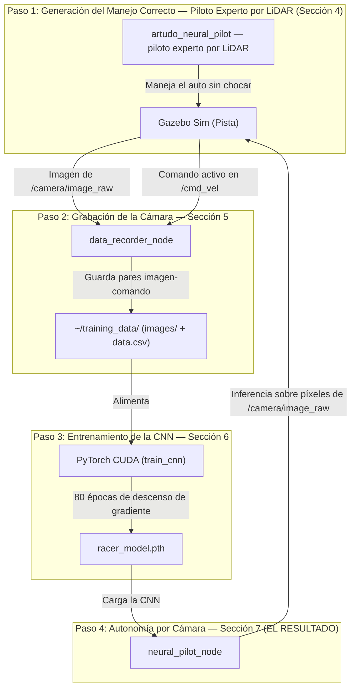
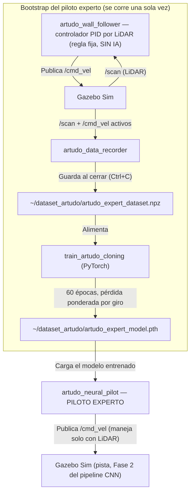

# Informe Técnico: Piloto Autónomo por Cámara mediante Red Neuronal Convolucional (CNN)

**Proyecto:** Vehículo Autónomo de Carreras — Conducción 100% por Visión de Cámara  
**Plataforma de Simulación:** ROS 2 Humble | Ignition Gazebo (Gazebo Sim) | PyTorch (CUDA Tesla T4)  
**Dominio Académico:** Visión por Computadora, Deep Learning End-to-End (Aprendizaje por Imitación), Control en Bucle Cerrado  
**Alcance de este informe:** Este documento cubre el pipeline completo del piloto por cámara: el **piloto experto por LiDAR** que genera los datos de manejo correcto (flujo y código completo en la Sección 4), la grabación de imágenes, la arquitectura y entrenamiento de la Red Neuronal Convolucional (CNN), y el piloto autónomo final por cámara. La visión clásica por color (OpenCV/HSV, ver `INFORME_VISION.md`) es una línea de trabajo separada y no se desarrolla acá.  
**Fecha de Actualización:** 2026-07-30

---

## 1. Metodología Fácil de Entender (Resumen Intuitivo)

Imaginá que querés enseñarle a alguien a manejar mostrándole exclusivamente lo que se ve por el parabrisas — sin decirle ninguna regla ("girá cuando veas esto", "frená cuando veas aquello"). Simplemente le mostrás miles de fotos de un buen conductor manejando, cada una con la acción correcta que tomó en ese instante, hasta que la persona aprende, por pura repetición y ejemplo, a relacionar lo que ve con lo que tiene que hacer. Eso es exactamente lo que hace este proyecto: una **Red Neuronal Convolucional (CNN)** aprende a manejar mirando **únicamente los píxeles de la cámara**, sin ningún sensor de distancia y sin ninguna regla de color programada a mano. A esta técnica se la llama **aprendizaje por imitación end-to-end** (extremo a extremo): la entrada cruda (la imagen) se conecta directamente, mediante una sola red, a la salida final (el comando de manejo).

### 1.1. Los 4 Pasos de la Metodología

* **Paso 1 — Generar el manejo correcto (piloto experto por LiDAR):** Para poder grabar "ejemplos de buen manejo", primero algo tiene que manejar bien. Se usa un piloto por LiDAR (`artudo_neural_pilot`) entrenado por **clonación de comportamiento** a partir de un controlador PID de seguimiento de pared. Este piloto no viene de fábrica: se genera una única vez mediante un flujo de 3 pasos propio (controlador PID sin IA → grabador de telemetría LiDAR → entrenamiento de una red pequeña). Flujo completo, arquitectura y código explicados línea por línea en la **Sección 4**.
* **Paso 2 — Grabar lo que ve la cámara:** Mientras ese piloto maneja, un nodo grabador (`data_recorder_node`) guarda, muchas veces por segundo, la imagen que la cámara está viendo en ese instante junto con el comando de manejo (velocidad y giro) que se estaba usando en ese mismo instante. Esto es parte central de este informe (Sección 5).
* **Paso 3 — Entrenar la CNN:** Un script (`train_cnn`) toma todas esas parejas (imagen, comando) y entrena una Red Neuronal Convolucional en la GPU para que aprenda a predecir el comando correcto a partir de la imagen (Sección 6).
* **Paso 4 — Manejar solo con la cámara (el resultado del proyecto):** Se apaga el piloto del Paso 1 y se enciende el **Piloto CNN** (`neural_pilot_node`), que maneja el auto viendo exclusivamente la cámara — sin LiDAR, sin reglas de color (Sección 7).



### 1.2. ¿Por Qué la Cámara y No Otro Sensor?

La cámara es el único sensor que se usa para el piloto final porque el objetivo académico de este trabajo es demostrar visión por computadora con Deep Learning: la capacidad de una red neuronal de extraer, por sí sola y sin reglas manuales, la información necesaria para conducir a partir de una imagen de color. Ningún otro sensor (LiDAR, ultrasonido, etc.) participa del piloto final — el `/scan` de LiDAR ni siquiera está entre las suscripciones del nodo que maneja al final (se verifica en la Sección 7). El piloto por LiDAR de la Sección 4 solo se usa como **generador de datos** para el Paso 1; su existencia no le resta nada al resultado final, que sigue siendo 100% dependiente de la cámara.

---

## 2. Fundamentos Matemáticos de la Red Neuronal Convolucional (CNN)

Esta sección explica, paso a paso y sin saltos, toda la matemática que hace posible que una imagen se convierta en un comando de manejo.

### 2.1. La Imagen como Tensor de Entrada

Una imagen de cámara se representa numéricamente como un **tensor** (un arreglo multidimensional de números) de dimensiones $Alto \times Ancho \times Canales$. En este proyecto, cada imagen capturada se redimensiona a $120 \times 160$ píxeles con 3 canales de color (Rojo, Verde, Azul), y cada valor de píxel (originalmente un entero de 0 a 255) se normaliza al rango $[0,1]$:

$$I_{norm}(x,y,c) = \frac{I(x,y,c)}{255}$$

Normalizar es importante porque las redes neuronales entrenan mejor y más rápido cuando sus entradas están en rangos numéricos pequeños y centrados, en vez de rangos grandes como $[0,255]$.

> **¿Por qué 160×120 y no la resolución nativa de la cámara?** Es un balance deliberado entre precisión y velocidad. Una imagen más grande implica más números de entrada, lo que multiplica el costo de cada convolución (Sección 2.2) y el tamaño del vector aplanado antes de las capas totalmente conectadas (Sección 2.4). A 160×120 la red conserva la información suficiente para distinguir el trazado de la pista, mientras mantiene el entrenamiento en minutos y la inferencia en tiempo real — a resolución completa, tanto el entrenamiento como cada frame de inferencia serían notablemente más lentos sin una mejora proporcional en el resultado.

---

### 2.2. Operación de Convolución (Extracción de Patrones Visuales)

El corazón de una CNN es la capa convolucional. Un filtro (también llamado *kernel*) $K$, de tamaño $k \times k$, se desliza sobre la imagen de entrada $I$, y en cada posición $(x,y)$ calcula una suma ponderada entre los valores de la imagen bajo el filtro y los propios valores del filtro:

$$F(x,y) = \sum_{i=0}^{k-1}\sum_{j=0}^{k-1} I(x+i,\, y+j) \cdot K(i,j)$$

El resultado $F$ es un **mapa de características**: una nueva imagen (más pequeña) donde los valores altos indican dónde la imagen original contenía el patrón visual que ese filtro particular "sabe" reconocer (un borde, un cambio brusco de color, una textura). A diferencia de la visión clásica (donde un humano define a mano qué buscar, por ejemplo un rango de color), **en una CNN los valores del filtro $K$ se aprenden solos durante el entrenamiento** — nadie los programa, se ajustan automáticamente para minimizar el error de predicción (Sección 2.5).

El parámetro *stride* (usado en este proyecto con valor 2 en las primeras capas) controla cada cuántos píxeles se mueve el filtro: un stride de 2 reduce el tamaño del mapa de características a la mitad en cada dimensión, lo que además de ahorrar cómputo obliga a la red a resumir información de una zona más amplia por cada valor de salida.

Apilando varias capas convolucionales una tras otra (la arquitectura de este proyecto usa 5, ver Sección 3), las primeras capas aprenden a detectar patrones simples (bordes, líneas, cambios de color) y las capas siguientes combinan esos patrones simples en patrones cada vez más complejos y específicos de la tarea (por ejemplo, la curvatura del borde de la pista) — sin que ningún humano diseñe esa jerarquía a mano.

---

### 2.3. Función de Activación ReLU

Después de cada convolución (y de cada capa totalmente conectada), se aplica una función de activación no lineal. Este proyecto usa **ReLU** (*Rectified Linear Unit*), la más común en visión por computadora:

$$\text{ReLU}(x) = \max(0, x)$$

Es decir: los valores negativos se convierten en 0, los positivos quedan igual. Sin esta no linealidad, apilar muchas capas sería matemáticamente equivalente a tener una sola capa (una cadena de operaciones puramente lineales sigue siendo lineal) — ReLU es lo que le permite a la red aprender relaciones complejas y no solo una simple combinación proporcional de píxeles.

---

### 2.4. Aplanado (Flatten) y Capas Totalmente Conectadas

Después de las 5 capas convolucionales, el mapa de características resultante (un tensor 3D de $64 \times 8 \times 13$, es decir, 64 canales de $8\times13$ píxeles cada uno) se **aplana** (*flatten*) a un solo vector de $64 \times 8 \times 13 = 6656$ números. Ese vector pasa por capas "totalmente conectadas" (*fully connected* / `nn.Linear`), donde cada neurona de salida es una combinación lineal de **todas** las entradas más un sesgo (*bias*):

$$z_j = \sum_{i} w_{ji} \cdot x_i + b_j$$

Donde $w_{ji}$ son los pesos aprendidos y $b_j$ el sesgo de la neurona $j$. Este proyecto reduce progresivamente ese vector de 6656 → 100 → 50 → 2 números, donde los **2 números finales son la salida real de la red**: velocidad lineal y velocidad angular.

---

### 2.5. Función de Pérdida (MSE Loss)

Para que la red aprenda, necesita una forma de medir qué tan mal está prediciendo. Se usa el **Error Cuadrático Medio** (*Mean Squared Error*):

$$\mathcal{L}(\theta) = \frac{1}{N} \sum_{i=1}^{N} \left( \hat{Y}_i - Y_i \right)^2$$

Donde $\hat{Y}_i$ es la acción (velocidad, giro) que predice la red para el ejemplo $i$, $Y_i$ es la acción real que hizo el piloto experto en ese mismo ejemplo (el dato grabado), y $\theta$ representa todos los pesos de la red (los filtros convolucionales y las capas totalmente conectadas juntos). Cuanto más se parezca la predicción al dato real, más chico es $\mathcal{L}$.

---

### 2.6. Optimización por Descenso de Gradiente (Backpropagation + Adam)

Entrenar consiste en ajustar los pesos $\theta$ para que $\mathcal{L}(\theta)$ sea lo más chico posible. Esto se hace con **descenso de gradiente**: se calcula la derivada parcial de la pérdida respecto a cada peso (esto es lo que hace *backpropagation*, propagando el error desde la salida hacia atrás por toda la red) y se actualiza cada peso moviéndolo en la dirección que más reduce el error:

$$\theta \leftarrow \theta - \eta \cdot \nabla_\theta \mathcal{L}(\theta)$$

Donde $\eta$ (*learning rate*, tasa de aprendizaje) controla el tamaño del paso — en este proyecto $\eta = 0.0005$. En vez del descenso de gradiente más simple, se usa el optimizador **Adam** (`torch.optim.Adam`), que adapta automáticamente la magnitud del ajuste para cada peso individualmente en función de su historial reciente de gradientes, lo que en la práctica converge más rápido y de forma más estable que un descenso de gradiente de tasa fija.

Este proceso se repite en **lotes** (*batches* de 64 ejemplos a la vez, en vez de uno por uno, por eficiencia computacional en la GPU) durante **80 épocas** (80 pasadas completas por todo el dataset).

---

### 2.7. Normalización de las Salidas (Targets)

Así como la imagen de entrada se normaliza (Sección 2.1), los comandos de manejo grabados (velocidad lineal en $\text{m/s}$, velocidad angular en $\text{rad/s}$) también se normalizan antes de entrenar, dividiéndolos por una constante de escala:

$$\text{lin}_{norm} = \frac{\text{lin}_x}{2.0} \qquad \text{ang}_{norm} = \frac{\text{ang}_z}{3.0}$$

Esto pone ambas salidas en rangos numéricos comparables, evitando que la red le dé más importancia (por tener valores más grandes en magnitud) a una salida sobre la otra durante el entrenamiento. Al usar la red ya entrenada (Sección 7), este proceso se revierte multiplicando por las mismas constantes ($\times 0.50$ y $\times 0.70$ respectivamente en el código final, ajustadas a los límites físicos reales del auto).

---

## 3. Arquitectura Completa de la Red `RacerCNN`

Antes del código de cada nodo, esta tabla resume la arquitectura completa de la red, capa por capa, con las dimensiones exactas del tensor en cada etapa (partiendo de una imagen de entrada de $120 \times 160 \times 3$):

| Capa | Tipo | Parámetros | Dimensión de salida |
|---|---|---|---|
| Entrada | Imagen normalizada | — | $3 \times 120 \times 160$ |
| Conv1 | `Conv2d(3, 24, kernel=5, stride=2)` + ReLU | 24 filtros de $5\times5$ | $24 \times 58 \times 78$ |
| Conv2 | `Conv2d(24, 36, kernel=5, stride=2)` + ReLU | 36 filtros de $5\times5$ | $36 \times 27 \times 37$ |
| Conv3 | `Conv2d(36, 48, kernel=5, stride=2)` + ReLU | 48 filtros de $5\times5$ | $48 \times 12 \times 17$ |
| Conv4 | `Conv2d(48, 64, kernel=3, stride=1)` + ReLU | 64 filtros de $3\times3$ | $64 \times 10 \times 15$ |
| Conv5 | `Conv2d(64, 64, kernel=3, stride=1)` + ReLU | 64 filtros de $3\times3$ | $64 \times 8 \times 13$ |
| Flatten | Aplanado | — | $6656$ |
| FC1 | `Linear(6656, 100)` + ReLU | — | $100$ |
| FC2 | `Linear(100, 50)` + ReLU | — | $50$ |
| FC3 (salida) | `Linear(50, 2)` | — | $2$ → `[linear_x, angular_z]` |

Esta arquitectura (5 convoluciones + 3 capas totalmente conectadas, achicando progresivamente el número de neuronas hasta llegar a las 2 salidas finales) sigue el mismo patrón de diseño que **PilotNet**, la arquitectura publicada por NVIDIA en 2016 para conducción autónoma end-to-end por cámara — es una de las arquitecturas de referencia más citadas académicamente para este tipo de tarea.

---

## 4. El Piloto Experto por LiDAR — Flujo y Código (Fase 1)

El piloto CNN (Sección 7) necesita ejemplos de "buen manejo" para poder aprender por imitación. Esos ejemplos los genera un **piloto experto que maneja usando únicamente LiDAR** (`artudo_neural_pilot`). Ese piloto **no viene de fábrica**: se construye una única vez mediante un flujo propio de 3 etapas que no involucra visión por cámara en absoluto. Esta sección documenta ese flujo completo y el código de sus 4 nodos.

> Aclaración de alcance: el piloto experto **no forma parte del resultado final** del proyecto (que es 100% por cámara) — es una herramienta de bootstrap, generada una sola vez, para producir el dataset de la Sección 5. Se documenta acá con el mismo nivel de detalle que el resto del pipeline porque es indispensable para reproducir el proyecto desde cero.

### 4.1. Flujo de Generación del Piloto Experto



Los 3 pasos del bootstrap, en orden:

1. **Controlador PID sin IA (`artudo_wall_follower`):** un algoritmo clásico de seguimiento de pared (sin ninguna red neuronal) maneja el auto usando geometría simple sobre dos lecturas de LiDAR. Es la fuente de "buen manejo" más básica del proyecto — no aprende nada, solo aplica una fórmula fija.
2. **Grabador de telemetría (`artudo_data_recorder`):** mientras el PID maneja, este nodo graba el LiDAR (resumido a 8 sectores) y el comando activo en cada instante, y al cerrarse guarda todo en un archivo `.npz`.
3. **Entrenamiento por clonación de comportamiento (`train_artudo_cloning`):** toma ese `.npz` y entrena una red neuronal pequeña (`ArtudoNeuralDriver`) para que imite al PID. El resultado es `artudo_expert_model.pth`.

Una vez que existe `artudo_expert_model.pth`, el nodo **`artudo_neural_pilot`** lo carga y maneja de forma autónoma **por su cuenta** — a partir de ahí ya no hace falta el PID ni volver a grabar: este es el piloto experto que se usa en la Fase 2 de la Sección 8 (grabación de datos de cámara para la CNN).

### 4.2. Arquitectura de la Red del Piloto Experto (`ArtudoNeuralDriver`)

Una red mucho más chica que `RacerCNN` (Sección 3), porque su entrada no es una imagen sino solo 8 números (distancias de LiDAR):

| Capa | Tipo | Dimensión de salida |
|---|---|---|
| Entrada | 8 sectores LiDAR normalizados en $[0,1]$ | $8$ |
| FC1 | `Linear(8, 64)` + ReLU | $64$ |
| FC2 | `Linear(64, 64)` + ReLU | $64$ |
| FC3 | `Linear(64, 32)` + ReLU | $32$ |
| FC4 (salida) | `Linear(32, 2)` + **Tanh** | $2$ → `[steer, speed]`, ambos en $[-1, 1]$ |

A diferencia de `RacerCNN` (que no acota su salida), acá la última capa usa **Tanh** ($\tanh(x) \in [-1,1]$) para garantizar que la salida cruda de la red ya esté en un rango acotado y estable, antes de desnormalizarla multiplicando por los límites físicos del auto (`×0.70` para el giro, `×0.50` para la velocidad — ver Sección 4.6, punto 5).

---

### 4.3. Código: Controlador Base sin IA (`artudo_wall_follower_node.py`)

Es el generador de manejo más elemental del proyecto: **no usa ninguna red neuronal**, solo un controlador PID clásico que mantiene al auto a una distancia objetivo de la pared usando dos lecturas de LiDAR.

```python
#!/usr/bin/env python3
"""
Nodo Autónomo Wall-Following de ar-tu-do-master (ROS 2 Humble / Gazebo Sim).
Adaptación 1:1 de la navegación por seguimiento de paredes con controlador PID
de F1TENTH / ar-tu-do-master.
"""

import math
import rclpy
from rclpy.node import Node
from sensor_msgs.msg import LaserScan
from geometry_msgs.msg import Twist


class PIDController:
    def __init__(self, kp=1.8, ki=0.001, kd=0.5):
        self.kp = kp
        self.ki = ki
        self.kd = kd
        self.prev_error = 0.0
        self.integral = 0.0

    def update(self, error, dt=0.05):
        self.integral += error * dt
        derivative = (error - self.prev_error) / dt if dt > 0 else 0.0
        self.prev_error = error
        return self.kp * error + self.ki * self.integral + self.kd * derivative


class ARTUDOWallFollower(Node):
    def __init__(self):
        super().__init__('artudo_wall_follower_node')

        self.scan_sub = self.create_subscription(
            LaserScan, '/scan', self.on_scan, 10)
        self.cmd_pub = self.create_publisher(
            Twist, '/cmd_vel', 10)

        self.pid = PIDController(kp=1.8, ki=0.001, kd=0.5)
        self.target_distance = 1.0          # Distancia objetivo al centro del carril / pared
        self.prediction_distance = 0.8      # Proyección hacia adelante en metros
        self.max_speed = 0.45               # Velocidad máxima en rectas
        self.min_speed = 0.18               # Velocidad mínima en curvas cerradas
        self.last_time = self.get_clock().now()

        self.get_logger().info('=' * 60)
        self.get_logger().info('   PILOTO AUTÓNOMO WALL-FOLLOWING (1:1 de ar-tu-do-master)')
        self.get_logger().info('=' * 60)

    def get_range_at_angle(self, scan_msg, angle_deg):
        angle_rad = math.radians(angle_deg)
        if angle_rad < scan_msg.angle_min or angle_rad > scan_msg.angle_max:
            return 5.0

        index = int((angle_rad - scan_msg.angle_min) / scan_msg.angle_increment)
        if 0 <= index < len(scan_msg.ranges):
            r = scan_msg.ranges[index]
            if not math.isinf(r) and not math.isnan(r) and r > 0.12:
                return min(r, 10.0)
        return 5.0

    def on_scan(self, msg):
        now = self.get_clock().now()
        dt = (now - self.last_time).nanoseconds / 1e9
        if dt <= 0.0:
            dt = 0.05
        self.last_time = now

        # Medición a dos ángulos (-45° y -90° a la derecha) para predecir la trayectoria
        a = self.get_range_at_angle(msg, -45.0)
        b = self.get_range_at_angle(msg, -90.0)
        theta = math.radians(45.0)

        # Ángulo alpha de inclinación del vehículo con respecto a la pared
        alpha = math.atan2(a * math.cos(theta) - b, a * math.sin(theta))
        current_dist = b * math.cos(alpha)
        predicted_dist = current_dist + self.prediction_distance * math.sin(alpha)

        # Error entre la posición predicha y la distancia objetivo
        error = self.target_distance - predicted_dist

        # Corrección PID de giro
        steering = self.pid.update(error, dt=dt)
        steering = max(min(steering, 0.70), -0.70)

        # Ajuste de velocidad: frena proporcionalmente en curvas cerradas
        speed = self.max_speed * (1.0 - 0.45 * (abs(steering) / 0.70))
        speed = max(min(speed, self.max_speed), self.min_speed)

        # Publicar orden de control a /cmd_vel
        twist = Twist()
        twist.linear.x = float(speed)
        twist.angular.z = float(steering)
        self.cmd_pub.publish(twist)


def main(args=None):
    rclpy.init(args=args)
    node = ARTUDOWallFollower()
    try:
        rclpy.spin(node)
    except KeyboardInterrupt:
        pass
    finally:
        node.destroy_node()
        if rclpy.ok():
            rclpy.shutdown()


if __name__ == '__main__':
    main()
```

#### 💡 Explicación línea por línea de `artudo_wall_follower_node.py`:

1. **`class PIDController` (líneas 15-27):** Implementación genérica de un controlador **PID** (Proporcional-Integral-Derivativo), el algoritmo de control clásico más usado en robótica. `update(error, dt)` recibe el error actual (qué tan lejos está el auto de la distancia objetivo) y devuelve una corrección de giro combinando tres términos: `kp*error` (reacciona proporcional al error actual), `ki*integral` (corrige errores pequeños y persistentes acumulados en el tiempo) y `kd*derivative` (anticipa hacia dónde va el error, amortiguando oscilaciones).
2. **Suscripción y publicador (líneas 34-37):** El nodo se suscribe a `/scan` (LiDAR) y publica directamente en `/cmd_vel` — es un lazo de control reactivo simple: lee el sensor, calcula, publica el comando, y así en cada mensaje de LiDAR nuevo.
3. **Parámetros de conducción (líneas 40-43):** `target_distance` es a qué distancia de la pared se quiere mantener el auto; `prediction_distance` proyecta la posición futura del auto para anticipar la corrección; `max_speed`/`min_speed` acotan la velocidad entre rectas y curvas cerradas.
4. **`get_range_at_angle` (líneas 50-60):** Dado un ángulo en grados, calcula el índice correspondiente dentro del arreglo `ranges` del mensaje `LaserScan` y devuelve la distancia medida en esa dirección exacta (con `5.0` como valor de respaldo si el ángulo está fuera de rango o la lectura no es válida).
5. **Cálculo de `dt` (líneas 63-67):** Mide el tiempo real transcurrido desde el último mensaje de LiDAR procesado, para que el término derivativo/integral del PID sea correcto independientemente de la frecuencia real de los mensajes (en vez de asumir un intervalo fijo).
6. **Geometría del seguimiento de pared (líneas 70-77):** Toma dos lecturas de LiDAR, una a -45° y otra a -90° (mirando hacia la derecha), y con trigonometría básica (`atan2`, `cos`, `sin`) calcula el ángulo de inclinación del auto respecto a la pared (`alpha`) y proyecta dónde va a estar el auto un instante en el futuro (`predicted_dist`) — esto es lo que le permite al controlador anticipar curvas en vez de solo reaccionar a la distancia actual.
7. **Error y corrección PID (líneas 80-84):** `error` es la diferencia entre la distancia objetivo y la distancia predicha; se lo pasa al PID para obtener el `steering` (giro), acotado a los límites físicos del auto ($\pm 0.70$ rad).
8. **Velocidad proporcional al giro (líneas 87-88):** La velocidad se reduce linealmente según qué tan cerrado sea el giro actual (`abs(steering)/0.70`) — el mismo principio de "frenar en curvas, acelerar en rectas" que después reaparece en el piloto CNN final (Sección 7, punto 10).
9. **Publicación (líneas 91-94):** Empaqueta velocidad y giro en un mensaje `Twist` y lo publica en `/cmd_vel`, moviendo el auto en la simulación.

---

### 4.4. Código: Grabador de Telemetría LiDAR (`artudo_data_recorder_node.py`)

Mientras el PID de la Sección 4.3 maneja, este nodo graba sus lecturas de LiDAR y sus comandos — es el equivalente, para el piloto experto, de lo que `data_recorder.py` (Sección 5) hace para la cámara.

```python
#!/usr/bin/env python3
"""
Grabador Automático de Telemetría LiDAR (1:1 con artudo_wall_follower).
Graba muestras de Estado (LiDAR + Cinemática) y Acción (Giro + Velocidad)
mientras el vehículo conduce de forma autónoma.
"""

import os
import math
import numpy as np
import rclpy
from rclpy.node import Node
from sensor_msgs.msg import LaserScan
from geometry_msgs.msg import Twist

class ARTUDODataRecorder(Node):
    def __init__(self):
        super().__init__('artudo_data_recorder')

        self.save_dir = os.path.expanduser('~/dataset_artudo')
        os.makedirs(self.save_dir, exist_ok=True)
        self.output_file = os.path.join(self.save_dir, 'artudo_expert_dataset.npz')

        self.scan_sub = self.create_subscription(
            LaserScan, '/scan', self.on_scan, 10)
        self.cmd_sub = self.create_subscription(
            Twist, '/cmd_vel', self.on_cmd, 10)

        self.latest_scan_sectors = None
        self.latest_twist = Twist()

        self.observations = []
        self.actions = []

        self.timer = self.create_timer(0.05, self.record_step) # 20 Hz (50ms)

        self.get_logger().info('=' * 60)
        self.get_logger().info(f'   GRABADOR DE TELEMETRÍA AUTOMÁTICO INICIADO')
        self.get_logger().info(f'   Guardando en: {self.output_file}')
        self.get_logger().info('=' * 60)

    def on_scan(self, msg):
        n = len(msg.ranges)
        num_sectors = 8
        sector_size = n // num_sectors
        obs = []
        for i in range(num_sectors):
            sector_ranges = msg.ranges[i*sector_size : (i+1)*sector_size]
            valid_ranges = [r for r in sector_ranges if not math.isinf(r) and not math.isnan(r) and r > 0.12]
            min_r = min(valid_ranges) if valid_ranges else 10.0
            obs.append(min(min_r, 10.0) / 10.0)
        self.latest_scan_sectors = np.array(obs, dtype=np.float32)

    def on_cmd(self, msg):
        self.latest_twist = msg

    def record_step(self):
        if self.latest_scan_sectors is None:
            return

        steer = self.latest_twist.angular.z
        speed = self.latest_twist.linear.x

        # Solo grabar si el auto se está moviendo activamente
        if abs(speed) > 0.05 or abs(steer) > 0.05:
            # Estado X: 8 sectores LiDAR + speed + steer
            state = np.concatenate([
                self.latest_scan_sectors,
                np.array([speed / 0.50, steer / 0.70], dtype=np.float32)
            ])
            action = np.array([steer, speed], dtype=np.float32)

            self.observations.append(state)
            self.actions.append(action)

            count = len(self.observations)
            if count % 200 == 0:
                laps_estimate = count / 750.0
                self.get_logger().info(f'[GRABANDO] Muestras: {count:05d} (~{laps_estimate:.1f} vueltas)')

    def save_dataset(self):
        if len(self.observations) > 0:
            obs_array = np.array(self.observations, dtype=np.float32)
            act_array = np.array(self.actions, dtype=np.float32)
            np.savez_compressed(self.output_file, obs=obs_array, actions=act_array)
            self.get_logger().info('=' * 60)
            self.get_logger().info(f'[ÉXITO] Dataset guardado correctamente:')
            self.get_logger().info(f'  Total muestras: {len(obs_array)}')
            self.get_logger().info(f'  Formato Obs   : {obs_array.shape}')
            self.get_logger().info(f'  Formato Act   : {act_array.shape}')
            self.get_logger().info(f'  Ruta          : {self.output_file}')
            self.get_logger().info('=' * 60)

def main(args=None):
    rclpy.init(args=args)
    node = ARTUDODataRecorder()
    try:
        rclpy.spin(node)
    except KeyboardInterrupt:
        node.get_logger().info("Deteniendo grabación...")
    finally:
        node.save_dataset()
        node.destroy_node()
        if rclpy.ok():
            rclpy.shutdown()

if __name__ == '__main__':
    main()
```

#### 💡 Explicación línea por línea de `artudo_data_recorder_node.py`:

1. **Directorio y archivo de salida (líneas 20-22):** A diferencia de `data_recorder.py` (Sección 5, que escribe imagen por imagen en tiempo real a un CSV), este nodo **acumula todo en memoria** (`self.observations`, `self.actions`) y recién escribe a disco un único archivo comprimido `.npz` al cerrarse — es viable porque cada muestra son solo 10 números (no una imagen), así que miles de muestras caben cómodamente en RAM.
2. **Doble suscripción (líneas 24-27):** Igual que `data_recorder.py`, se suscribe por separado a `/scan` y a `/cmd_vel`, con `self.latest_twist` como variable puente entre ambos callbacks asíncronos.
3. **`on_scan` — reducción a 8 sectores (líneas 42-52):** El LiDAR simulado entrega cientos de rayos; este método los agrupa en 8 sectores angulares, se queda con la distancia **mínima válida** de cada sector (la lectura más crítica, la más cercana a un obstáculo), la recorta a un máximo de 10 m y la normaliza a $[0,1]$ dividiendo por 10 — exactamente el mismo preprocesamiento de LiDAR que usa después `artudo_neural_pilot` (Sección 4.6) y que originalmente calculaba el propio `artudo_neural_pilot_node.py`. Que ambos nodos procesen el LiDAR de la misma forma es indispensable: si el formato de entrada en el entrenamiento no coincide con el de la inferencia, la red recibiría datos con una distribución distinta a la aprendida.
4. **`record_step`, temporizador a 20 Hz (línea 35 y 57-79):** En vez de grabar en cada callback de sensor (que llegan a frecuencias distintas y desincronizadas), un `Timer` de ROS 2 dispara `record_step` cada 50 ms (20 Hz) de forma regular, leyendo el último estado conocido de LiDAR y de comando. Esto da un dataset con espaciado temporal uniforme, más fácil de aprender que uno con intervalos irregulares.
5. **Vector de estado de 10 valores (líneas 67-70):** El estado grabado no son solo los 8 sectores de LiDAR: se le agregan además la velocidad y el giro **actuales** (normalizados), dando 10 números en total. `train_artudo_cloning.py` (Sección 4.5) descarta esas 2 columnas extra al entrenar (se queda solo con los 8 de LiDAR) — quedaron grabadas por si en el futuro se quisiera experimentar dándole a la red memoria de su propio estado cinemático, pero no se usan en la versión actual del piloto experto.
6. **Filtro de movimiento (línea 65):** Igual que en `data_recorder.py` (Sección 5), no se graba nada si el auto está prácticamente detenido (`speed` y `steer` por debajo de `0.05`), para no llenar el dataset de ejemplos triviales de "auto parado".
7. **`save_dataset` (líneas 81-92):** Convierte las listas de Python acumuladas a arrays de NumPy y las guarda comprimidas con `np.savez_compressed` en un único archivo `.npz` con dos arreglos con nombre (`obs`, `actions`) — el formato que espera `train_artudo_cloning.py` al cargarlo.
8. **Guardado garantizado al cerrar (líneas 99-105):** `save_dataset()` se llama dentro del bloque `finally`, así que se ejecuta tanto si el nodo termina normalmente como si se lo interrumpe con `Ctrl+C` — es la forma correcta de terminar esta grabación (nunca matar el proceso a la fuerza, porque los datos solo se escriben a disco al final).

---

### 4.5. Código: Entrenamiento por Clonación de Comportamiento (`train_artudo_cloning.py`)

Toma el `.npz` grabado en la Sección 4.4 y entrena la red `ArtudoNeuralDriver` (arquitectura de la Sección 4.2) para que imite al controlador PID.

```python
#!/usr/bin/env python3
"""
Entrenador por Clonación de Comportamiento (PyTorch CUDA T4)
Entrena una Red Neuronal MLP en segundos usando el dataset de 20+ vueltas
guardado por artudo_data_recorder_node.
"""

import os
import sys
import numpy as np
import torch
import torch.nn as nn
import torch.optim as optim
from torch.utils.data import TensorDataset, DataLoader

class ArtudoNeuralDriver(nn.Module):
    def __init__(self, input_dim=8, output_dim=2):
        super(ArtudoNeuralDriver, self).__init__()
        self.net = nn.Sequential(
            nn.Linear(input_dim, 64),
            nn.ReLU(),
            nn.Linear(64, 64),
            nn.ReLU(),
            nn.Linear(64, 32),
            nn.ReLU(),
            nn.Linear(32, output_dim),
            nn.Tanh()
        )

    def forward(self, x):
        return self.net(x)

def main():
    print("=" * 60)
    print("   ENTRENAMIENTO SUPERVISADO POR CLONACIÓN DE COMPORTAMIENTO")
    print("=" * 60)

    dataset_path = os.path.expanduser('~/dataset_artudo/artudo_expert_dataset.npz')
    model_path = os.path.expanduser('~/dataset_artudo/artudo_expert_model.pth')

    if not os.path.exists(dataset_path):
        print(f"[ERROR] No se encontró el dataset en: {dataset_path}")
        print("Asegúrate de haber corrido artudo_data_recorder y presionado Ctrl+C para guardar.")
        sys.exit(1)

    print(f"Cargando dataset desde: {dataset_path}")
    data = np.load(dataset_path)
    obs = data['obs']       # (N, 10) o (N, 8)
    actions = data['actions'] # (N, 2) [steer, speed]

    # Eliminar atajo de memoria: Aislar únicamente las 8 columnas del LiDAR
    if obs.shape[1] > 8:
        obs = obs[:, :8]

    # Normalizar acciones a [-1.0, 1.0] para entrenamiento suave con Tanh
    actions_norm = np.copy(actions)
    actions_norm[:, 0] = actions[:, 0] / 0.70  # steer normalizado
    actions_norm[:, 1] = actions[:, 1] / 0.50  # speed normalizado

    print(f"Total de Muestras Experta Capturadas: {len(obs)}")
    print(f"Formato de Observaciones LiDAR (8 sectores): {obs.shape}")
    print(f"Formato de Acciones [steer, speed]         : {actions.shape}")
    print("=" * 60)

    device = torch.device('cuda' if torch.cuda.is_available() else 'cpu')
    print(f"Dispositivo de Entrenamiento       : {device} ({torch.cuda.get_device_name(0) if torch.cuda.is_available() else 'CPU'})")

    # Convertir Tensors
    X = torch.tensor(obs, dtype=torch.float32)
    Y = torch.tensor(actions_norm, dtype=torch.float32)

    # Split Train/Val (90% / 10%)
    dataset = TensorDataset(X, Y)
    train_size = int(0.9 * len(dataset))
    val_size = len(dataset) - train_size
    train_ds, val_ds = torch.utils.data.random_split(dataset, [train_size, val_size])

    train_loader = DataLoader(train_ds, batch_size=256, shuffle=True)
    val_loader = DataLoader(val_ds, batch_size=256, shuffle=False)

    model = ArtudoNeuralDriver(input_dim=obs.shape[1], output_dim=actions.shape[1]).to(device)
    # reduction='none' para poder ponderar cada muestra por separado
    criterion = nn.MSELoss(reduction='none')
    optimizer = optim.Adam(model.parameters(), lr=1e-3, weight_decay=1e-5)

    def weighted_loss(outputs, targets):
        # Las curvas cerradas (steer alto) son escasas frente a los tramos rectos.
        # Sin ponderar, el MSE "promedia" el giro y la red sub-vira en curvas,
        # provocando choques. Se pondera cada muestra según |steer| objetivo.
        per_sample = criterion(outputs, targets)              # (batch, 2)
        steer_weight = 1.0 + 4.0 * torch.abs(targets[:, 0])    # 1x recto .. 5x giro máximo
        return (per_sample * steer_weight.unsqueeze(1)).mean()

    epochs = 60
    print("\nIniciando entrenamiento por 60 épocas (con pérdida ponderada por giro)...")
    print("-" * 60)

    for epoch in range(1, epochs + 1):
        model.train()
        train_loss = 0.0
        for batch_x, batch_y in train_loader:
            batch_x, batch_y = batch_x.to(device), batch_y.to(device)
            optimizer.zero_grad()
            outputs = model(batch_x)
            loss = weighted_loss(outputs, batch_y)
            loss.backward()
            optimizer.step()
            train_loss += loss.item() * batch_x.size(0)

        train_loss /= train_size

        model.eval()
        val_loss = 0.0
        with torch.no_grad():
            for batch_x, batch_y in val_loader:
                batch_x, batch_y = batch_x.to(device), batch_y.to(device)
                outputs = model(batch_x)
                loss = weighted_loss(outputs, batch_y)
                val_loss += loss.item() * batch_x.size(0)
        val_loss /= val_size

        if epoch % 5 == 0 or epoch == 1:
            print(f"Época {epoch:02d}/{epochs:02d} | Train Loss: {train_loss:.6f} | Val Loss: {val_loss:.6f}")

    # Guardar modelo
    os.makedirs(os.path.dirname(model_path), exist_ok=True)
    torch.save(model.state_dict(), model_path)
    print("=" * 60)
    print(f"[ÉXITO] Modelo de Red Neuronal Clonado guardado en:\n  {model_path}")
    print("=" * 60)

if __name__ == '__main__':
    main()
```

#### 💡 Explicación línea por línea de `train_artudo_cloning.py`:

1. **`class ArtudoNeuralDriver` (líneas 16-31):** La misma arquitectura de la Sección 4.2 — 4 capas `Linear` con ReLU intermedias y `Tanh` final. Tiene que ser una copia idéntica a la que usa `artudo_neural_pilot_node.py` (Sección 4.6) para que los pesos guardados calcen al cargarlos.
2. **Validación de dataset (líneas 41-44):** Si no existe `~/dataset_artudo/artudo_expert_dataset.npz` (o sea, si nunca se corrió el grabador de la Sección 4.4 hasta el final), el script corta con un mensaje de error claro en vez de fallar de forma confusa.
3. **Aislar las 8 columnas de LiDAR (líneas 51-53):** El estado grabado tiene 10 columnas (8 de LiDAR + velocidad + giro actuales, ver Sección 4.4 punto 5). Acá se descartan las últimas 2 y solo se entrena con las 8 de LiDAR — esto es deliberado: si la red viera su propio comando anterior como entrada, podría aprender un "atajo" trivial (copiar el comando previo) en vez de aprender a leer el LiDAR, lo que la haría inútil apenas su comportamiento se desvíe un poco del PID original.
4. **Normalización de acciones (líneas 55-58):** Se dividen `steer` y `speed` por los mismos límites físicos usados en `artudo_wall_follower_node.py` ($0.70$ y $0.50$), dejando ambas salidas en $[-1, 1]$ — el rango que produce naturalmente la activación `Tanh` de la última capa (Sección 4.2), lo que hace el entrenamiento más estable.
5. **División train/validation 90/10 (líneas 73-76):** Proporción distinta a la de `train_cnn.py` (80/20, Sección 6) porque acá el dataset es mucho más chico (números, no imágenes) y no hace falta apartar tantos ejemplos para validar de forma confiable.
6. **`weighted_loss` — pérdida ponderada por giro (líneas 86-92):** Es el equivalente, para este dataset, del balanceo de datos de `train_cnn.py` (Sección 6, punto 6): como el auto pasa la mayor parte del tiempo en tramos rectos, un MSE sin ponderar aprendería a subestimar el giro en curvas. En vez de descartar muestras (como hace `train_cnn.py`), acá se **pondera el error de cada muestra según qué tan cerrado sea su giro objetivo** — de 1x para una recta a 5x para el giro máximo — así los errores en curvas pesan más en la pérdida total y la red les presta más atención.
7. **Bucle de entrenamiento (líneas 98-120):** Estructuralmente idéntico al de `train_cnn.py` (Sección 6, punto 11): `forward` → `weighted_loss` → `backward` → `optimizer.step()`, con validación sin gradientes después de cada época. Corre 60 épocas (menos que las 80 de la CNN, porque el problema es mucho más simple: 8 números de entrada contra una imagen completa).
8. **Guardado del modelo (líneas 125-127):** Igual que en `train_cnn.py`, se guarda solo `state_dict()` (los pesos) en `~/dataset_artudo/artudo_expert_model.pth` — el archivo que carga `artudo_neural_pilot_node.py` al arrancar (Sección 4.6).

---

### 4.6. Código: El Piloto Experto Final (`artudo_neural_pilot_node.py`)

Este es el nodo que efectivamente se usa como piloto experto en la Fase 2 de la guía de ejecución (Sección 8): carga `artudo_expert_model.pth` (producido en la Sección 4.5) y maneja el auto de forma autónoma **usando solo LiDAR**, sin volver a necesitar el controlador PID.

```python
#!/usr/bin/env python3
"""
Piloto Neuronal Clonado (Inferencia PyTorch en Tiempo Real).
Carga la Red Neuronal entrenada con el dataset de artudo y conduce
el vehículo de forma autónoma basándose únicamente en la red neuronal.
"""

import os
import math
import numpy as np
import torch
import torch.nn as nn

import rclpy
from rclpy.node import Node
from sensor_msgs.msg import LaserScan
from geometry_msgs.msg import Twist

class ArtudoNeuralDriver(nn.Module):
    def __init__(self, input_dim=8, output_dim=2):
        super(ArtudoNeuralDriver, self).__init__()
        self.net = nn.Sequential(
            nn.Linear(input_dim, 64),
            nn.ReLU(),
            nn.Linear(64, 64),
            nn.ReLU(),
            nn.Linear(64, 32),
            nn.ReLU(),
            nn.Linear(32, output_dim),
            nn.Tanh()
        )

    def forward(self, x):
        return self.net(x)

class ARTUDONeuralPilot(Node):
    def __init__(self):
        super().__init__('artudo_neural_pilot')

        model_path = os.path.expanduser('~/dataset_artudo/artudo_expert_model.pth')
        if not os.path.exists(model_path):
            self.get_logger().error(f"No se encontró el modelo entrenado en: {model_path}")
            self.get_logger().error("Ejecuta primero: ros2 run sim_vision_test train_artudo_cloning")
            raise FileNotFoundError(f"Modelo no encontrado en {model_path}")

        self.device = torch.device('cuda' if torch.cuda.is_available() else 'cpu')
        self.model = ArtudoNeuralDriver(input_dim=8, output_dim=2).to(self.device)
        self.model.load_state_dict(torch.load(model_path, map_location=self.device))
        self.model.eval()

        self.scan_sub = self.create_subscription(
            LaserScan, '/scan', self.on_scan, 10)
        self.cmd_pub = self.create_publisher(
            Twist, '/cmd_vel', 10)

        self.last_steer = 0.0
        self.last_speed = 0.0

        self.get_logger().info('=' * 60)
        self.get_logger().info(f'   PILOTO NEURONAL CLONADO INICIADO ({self.device})')
        self.get_logger().info(f'   Modelo cargado: {model_path}')
        self.get_logger().info('=' * 60)

    def on_scan(self, msg):
        n = len(msg.ranges)
        num_sectors = 8
        sector_size = n // num_sectors
        obs = []
        for i in range(num_sectors):
            sector_ranges = msg.ranges[i*sector_size : (i+1)*sector_size]
            valid_ranges = [r for r in sector_ranges if not math.isinf(r) and not math.isnan(r) and r > 0.12]
            min_r = min(valid_ranges) if valid_ranges else 10.0
            obs.append(min(min_r, 10.0) / 10.0)

        lidar_sectors = np.array(obs, dtype=np.float32)

        with torch.no_grad():
            tensor_in = torch.tensor(lidar_sectors, dtype=torch.float32).unsqueeze(0).to(self.device)
            output = self.model(tensor_in).cpu().numpy()[0]

        # Des-normalizar salidas
        steer = float(output[0]) * 0.70
        speed = float(output[1]) * 0.50

        # Garantizar marcha hacia adelante constante y límites físicos de giro
        speed = max(min(speed, 0.50), 0.18)
        steer = max(min(steer, 0.70), -0.70)

        # --- Red de seguridad anti-choque ---
        # La red clonada nunca vio, durante el entrenamiento, estados de "casi
        # tocando la pared" (el experto PID siempre corregía a tiempo), así que
        # ante esos estados fuera de distribución puede sub-virar y empotrarse.
        # sectores: 0..7 cubren -180..180°; el frente (0°) cae entre 3 (-45..0°) y 4 (0..45°).
        front_dist = min(lidar_sectors[3], lidar_sectors[4]) * 10.0
        if front_dist < 0.45:
            left_space = lidar_sectors[5] + lidar_sectors[6]
            right_space = lidar_sectors[1] + lidar_sectors[2]
            steer = 0.70 if left_space > right_space else -0.70
            speed = 0.18

        self.last_steer = steer
        self.last_speed = speed

        twist = Twist()
        twist.linear.x = speed
        twist.angular.z = steer
        self.cmd_pub.publish(twist)

def main(args=None):
    rclpy.init(args=args)
    try:
        node = ARTUDONeuralPilot()
        rclpy.spin(node)
    except FileNotFoundError:
        pass
    except KeyboardInterrupt:
        pass
    finally:
        if rclpy.ok():
            rclpy.shutdown()

if __name__ == '__main__':
    main()
```

#### 💡 Explicación línea por línea de `artudo_neural_pilot_node.py`:

1. **`class ArtudoNeuralDriver` (líneas 19-34):** Copia idéntica de la arquitectura de la Sección 4.2 / 4.5, requisito indispensable para poder cargar `artudo_expert_model.pth` con `load_state_dict`.
2. **Validación del modelo al arrancar (líneas 40-44):** Si `~/dataset_artudo/artudo_expert_model.pth` no existe (o sea, si nunca se corrió el bootstrap completo de la Sección 4.1), el nodo falla con un mensaje explícito indicando exactamente qué comando correr (`train_artudo_cloning`) en vez de un error críptico.
3. **Carga del modelo (líneas 46-49):** Igual patrón que `neural_pilot_node.py` (Sección 7): crea la red, carga los pesos con `load_state_dict`, y llama a `self.model.eval()` para ponerla en modo inferencia.
4. **Única suscripción: `/scan` (líneas 51-52):** Este nodo **no tiene ninguna suscripción a cámara** — es la contraparte exacta de `neural_pilot_node.py`, que no tiene ninguna suscripción a LiDAR. Cada piloto es 100% dependiente de un solo tipo de sensor.
5. **`on_scan` — mismo preprocesamiento que el grabador (líneas 64-75):** Reduce los cientos de rayos del LiDAR a 8 sectores, tomando el mínimo válido de cada uno y normalizando a $[0,1]$ — **exactamente** el mismo cálculo que hace `artudo_data_recorder_node.py` (Sección 4.4, punto 3). Que ambos coincidan es obligatorio por la misma razón que en el piloto CNN (Sección 7, punto 5): un preprocesamiento distinto al de entrenamiento degrada la calidad de la predicción de forma silenciosa.
6. **Inferencia (líneas 77-79):** Un solo `forward pass` sin gradientes (`torch.no_grad()`) convierte los 8 sectores de LiDAR en 2 salidas normalizadas (`steer`, `speed` en $[-1,1]$ gracias al `Tanh` de la Sección 4.2).
7. **Desnormalización (líneas 82-83):** Multiplica por los mismos límites físicos usados al entrenar (`×0.70` para el giro, `×0.50` para la velocidad, Sección 4.5 punto 4), revirtiendo la normalización y devolviendo unidades reales.
8. **Límites de seguridad básicos (líneas 86-87):** Un `clip` doble: la velocidad nunca baja de `0.18` (evita que el auto se quede completamente detenido) ni supera `0.50`; el giro se acota a $\pm 0.70$ rad — los mismos límites físicos usados en todo el flujo del piloto experto.
9. **Red de seguridad anti-choque (líneas 89-99):** Esta es la única lógica del nodo que **no** viene de la red neuronal. El comentario del propio código lo explica: como el PID experto (Sección 4.3) siempre corregía el rumbo con anticipación, nunca generó ejemplos de "estar casi tocando una pared" — son estados fuera de la distribución de entrenamiento (*out-of-distribution*), y ante ellos la red clonada puede responder mal. Como salvaguarda, si la distancia frontal (`front_dist`, mínimo de los sectores 3 y 4) cae por debajo de $0.45$ m, se **ignora la predicción de la red** para ese instante y se fuerza un giro máximo hacia el lado con más espacio libre (comparando la suma de sectores a la izquierda contra la derecha), a velocidad reducida. Es un ejemplo directo de **sistema híbrido** (IA + regla de emergencia), el mismo patrón de diseño que reaparece en el piloto CNN final (Sección 7, punto 10).
10. **Publicación (líneas 104-107):** Empaqueta `speed` y `steer` en un `Twist` y lo publica en `/cmd_vel` — desde este momento, el auto maneja de forma completamente autónoma por LiDAR, listo para ser usado como generador de datos en la Fase 2 de la Sección 8.

---

## 5. Nodo 1: Grabador de Datos de Entrenamiento (`data_recorder.py`)

Este nodo es el puente entre el Paso 1 (piloto experto de la Sección 4) y el Paso 3 (entrenamiento, Sección 6): captura, sincronizadas en el tiempo, la imagen de la cámara y el comando de manejo vigente en ese instante.

```python
import rclpy
from rclpy.node import Node
from sensor_msgs.msg import Image
from geometry_msgs.msg import Twist
from cv_bridge import CvBridge
import cv2
import csv
import os
import time

class DataRecorderNode(Node):
    def __init__(self):
        super().__init__('data_recorder_node')

        # Directorio de guardado de datos
        self.data_dir = os.path.expanduser('~/training_data')
        self.images_dir = os.path.join(self.data_dir, 'images')
        os.makedirs(self.images_dir, exist_ok=True)

        self.csv_path = os.path.join(self.data_dir, 'data.csv')
        self.csv_fileExists = os.path.exists(self.csv_path)

        # Crear archivo CSV e incluir cabecera si es nuevo
        self.csv_file = open(self.csv_path, 'a', newline='')
        self.csv_writer = csv.writer(self.csv_file)
        if not self.csv_fileExists:
            self.csv_writer.writerow(['image_path', 'linear_x', 'angular_z'])
            self.csv_file.flush()

        self.bridge = CvBridge()
        self.latest_twist = Twist()

        # Suscripción a la cámara
        self.image_sub = self.create_subscription(
            Image, '/camera/image_raw', self.image_callback, 10)

        # Suscripción a cmd_vel (comandos del piloto activo)
        self.cmd_sub = self.create_subscription(
            Twist, '/cmd_vel', self.cmd_callback, 10)

        self.frame_count = 0

    def cmd_callback(self, msg):
        self.latest_twist = msg

    def image_callback(self, msg):
        # Solo grabamos datos si el carro se esta moviendo (conduccion activa)
        linear = self.latest_twist.linear.x
        angular = self.latest_twist.angular.z

        if abs(linear) > 0.01 or abs(angular) > 0.01:
            try:
                frame = self.bridge.imgmsg_to_cv2(msg, 'bgr8')
                frame_resized = cv2.resize(frame, (160, 120))

                timestamp = int(time.time() * 1000)
                img_filename = f"frame_{timestamp}_{self.frame_count:05d}.png"
                img_path = os.path.join(self.images_dir, img_filename)

                cv2.imwrite(img_path, frame_resized)

                rel_img_path = os.path.join('images', img_filename)
                self.csv_writer.writerow([rel_img_path, linear, angular])
                self.csv_file.flush()

                self.frame_count += 1

            except Exception as e:
                self.get_logger().error(f"Error al grabar frame: {e}")

    def destroy_node(self):
        self.csv_file.close()
        super().destroy_node()

def main(args=None):
    rclpy.init(args=args)
    node = DataRecorderNode()
    try:
        rclpy.spin(node)
    except KeyboardInterrupt:
        pass
    finally:
        node.destroy_node()
        if rclpy.ok():
            rclpy.shutdown()

if __name__ == '__main__':
    main()
```

### 💡 Explicación Línea por Línea de `data_recorder.py`:

1. **Importaciones (líneas 1-9):** `Image` y `Twist` son los tipos de mensaje de ROS 2 para imágenes de cámara y comandos de velocidad respectivamente. `CvBridge` es la librería que convierte entre el formato de mensaje de imagen de ROS y el formato `numpy`/OpenCV que se puede procesar y guardar como archivo `.png`.
2. **`self.data_dir` / `self.images_dir` (líneas 16-18):** Define `~/training_data/` como carpeta raíz y `~/training_data/images/` para las imágenes. `os.makedirs(..., exist_ok=True)` crea la carpeta si no existe, y si ya existe **no la borra ni la toca** — esto es lo que permite que grabaciones de sesiones distintas se acumulen en el mismo lugar.
3. **`self.csv_path` / apertura del archivo (líneas 20-24):** El archivo `data.csv` se abre en modo `'a'` (*append*, agregar), no en modo `'w'` (que sobrescribiría). `self.csv_fileExists` se chequea antes de abrir, para saber si hace falta escribir la fila de encabezado (`image_path, linear_x, angular_z`) o si ya está.
4. **`self.bridge` y `self.latest_twist` (líneas 30-31):** `latest_twist` es una variable de estado que siempre guarda el último comando de manejo recibido — es la memoria que le permite al nodo saber "qué estaba haciendo el auto" en el momento exacto en que llega cada imagen nueva.
5. **Las dos suscripciones (líneas 34-39):** Una escucha `/camera/image_raw` (dispara `image_callback` cada vez que llega un frame nuevo de cámara) y otra escucha `/cmd_vel` (dispara `cmd_callback` cada vez que el piloto activo publica un comando). Son asíncronas entre sí — por eso se necesita la variable `self.latest_twist` como puente entre ambas.
6. **`cmd_callback` (líneas 44-45):** Extremadamente simple a propósito: solo actualiza la variable de memoria. No hace ningún procesamiento pesado en este callback para no introducir demoras.
7. **`image_callback`, condición de movimiento (líneas 48-53):** Antes de guardar nada, chequea que `linear` o `angular` superen un umbral mínimo (0.01). Esto descarta automáticamente los frames en los que el auto está detenido, evitando que el dataset final quede lleno de miles de ejemplos redundantes de "auto parado, comando cero" que no le enseñarían nada útil a la red.
8. **Conversión y redimensionado (líneas 55-59):** `imgmsg_to_cv2(msg, 'bgr8')` convierte el mensaje ROS a una matriz `numpy` en formato de color BGR (el que usa OpenCV por convención). `cv2.resize(frame, (160, 120))` la reduce al tamaño exacto que espera la red (Sección 3) — reducir el tamaño de la imagen disminuye drásticamente el costo computacional del entrenamiento sin perder la información relevante para la tarea de manejo.
9. **Nombre de archivo único (líneas 61-63):** `timestamp = int(time.time() * 1000)` da el tiempo actual en milisegundos, combinado con `self.frame_count` (un contador que empieza en 0 cada vez que se ejecuta el nodo). Esta combinación garantiza que dos ejecuciones distintas del grabador, en momentos distintos, nunca generen el mismo nombre de archivo — es lo que hace seguro acumular datos de múltiples sesiones sin colisiones.
10. **Guardado en disco y en CSV (líneas 65-71):** `cv2.imwrite` escribe el `.png` físicamente en `images/`. La fila que se agrega al CSV usa una ruta **relativa** (`images/frame_...png`, no la ruta absoluta completa) — esto hace que el dataset sea portable: si se mueve la carpeta `~/training_data/` a otra máquina, las rutas del CSV siguen siendo válidas.
11. **`self.csv_file.flush()` (línea 71):** Fuerza que la fila se escriba físicamente en disco de inmediato, en vez de quedar en un buffer de memoria — así, si el proceso se interrumpe abruptamente (por ejemplo, se corta la sesión SSH), no se pierden los datos ya grabados hasta ese punto.
12. **`destroy_node` (líneas 80-82):** Sobrescribe el método estándar de ROS 2 para asegurarse de cerrar (`close()`) el archivo CSV correctamente al apagar el nodo, evitando corrupción del archivo.

---

## 6. Script 2: Entrenamiento de la Red Convolucional (`train_cnn.py`)

Este script implementa exactamente la arquitectura y la matemática descritas en las Secciones 2 y 3: lee el dataset grabado por `data_recorder.py` (Sección 5) y produce el modelo entrenado.

```python
import torch
import torch.nn as nn
import torch.optim as optim
from torch.utils.data import Dataset, DataLoader
import pandas as pd
import numpy as np
import cv2
import os
import sys

# Modelo CNN multivariable
class RacerCNN(nn.Module):
    def __init__(self):
        super(RacerCNN, self).__init__()
        self.conv = nn.Sequential(
            nn.Conv2d(3, 24, kernel_size=5, stride=2),
            nn.ReLU(),
            nn.Conv2d(24, 36, kernel_size=5, stride=2),
            nn.ReLU(),
            nn.Conv2d(36, 48, kernel_size=5, stride=2),
            nn.ReLU(),
            nn.Conv2d(48, 64, kernel_size=3),
            nn.ReLU(),
            nn.Conv2d(64, 64, kernel_size=3),
            nn.ReLU(),
        )
        self.fc = nn.Sequential(
            nn.Flatten(),
            nn.Linear(64 * 8 * 13, 100),
            nn.ReLU(),
            nn.Linear(100, 50),
            nn.ReLU(),
            nn.Linear(50, 2) # [linear_x, angular_z]
        )

    def forward(self, x):
        x = self.conv(x)
        x = self.fc(x)
        return x

class RacerDataset(Dataset):
    def __init__(self, dataframe, root_dir):
        self.data_df = dataframe
        self.root_dir = root_dir

    def __len__(self):
        return len(self.data_df)

    def __getitem__(self, idx):
        img_name = os.path.join(self.root_dir, self.data_df.iloc[idx, 0])
        image = cv2.imread(img_name)
        image = image.astype(np.float32) / 255.0
        image = np.transpose(image, (2, 0, 1))

        linear_x = float(self.data_df.iloc[idx, 1])
        angular_z = float(self.data_df.iloc[idx, 2])

        linear_x_norm = linear_x / 2.0
        angular_z_norm = angular_z / 3.0
        targets = np.array([linear_x_norm, angular_z_norm], dtype=np.float32)

        return torch.tensor(image), torch.tensor(targets, dtype=torch.float32)

def train():
    data_dir = os.path.expanduser('~/training_data')
    csv_path = os.path.join(data_dir, 'data.csv')

    if not os.path.exists(csv_path):
        print(f"ERROR: No se encontro el archivo de datos {csv_path}")
        sys.exit(1)

    df = pd.read_csv(csv_path)

    # --- BALANCEO DE DATOS ---
    rectas = df[(df['angular_z'].abs() < 0.05) & (df['linear_x'] > 0.0)]
    curvas = df[df['angular_z'].abs() >= 0.05]
    reversa = df[df['linear_x'] < -0.01]
    detenido = df[(df['linear_x'].abs() < 0.01) & (df['angular_z'].abs() < 0.01)]

    rectas_filtradas = rectas.sample(frac=0.15, random_state=42) if len(rectas) > 0 else rectas
    detenidos_filtrados = detenido.sample(frac=0.10, random_state=42) if len(detenido) > 0 else detenido

    df_balanceado = pd.concat([rectas_filtradas, detenidos_filtrados, curvas, reversa]).sample(frac=1.0, random_state=42).reset_index(drop=True)

    dataset = RacerDataset(dataframe=df_balanceado, root_dir=data_dir)

    train_size = int(0.8 * len(dataset))
    val_size = len(dataset) - train_size
    train_dataset, val_dataset = torch.utils.data.random_split(dataset, [train_size, val_size])

    train_loader = DataLoader(train_dataset, batch_size=64, shuffle=True, num_workers=2)
    val_loader = DataLoader(val_dataset, batch_size=64, shuffle=False, num_workers=2)

    device = torch.device('cuda' if torch.cuda.is_available() else 'cpu')

    model = RacerCNN().to(device)
    criterion = nn.MSELoss()
    optimizer = optim.Adam(model.parameters(), lr=0.0005)

    epochs = 80
    for epoch in range(epochs):
        model.train()
        train_loss = 0.0
        for images, targets in train_loader:
            images, targets = images.to(device), targets.to(device)
            optimizer.zero_grad()
            outputs = model(images)
            loss = criterion(outputs, targets)
            loss.backward()
            optimizer.step()
            train_loss += loss.item() * images.size(0)

        model.eval()
        val_loss = 0.0
        with torch.no_grad():
            for images, targets in val_loader:
                images, targets = images.to(device), targets.to(device)
                outputs = model(images)
                loss = criterion(outputs, targets)
                val_loss += loss.item() * images.size(0)

        train_loss /= len(train_dataset)
        val_loss /= len(val_dataset)

        if (epoch+1) % 5 == 0 or epoch == 0:
            print(f"Epoch {epoch+1:02d}/{epochs:02d} | Train Loss: {train_loss:.5f} | Val Loss: {val_loss:.5f}")

    model_path = os.path.join(data_dir, 'racer_model.pth')
    torch.save(model.state_dict(), model_path)
    print(f"Entrenamiento completado. Modelo guardado en {model_path}")
```

### 💡 Explicación Línea por Línea de `train_cnn.py`:

1. **`class RacerCNN` (líneas 12-39):** Implementación exacta en PyTorch de la arquitectura de la Sección 3. `self.conv` es la secuencia de las 5 capas convolucionales + ReLU (Secciones 2.2-2.3); `self.fc` es el aplanado + las 3 capas totalmente conectadas (Sección 2.4). El método `forward` define el orden en que los datos atraviesan la red: primero todas las convoluciones, después el bloque totalmente conectado.
2. **`class RacerDataset` (líneas 41-59):** Implementa la interfaz `Dataset` de PyTorch, que permite que `DataLoader` (más abajo) recorra el dataset en lotes de forma eficiente. `__len__` le dice a PyTorch cuántos ejemplos hay en total; `__getitem__` define cómo se construye **un** ejemplo individual dado su índice.
3. **Carga y normalización de imagen (líneas 51-53):** `cv2.imread` lee el `.png` del disco. `.astype(np.float32) / 255.0` aplica exactamente la normalización de la Sección 2.1. `np.transpose(image, (2, 0, 1))` reordena los ejes de (Alto, Ancho, Canal) — el formato en que OpenCV guarda imágenes — a (Canal, Alto, Ancho), que es el formato que PyTorch espera para sus capas convolucionales.
4. **Normalización de targets (líneas 58-60):** Aplica exactamente las constantes de escala de la Sección 2.7 ($/2.0$ y $/3.0$) a los comandos reales grabados, antes de dárselos a la red como "respuesta correcta" durante el entrenamiento.
5. **Carga del CSV y validación (líneas 68-73):** Si `~/training_data/data.csv` no existe (es decir, si nunca se corrió el grabador de la Sección 5), el script termina con un mensaje de error claro en vez de fallar de forma confusa más adelante.
6. **Balanceo de datos (líneas 78-88):** Este es uno de los bloques más importantes técnicamente. Sin corregirlo, un dataset grabado en una pista real queda dominado por los tramos rectos (el auto pasa la mayor parte del tiempo manejando derecho). Si se entrenara así sin más, la red aprendería a minimizar el error promedio simplemente prediciendo "seguir derecho" casi siempre, porque estadísticamente eso ya minimiza gran parte de la pérdida — y fallaría justo en las curvas, que es donde más importa que decida bien. El código separa los ejemplos en 4 categorías (`rectas`, `curvas`, `reversa`, `detenido`) y descarta aleatoriamente el 85% de las rectas y el 90% de los "detenido", dejando intacto el 100% de las curvas y reversas. El resultado (`df_balanceado`) le da a la red una distribución de ejemplos mucho más equilibrada entre "seguir derecho" y "tener que girar". (Nótese que `train_artudo_cloning.py`, Sección 4.5, resuelve el mismo problema con un enfoque distinto: en vez de descartar muestras, pondera el error de cada una según su giro.)
7. **División train/validation (líneas 92-95):** El 80% de los datos balanceados se usa para entrenar (`train_dataset`) y el 20% restante se aparta como `val_dataset` — un conjunto que la red **nunca usa para ajustar sus pesos**, solo para medir, después de cada época, si lo que aprendió generaliza a ejemplos que no vio durante el entrenamiento (si `val_loss` fuera mucho peor que `train_loss`, sería señal de sobreajuste/*overfitting*).
8. **`DataLoader` (líneas 97-98):** Envuelve los datasets para entregarlos en lotes (*batches*) de 64 ejemplos. `shuffle=True` en el de entrenamiento mezcla el orden en cada época, para que la red no aprenda ningún patrón espurio relacionado con el orden de grabación.
9. **Selección de dispositivo (línea 102):** `torch.device('cuda' if torch.cuda.is_available() else 'cpu')` usa la GPU (Tesla T4) automáticamente si está disponible, y cae de vuelta a CPU si no — el mismo código funciona en ambos casos, solo cambia la velocidad.
10. **Definición de pérdida y optimizador (líneas 106-107):** `nn.MSELoss()` implementa exactamente la fórmula de la Sección 2.5. `optim.Adam(..., lr=0.0005)` implementa el optimizador de la Sección 2.6 con esa tasa de aprendizaje específica.
11. **Bucle de entrenamiento (líneas 112-131):** Por cada una de las 80 épocas: recorre todos los lotes de entrenamiento haciendo `forward` (predicción), calcula `loss`, hace `loss.backward()` (backpropagation, calcula los gradientes) y `optimizer.step()` (aplica la actualización de pesos de la Sección 2.6). `optimizer.zero_grad()` es obligatorio antes de cada `backward()` porque PyTorch acumula gradientes por defecto — sin resetearlos, se sumarían los de lotes anteriores por error.
12. **Bloque de validación (líneas 124-131):** `model.eval()` desactiva comportamientos específicos de entrenamiento (no aplica en esta arquitectura, pero es buena práctica estándar). `with torch.no_grad()` desactiva el cálculo de gradientes durante la validación, porque no se va a entrenar con estos datos — esto ahorra memoria y cómputo.
13. **Guardado del modelo (líneas 139-141):** `torch.save(model.state_dict(), model_path)` guarda únicamente los pesos aprendidos (no la arquitectura ni el optimizador) en `~/training_data/racer_model.pth` — este es el archivo que carga el piloto final (Sección 7).

---

## 7. Nodo 3: Piloto CNN Autónomo por Cámara (`neural_pilot_node.py`) — El Resultado Final

Este es el nodo que efectivamente conduce el auto en tiempo real, usando **solo** la imagen de la cámara y la red entrenada en la Sección 6.

```python
import rclpy
from rclpy.node import Node
from sensor_msgs.msg import Image
from geometry_msgs.msg import Twist
from cv_bridge import CvBridge
import cv2
import numpy as np
import os
import torch
import torch.nn as nn

# Modelo CNN con 2 salidas normalizadas
class RacerCNN(nn.Module):
    def __init__(self):
        super(RacerCNN, self).__init__()
        self.conv = nn.Sequential(
            nn.Conv2d(3, 24, kernel_size=5, stride=2),
            nn.ReLU(),
            nn.Conv2d(24, 36, kernel_size=5, stride=2),
            nn.ReLU(),
            nn.Conv2d(36, 48, kernel_size=5, stride=2),
            nn.ReLU(),
            nn.Conv2d(48, 64, kernel_size=3),
            nn.ReLU(),
            nn.Conv2d(64, 64, kernel_size=3),
            nn.ReLU(),
        )
        self.fc = nn.Sequential(
            nn.Flatten(),
            nn.Linear(64 * 8 * 13, 100),
            nn.ReLU(),
            nn.Linear(100, 50),
            nn.ReLU(),
            nn.Linear(50, 2)
        )

    def forward(self, x):
        x = self.conv(x)
        x = self.fc(x)
        return x

class NeuralPilotNode(Node):
    def __init__(self):
        super().__init__('neural_pilot_node')

        self.cmd_pub = self.create_publisher(Twist, '/cmd_vel', 10)
        self.bridge = CvBridge()

        self.declare_parameter('base_speed', 0.50)
        self.declare_parameter('max_angular_speed', 0.70)
        self.declare_parameter('reverse_threshold', -0.15)
        # Peso del giro anterior en el suavizado exponencial (0 = sin suavizado)
        self.declare_parameter('steer_smoothing', 0.0)

        # Estado del giro suavizado entre frames
        self.prev_angular_z = 0.0

        model_path = os.path.expanduser('~/training_data/racer_model.pth')
        self.device = torch.device('cuda' if torch.cuda.is_available() else 'cpu')

        if not os.path.exists(model_path):
            self.get_logger().error(f"ERROR: No se encontro el modelo en {model_path}")
            raise FileNotFoundError("Modelo racer_model.pth no encontrado.")

        self.model = RacerCNN()
        self.model.load_state_dict(torch.load(model_path, map_location=self.device))
        self.model.to(self.device)
        self.model.eval()

        self.sub = self.create_subscription(
            Image, '/camera/image_raw', self.image_callback, 10)

    def image_callback(self, msg):
        try:
            frame = self.bridge.imgmsg_to_cv2(msg, 'bgr8')
            frame_resized = cv2.resize(frame, (160, 120))

            # Transformar imagen para PyTorch
            img_tensor = frame_resized.astype(np.float32) / 255.0
            img_tensor = np.transpose(img_tensor, (2, 0, 1))
            img_tensor = torch.tensor(img_tensor).unsqueeze(0).to(self.device)

            # Inferencia en la GPU
            with torch.no_grad():
                prediction = self.model(img_tensor)
                outputs = prediction.cpu().numpy()[0]

            raw_linear = float(outputs[0]) * 2.0
            raw_angular = float(outputs[1]) * 3.0

            base_speed = self.get_parameter('base_speed').value
            max_ang = self.get_parameter('max_angular_speed').value
            rev_thr = self.get_parameter('reverse_threshold').value
            smoothing = self.get_parameter('steer_smoothing').value

            # --- SISTEMA HIBRIDO: IA DIRIGE, REGLA CONTROLA VELOCIDAD ---
            angular_z_instant = float(np.clip(raw_angular, -max_ang, max_ang))

            # Suavizado exponencial (EMA) opcional entre frames
            angular_z = smoothing * self.prev_angular_z + (1.0 - smoothing) * angular_z_instant
            self.prev_angular_z = angular_z

            if raw_linear < rev_thr:
                linear_x = float(np.clip(raw_linear, -0.4, -0.1))
                mode = "REVERSA"
            else:
                turn_ratio = abs(angular_z) / max_ang
                linear_x = base_speed * max(0.25, 1.0 - 0.7 * turn_ratio)
                mode = "AVANCE"

            twist = Twist()
            twist.linear.x = linear_x
            twist.angular.z = angular_z
            self.cmd_pub.publish(twist)

        except Exception as e:
            self.get_logger().error(f"Error en piloto de IA: {e}")

def main(args=None):
    rclpy.init(args=args)
    try:
        node = NeuralPilotNode()
        rclpy.spin(node)
    except KeyboardInterrupt:
        pass
    except FileNotFoundError:
        pass
    finally:
        if rclpy.ok():
            rclpy.shutdown()

if __name__ == '__main__':
    main()
```

### 💡 Explicación Línea por Línea de `neural_pilot_node.py`:

1. **`class RacerCNN` (líneas 13-40):** Es una copia idéntica, campo por campo, de la arquitectura definida en `train_cnn.py` (Sección 6). Esto es imprescindible: para poder cargar los pesos guardados en `racer_model.pth`, la estructura de capas en memoria tiene que coincidir exactamente con la que existía cuando se guardaron esos pesos.
2. **Parámetros ROS declarados (líneas 50-52):** `base_speed`, `max_angular_speed` y `reverse_threshold` se declaran como parámetros de ROS 2 (no como constantes fijas en el código), lo que permite ajustarlos desde la línea de comandos al lanzar el nodo (`--ros-args -p base_speed:=0.6`) sin tener que modificar ni recompilar el código.
3. **Carga del modelo (líneas 54-63):** Verifica primero que el archivo `racer_model.pth` exista (si no se corrió el entrenamiento de la Sección 6, lanza un error claro en vez de fallar de forma confusa). `load_state_dict` carga los pesos guardados dentro de la arquitectura recién instanciada. `self.model.eval()` pone la red en modo evaluación/inferencia (relevante para capas como Dropout o BatchNorm, que esta arquitectura no usa, pero es la práctica estándar correcta).
4. **Suscripción única a la cámara (líneas 65-66):** `self.sub = self.create_subscription(Image, '/camera/image_raw', ...)` — esta es la única fuente de información de todo el nodo. No hay ninguna suscripción a `/scan` (LiDAR) en ningún lugar del archivo — a diferencia del piloto experto de la Sección 4.6, que es exactamente al revés (solo LiDAR, sin cámara): la confirmación de que el manejo final es matemáticamente 100% dependiente de la cámara.
5. **Preprocesamiento de la imagen en vivo (líneas 70-76):** Reproduce **exactamente** los mismos pasos que `RacerDataset.__getitem__` en el entrenamiento (Sección 6, punto 3): mismo tamaño de redimensionado (160×120), misma normalización ($/255.0$), mismo reordenamiento de canales. Esto no es casual — si el preprocesamiento en inferencia fuera distinto al usado en entrenamiento, la red recibiría datos con una distribución numérica diferente a la que aprendió, y sus predicciones perderían precisión de forma silenciosa (un error clásico y difícil de detectar en proyectos de deep learning aplicado).
6. **`unsqueeze(0)` (línea 76):** Las redes de PyTorch esperan siempre un **lote** de imágenes, aunque sea de tamaño 1 (dimensión: `batch, canal, alto, ancho`). `unsqueeze(0)` agrega esa dimensión de lote faltante a la imagen individual.
7. **Inferencia (líneas 79-81):** `with torch.no_grad()` desactiva el cálculo de gradientes (no hace falta durante el manejo, solo durante el entrenamiento) — esto acelera la predicción y reduce el uso de memoria. Un solo `forward pass` de la red entrenada convierte la imagen directamente en las 2 salidas numéricas.
8. **Des-normalización (líneas 83-84):** Revierte exactamente la normalización de la Sección 2.7, multiplicando por las mismas constantes de escala, para volver a obtener valores en unidades físicas reales ($\text{m/s}$ y $\text{rad/s}$).
9. **Suavizado exponencial del giro (`steer_smoothing`):** cada frame se predice de forma independiente, sin ninguna memoria del anterior — así que un frame puntualmente ruidoso puede producir un giro exagerado de un instante a otro. `angular_z_instant` es el giro que la red pide *ahora mismo*; `angular_z` es una mezcla ponderada entre ese valor y el giro del frame anterior (`self.prev_angular_z`), controlada por el parámetro `steer_smoothing` (0.0 = sin suavizar, usa el valor instantáneo tal cual; más cerca de 1.0 = más peso al pasado, más lento para reaccionar). El valor por defecto quedó en `0.0` tras comprobar en pruebas reales que un suavizado alto introducía demasiado retraso frente a curvas que exigen corregir rápido, y terminaba causando más choques, no menos — queda disponible para ajustarlo con calma vía `--ros-args -p steer_smoothing:=X` si hiciera falta en otro circuito.
10. **Sistema híbrido de velocidad:** La **dirección** (`angular_z`, ya suavizada) sale directamente de lo que predijo la red, solo acotada a un rango físico seguro (`np.clip`). La **velocidad**, en cambio, combina la predicción de la IA con una regla de seguridad explícita: si la red predice un valor de avance por debajo de `reverse_threshold`, se interpreta como intención de retroceder y se acota a un rango de reversa controlado; si no, la velocidad de avance se reduce proporcionalmente según qué tan cerrado sea el giro (`turn_ratio`) — frenando en curvas cerradas y acelerando en tramos rectos. Es el mismo patrón de diseño (IA + regla explícita) que la "red de seguridad anti-choque" del piloto experto (Sección 4.6, punto 9).
11. **Publicación del comando:** El resultado final se empaqueta en un mensaje `Twist` y se publica en `/cmd_vel` — el mismo tópico que efectivamente mueve las ruedas del auto en la simulación.
12. **Manejo de excepciones:** Cualquier error durante el procesamiento de un frame individual se captura y se registra como log, sin tumbar el nodo completo — así un frame corrupto puntual no interrumpe la conducción. `FileNotFoundError` se captura por separado en `main()` para dar un cierre ordenado si el modelo nunca se encontró al arrancar.

> **📝 Nota de depuración 1 (errata de escala, corregida):** una versión anterior de este nodo desnormalizaba multiplicando por `0.50` y `0.70` (los límites físicos del auto) en vez de por `2.0` y `3.0` (el inverso exacto de la normalización de la Sección 2.7). Ese desajuste reducía el giro real enviado al auto a solo ~23% de lo que la red predecía internamente, causando que el auto no tomara bien las curvas.
>
> **📝 Nota de depuración 2 (suavizado, calibrado):** al corregir la escala, un frame puntualmente ruidoso empezó a producir giros bruscos de un instante a otro. Se probó agregar suavizado exponencial (`steer_smoothing`) para amortiguarlo, pero un valor alto (`0.6`) introdujo demasiado retraso frente a curvas que exigen corregir rápido, y el auto terminó chocando más seguido, incluso en tramos rectos — se dejó en `0.0` (desactivado) por defecto.
>
> **📝 Nota de depuración 3 (calidad del dataset, causa raíz real):** el motivo principal por el que el piloto seguía fallando en curvas específicas resultó ser **contaminación del dataset de entrenamiento**: durante algunas sesiones de grabación (Sección 5) hubo intervención manual del operador mezclada con los comandos del piloto experto — `data_recorder_node` graba cualquier cosa que esté publicándose en `/cmd_vel`, sin distinguir su origen, así que esos errores humanos (incluyendo maniobras de reversa) quedaron grabados como si fueran ejemplos correctos, y la CNN los imitó fielmente. La solución fue descartar ese dataset y grabar una tanda nueva dejando manejar **exclusivamente** al piloto experto, sin ninguna intervención manual durante la grabación. Con ese dataset limpio y las dos correcciones anteriores, el piloto completó la pista sin chocar.

---

## 8. Cómo Ejecutar Este Pipeline

El piloto CNN **no viene entrenado de fábrica** — el modelo se genera siguiendo 5 fases (la primera, bootstrap del piloto experto, una sola vez; después el modelo entrenado se reutiliza siempre que no se lo vuelva a sobrescribir):

| Fase | Qué hace | Sección de este informe |
|---|---|---|
| 0 — Bootstrap del piloto experto | PID por LiDAR → grabador de telemetría → clonación de comportamiento | Sección 4 |
| 1 — El piloto experto maneja | `artudo_neural_pilot` conduce solo, por LiDAR | Sección 4.6 |
| 2 — Grabar la cámara | `data_recorder_node` graba imagen + comando mientras el piloto experto maneja | Sección 5 |
| 3 — Entrenar la CNN | `train_cnn` entrena `RacerCNN` sobre el dataset grabado | Sección 6 |
| 4 — Manejar solo con la cámara | `neural_pilot_node` — el resultado final | Sección 7 |

**Los comandos completos, terminal por terminal y con rutas listas para copiar y pegar, están en el [`README.md`](README.md) del repositorio** — esa es la guía operativa de referencia; este informe se concentra en explicar el *porqué* de cada paso y el código detrás de él, no en repetir los comandos.

> ⏱️ **Cuánto grabar en la Fase 2:** la calidad del piloto final depende directamente de cuántos datos variados se graben. Sesiones cortas (del orden de 1-2 horas) resultaron **insuficientes** en la práctica — el piloto termina fallando en curvas o situaciones que el dataset no cubrió lo suficiente. Grabar en múltiples sesiones, con varias vueltas completas por sesión y buena variedad de curvas, da resultados notablemente mejores que una sola sesión corta.

### ☁️ Opción con más recursos: AWS EC2 (opcional, solo si tenés presupuesto)

Todo este pipeline corre en una laptop sin GPU (más lento, pero funcional). Si tenés presupuesto y querés acelerar el entrenamiento y el renderizado de Gazebo con una GPU dedicada, se puede correr exactamente el mismo pipeline en una instancia AWS EC2 con GPU (por ejemplo `g4dn.xlarge`, NVIDIA T4) en vez de tu máquina local — la única diferencia es la ruta del repositorio y que `torch` detecta la GPU automáticamente (`cuda` en vez de `cpu`), sin cambiar ni una línea de código. Detalle de instancias recomendadas, configuración de escritorio remoto sin monitor físico y costos aproximados en [`INFORME_VISION.md`, Sección 8](INFORME_VISION.md).

---

## 9. Glosario de Términos Técnicos (Para Entender Sin Tecnicismos)

| Término | Qué significa en criollo |
|---|---|
| **Nodo (ROS 2)** | Un programa independiente que se enciende con `ros2 run ...`. Cada terminal de la Sección 8 enciende un nodo distinto; todos corren al mismo tiempo pero por separado. |
| **Tópico (topic)** | Un canal de comunicación con nombre (ej. `/cmd_vel`, `/camera/image_raw`, `/scan`) por el que los nodos se pasan datos. Un nodo "publica" (envía) y otro se "suscribe" (escucha). |
| **`/cmd_vel`** | El tópico que de verdad mueve las ruedas del auto (velocidad de avance + giro). |
| **`Twist`** | El tipo de mensaje que viaja por `/cmd_vel`: trae "cuánto avanzar" (`linear.x`) y "cuánto girar" (`angular.z`). |
| **Cámara / imagen RGB** | Sensor de color, igual que una cámara de celular — es el único sensor que usa el piloto final de este informe (Sección 7). |
| **LiDAR / `/scan`** | Sensor de distancia por láser que devuelve cientos de mediciones (`ranges`) alrededor del auto. Es el único sensor que usa el piloto experto (Sección 4) — no participa del piloto final. |
| **Sectores LiDAR** | Técnica para resumir los cientos de rayos de un LiDAR en un puñado de números manejables (8 en este proyecto): se agrupan los rayos por rango angular y se toma la distancia mínima de cada grupo. |
| **Tensor** | La forma en que una red neuronal representa los datos internamente: un arreglo de números con varias dimensiones (para una imagen: alto, ancho y canales de color; para el LiDAR: un simple vector de 8 números). |
| **CNN (Red Neuronal Convolucional)** | Un tipo de red neuronal diseñada específicamente para procesar imágenes completas, detectando patrones visuales de forma automática mediante filtros que se deslizan sobre la imagen (Sección 2.2). |
| **MLP (Perceptrón Multicapa)** | Red neuronal formada solo por capas totalmente conectadas (`Linear`), sin convoluciones — la arquitectura que usa el piloto experto por LiDAR (Sección 4.2), apropiada porque su entrada ya es un vector chico de números, no una imagen. |
| **Convolución / Kernel / Filtro** | La operación básica de una CNN: una pequeña ventana de números (kernel) que recorre toda la imagen calculando una suma ponderada en cada posición, produciendo un "mapa" de dónde aparece cierto patrón visual. |
| **Stride** | Cada cuántos píxeles se mueve el filtro convolucional al deslizarse. Un stride mayor reduce más el tamaño de la imagen resultante. |
| **Mapa de características** | El resultado de aplicar un filtro convolucional a una imagen: una nueva imagen (más chica) que resalta dónde aparece el patrón que ese filtro detecta. |
| **ReLU** | Función matemática simple ($\max(0,x)$) que se aplica después de cada capa para introducir no linealidad, permitiendo que la red aprenda relaciones complejas y no solo combinaciones proporcionales. |
| **Tanh** | Función de activación que comprime cualquier número real al rango $[-1, 1]$. La usa la última capa del piloto experto (Sección 4.2) para que su salida ya quede naturalmente acotada antes de desnormalizarla. |
| **Flatten (aplanado)** | Convertir un tensor con varias dimensiones (como un mapa de características 3D) en un solo vector de números, para poder pasarlo a las capas totalmente conectadas. |
| **Capa totalmente conectada (`Linear`)** | Una capa donde cada neurona de salida se calcula combinando **todas** las entradas de la capa anterior con pesos aprendidos, a diferencia de una capa convolucional que solo mira una ventana local. |
| **Peso (`weight`) / Sesgo (`bias`)** | Los números internos de la red que se ajustan durante el entrenamiento. Son literalmente "lo que la red aprendió". |
| **Pérdida / Loss (MSE)** | Un número que mide qué tan mal predice la red comparado con los datos reales grabados. Entrenar es, básicamente, ir bajando ese número. |
| **Pérdida ponderada (weighted loss)** | Variante de la pérdida MSE donde no todos los ejemplos pesan igual: el entrenamiento del piloto experto (Sección 4.5) multiplica el error de cada muestra por un factor proporcional a su giro, para que las curvas (escasas pero críticas) influyan más que los tramos rectos (abundantes pero triviales). |
| **Backpropagation** | El algoritmo que calcula cuánto contribuyó cada peso de la red al error final, propagando esa información desde la salida hacia atrás, capa por capa. |
| **Descenso de gradiente** | El método que usa esas contribuciones (gradientes) para ajustar cada peso en la dirección que más reduce el error. |
| **Optimizador (Adam)** | El algoritmo concreto que decide, en cada paso de entrenamiento, cuánto y en qué dirección mover cada peso, a partir del gradiente. Adam es una versión que adapta automáticamente el tamaño del ajuste por cada peso. |
| **Learning rate (tasa de aprendizaje)** | Qué tan grande es cada paso de ajuste de los pesos. Muy alto puede hacer que el entrenamiento "se pase" del mínimo error; muy bajo lo hace innecesariamente lento. |
| **Época (epoch)** | Una pasada completa por todo el dataset de entrenamiento. Entrenar "80 épocas" significa revisar los mismos ejemplos 80 veces, ajustando un poco los pesos en cada pasada. |
| **Batch (lote)** | Un grupo de ejemplos (64 para la CNN, 256 para el piloto experto) que se procesan juntos en cada paso de entrenamiento, en vez de uno por uno, por eficiencia en la GPU. |
| **Dataset de entrenamiento / validación** | El conjunto de ejemplos (imagen + comando correcto, o LiDAR + comando correcto) usado para ajustar los pesos (entrenamiento) o para medir si la red generaliza bien a ejemplos que nunca vio (validación). |
| **Balanceo de datos** | Técnica para evitar que el dataset esté dominado por el caso más común (rectas) a costa de los casos raros pero importantes (curvas), descartando aleatoriamente parte de los ejemplos más repetidos (CNN, Sección 6) o ponderando su error (piloto experto, Sección 4.5). |
| **Overfitting (sobreajuste)** | Cuando una red "memoriza" los ejemplos de entrenamiento en vez de aprender un patrón general, y por eso predice mal en situaciones nuevas. Se detecta comparando `train_loss` contra `val_loss`. |
| **Inferencia** | El momento en que la red ya entrenada recibe una entrada nueva (imagen o LiDAR) y calcula una predicción, sin aprender nada nuevo en ese instante — solo "aplica lo aprendido". |
| **End-to-end (extremo a extremo)** | Diseño donde la entrada cruda (píxeles, o distancias de LiDAR) se conecta directamente a la salida final (comando de manejo) mediante una sola red, sin pasos intermedios diseñados por un humano. |
| **Aprendizaje por imitación** | Técnica de entrenamiento donde la red aprende observando ejemplos de un "experto" en vez de aprender por prueba y error. El piloto CNN imita al piloto experto por LiDAR (Sección 4); a su vez, el piloto experto imita a un controlador PID clásico (Sección 4.3) — dos niveles de imitación encadenados. |
| **Clonación de comportamiento (behavioral cloning)** | Sinónimo técnico de aprendizaje por imitación end-to-end: entrenar una red para reproducir las acciones de un controlador o piloto ya existente a partir de pares (estado, acción) grabados. |
| **Controlador PID** | Algoritmo de control clásico (sin aprendizaje) que corrige un error combinando tres términos: Proporcional (reacciona al error actual), Integral (corrige errores pequeños acumulados) y Derivativo (anticipa la tendencia del error). Es la base del piloto experto (Sección 4.3), antes de que exista cualquier red neuronal en ese flujo. |
| **Wall-following (seguimiento de pared)** | Estrategia de navegación por LiDAR que mantiene al vehículo a una distancia objetivo constante de una pared o borde de pista, usando mediciones geométricas simples en vez de un mapa o una red neuronal. |
| **Red de seguridad anti-choque** | Bloque de código que reemplaza puntualmente la predicción de una red neuronal por una regla fija de emergencia, cuando el sensor detecta una situación peligrosa (por ejemplo, un obstáculo demasiado cerca) que la red nunca vio durante el entrenamiento. Presente tanto en el piloto experto (Sección 4.6) como, en versión de control de velocidad, en el piloto CNN final (Sección 7). |
| **CUDA / GPU** | La GPU es la tarjeta gráfica; CUDA es la tecnología de NVIDIA que le permite a PyTorch usarla para hacer muchísimas cuentas en paralelo, mucho más rápido que el procesador normal (CPU). |
| **`headless`** | Modo sin ventana gráfica. `headless:=false` abre la ventana 3D de Gazebo para verla; `headless:=true` la simulación corre "a ciegas" en el servidor, más rápido. |
| **Bucle cerrado (closed-loop)** | Un sistema que vuelve a medir el mundo real (la cámara o el LiDAR) después de cada acción y ajusta la próxima decisión según lo que midió — lo opuesto a repetir una secuencia fija sin mirar qué pasó. |
